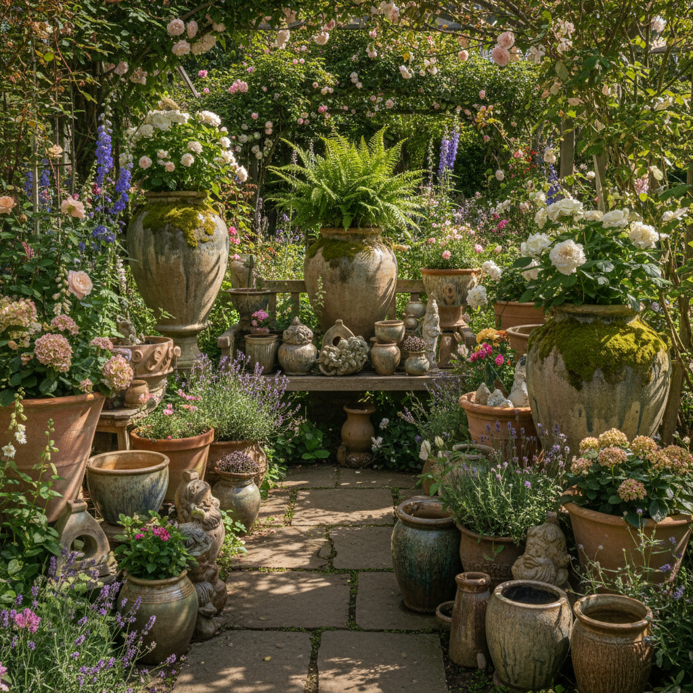

# Garden Ceramics Art 园林陶瓷艺术

> "Garden ceramics are clay returned to the earth it came from — pots, planters, sculptures, and ornaments placed among growing things, fired earth among living earth, the geometry of the kiln softened by moss and weather until the boundary between artifact and nature dissolves, each piece aging with its garden, accumulating the patina of seasons until it becomes as much a part of the landscape as the stones and trees around it." — Unknown

## 概述

园林陶瓷艺术（Garden Ceramics Art）是一种将陶瓷器物和装饰品用于园林和户外空间的艺术形式。园林陶瓷包括花盆、花器、雕塑、装饰品、铺地砖、墙面装饰等——它们在户外环境中经受风雨日晒，随时间积累独特的岁月痕迹。园林陶瓷的魅力在于人工与自然的融合——陶瓷器物在花园中与植物、石头、水共同构成完整的景观。

园林陶瓷艺术的核心要素包括：1）户外耐久——经受户外环境考验；2）与自然融合——与植物环境的融合；3）功能多样——花盆雕塑装饰等；4）岁月痕迹——随时间积累的美感；5）空间营造——营造园林空间；6）文化表达——体现园林文化；7）尺度多样——从小品到大型装置。

## 核心特征

| 特征 | 描述 |
|------|------|
| 户外耐久 | 经受户外环境 |
| 自然融合 | 与植物环境融合 |
| 功能多样 | 花盆雕塑装饰等 |
| 岁月痕迹 | 时间积累的美感 |
| 空间营造 | 营造园林空间 |
| 文化表达 | 体现园林文化 |

## 视觉特征

- **自然融合**：与植物环境的和谐
- **岁月感**：苔藓风化的岁月痕迹
- **造型多样**：各种造型的园林陶瓷
- **色彩自然**：与自然环境协调的色彩
- **尺度感**：从小品到大型的尺度变化
- **材质对比**：陶瓷与植物石材的对比

## 代表作品

| 作品 | 艺术家/文化 | 年代 | 意义 |
|------|-------------|------|------|
| *意大利陶罐* | 意大利 | 文艺复兴 | 经典园林陶罐 |
| *英国花园陶瓷* | 英国 | 18-19世纪 | 英式花园传统 |
| *中国园林陶瓷* | 中国 | 各时期 | 中国园林传统 |
| *日本庭院陶瓷* | 日本 | 各时期 | 日本庭院传统 |
| *当代园林陶瓷* | 各地艺术家 | 当代 | 当代园林陶瓷设计 |

## 历史时间线

| 时期 | 事件 |
|------|------|
| 古代 | 早期的陶制花盆和装饰 |
| 文艺复兴 | 意大利园林陶瓷的辉煌 |
| 18世纪 | 英式花园陶瓷的流行 |
| 各时期 | 中日园林陶瓷的发展 |
| 当代 | 园林陶瓷的当代设计 |

## 中国语境

中国园林陶瓷有极其丰富的传统。中国传统园林中，陶瓷元素无处不在——琉璃瓦顶、陶瓷花窗、瓷质栏杆、陶制花盆、瓷凳瓷桌等。中国的"缸景"是独特的园林陶瓷形式——大型陶缸中种植荷花、养金鱼，是江南园林的经典景观。中国传统的石湾陶塑常用于园林装饰——人物、动物、山水等题材的陶塑点缀在园林中。中国的琉璃构件是建筑园林陶瓷的重要组成——琉璃照壁、琉璃花窗等为园林增添色彩。中国当代园林设计中，陶瓷元素正在以新的方式回归——当代陶艺家为公共花园和私家庭院创作大型陶瓷装置和雕塑。

## AI生成概念图

## 与其他风格的关系

- **Landscape Architecture** → 景观建筑
- **Terracotta** → 赤陶
- **Architectural Ceramics** → 建筑陶瓷
- **Outdoor Sculpture** → 户外雕塑
- **Container Gardening** → 容器园艺
- **Chinese Garden** → 中国园林

---

*浮光艺志 | Chronicle of Artistry*
