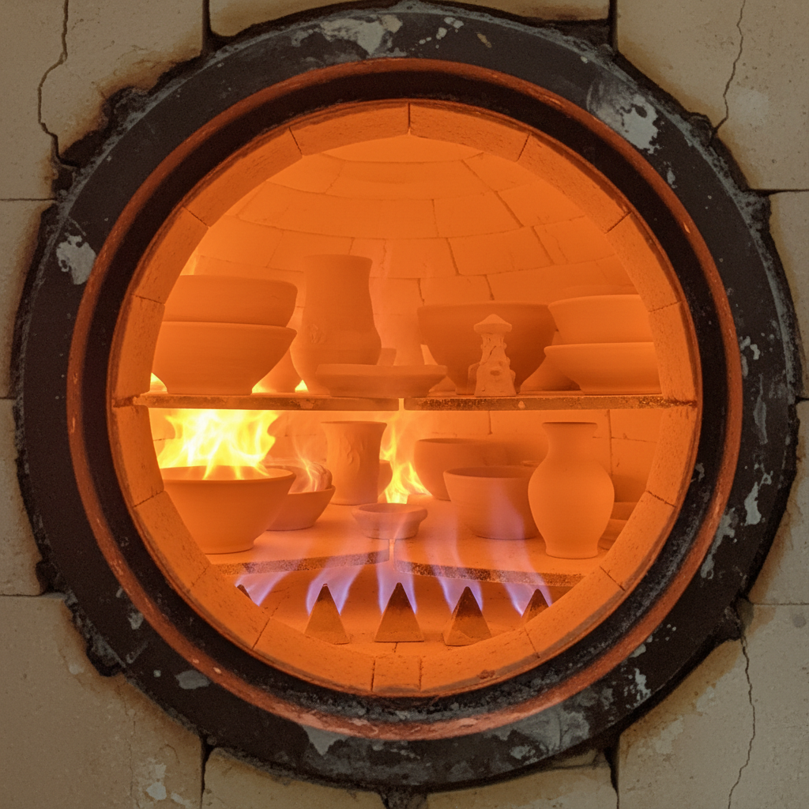

# Gas Kiln Art 气窑艺术

> "The gas kiln is controlled fire made flexible — burners that can be throttled from roaring oxidation to smoky reduction in the turn of a valve, temperature climbed in precise ramps or crashed in dramatic cooling, the potter conducting an orchestra of flame and air for hours, reading the kiln's mood through spy holes and pyrometric cones, gas giving the control of electricity with the atmosphere of wood, the modern compromise between predictability and poetry." — Unknown

## 概述

气窑艺术（Gas Kiln Art）是一种以天然气或液化石油气为燃料的窑炉烧制陶瓷的艺术形式。气窑是当代工作室陶艺中最常用的窑型之一——它结合了电窑的温度控制精度和柴窑的气氛可调性。气窑可以轻松在氧化和还原气氛之间切换，使陶艺家能够精确控制釉色效果。气窑烧制是实现青瓷、铜红釉等还原釉色的最实用方式。

气窑艺术的核心要素包括：1）气体燃料——天然气或液化气；2）气氛可调——可在氧化和还原间切换；3）温度精控——精确的温度控制；4）升温灵活——可设计各种升温曲线；5）还原能力——可实现强还原气氛；6）效率高——比柴窑更高效；7）可重复——相对可重复的烧制结果。

## 核心特征

| 特征 | 描述 |
|------|------|
| 气氛可调 | 氧化还原自由切换 |
| 温度精控 | 精确的温度控制 |
| 还原能力 | 可实现强还原气氛 |
| 高效率 | 比柴窑更高效 |
| 灵活性 | 多种烧制方案可选 |
| 可重复 | 相对可重复的结果 |

## 视觉特征

- **还原釉色**：青瓷、铜红等还原色
- **均匀效果**：比柴窑更均匀的效果
- **精确控制**：精确控制的色彩效果
- **气氛痕迹**：还原气氛的微妙痕迹
- **温度梯度**：窑内温度差异的效果
- **多样可能**：从氧化到还原的广泛范围

## 代表作品

| 作品 | 艺术家/文化 | 年代 | 意义 |
|------|-------------|------|------|
| *工作室青瓷* | 各地陶艺家 | 当代 | 气窑还原青瓷 |
| *气窑铜红* | 各地陶艺家 | 当代 | 气窑铜红釉 |
| *Bernard Leach传统* | Leach传统 | 20世纪 | 气窑工作室陶艺 |
| *当代气窑作品* | 各地陶艺家 | 当代 | 气窑的多元实践 |
| *工业气窑产品* | 各品牌 | 当代 | 工业气窑应用 |

## 历史时间线

| 时期 | 事件 |
|------|------|
| 19世纪末 | 气体燃料窑的出现 |
| 20世纪初 | 气窑在工业中的普及 |
| 1950年代 | 气窑进入工作室陶艺 |
| 1970年代 | 气窑成为工作室标配 |
| 当代 | 气窑技术的持续优化 |

## 中国语境

气窑在中国当代陶艺中有广泛应用——特别是在需要还原气氛的青瓷和铜红釉烧制中。中国的陶瓷产区——景德镇、龙泉等——大量使用气窑进行生产和创作。气窑使中国当代陶艺家能够在工作室条件下重现传统名窑的还原釉色——不需要建造大型柴窑就能烧制青瓷和铜红。中国的气窑技术在不断进步——从简单的手动控制到计算机程序控制，从单一气氛到复杂的气氛变化曲线。气窑是中国当代陶艺从传统向现代转型的重要技术支撑。

## AI生成概念图

## 与其他风格的关系

- **Reduction Firing** → 还原烧成
- **Wood Kiln** → 柴窑
- **Electric Kiln** → 电窑
- **Celadon** → 青瓷
- **Studio Pottery** → 工作室陶艺
- **Kiln Technology** → 窑炉技术

---

*浮光艺志 | Chronicle of Artistry*
