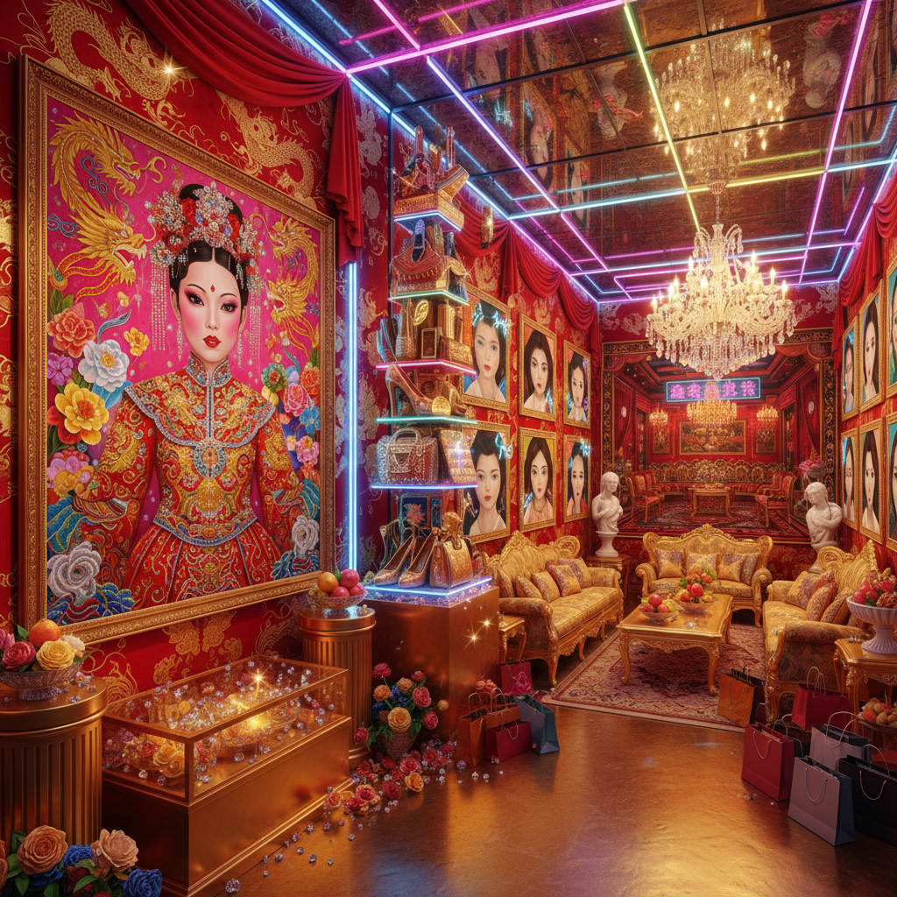

# Gaudy Art 艳俗艺术

> "Gaudy Art embraces everything that good taste rejects — the garish, the vulgar, the excessively decorative, the shamelessly commercial, the kitsch that knows it is kitsch and revels in it, a Chinese art movement that took the visual excess of new wealth, the golden dragons of karaoke bars, the neon of nightclub districts, the plastic flowers and fake luxury of a society intoxicated by sudden prosperity, and elevated it all into a deliberate aesthetic strategy that was simultaneously celebration and critique of China's headlong rush into consumer capitalism." — Unknown

## 概述

艳俗艺术（Gaudy Art / 艳俗艺术）是1990年代末至2000年代在中国兴起的一个艺术现象，代表艺术家包括徐一晖、杨卫、俸正杰和祁志龙。艳俗艺术以其刻意的"俗气"和"过度"著称——使用鲜艳的色彩、廉价的装饰元素、商业化的视觉语言和大众文化的符号，创造出一种既庸俗又精致、既批判又享受的视觉效果。

艳俗艺术的背景是1990年代中国的快速商业化和消费主义的兴起。新富阶层的审美趣味——金碧辉煌的装修、大红大绿的色彩、过度的装饰——成为艳俗艺术的视觉资源。艳俗艺术家并不简单地嘲笑这种"俗"，而是通过极端化和戏仿来揭示消费文化的内在逻辑。评论家栗宪庭将艳俗艺术视为对中国社会"审美民主化"的回应——当精英审美标准失效时，"俗"本身成为一种有效的艺术语言。

## 核心特征

| 特征 | 描述 |
|------|------|
| 艳丽 | 极度艳丽的色彩 |
| 俗气 | 刻意的俗气 |
| 过度 | 视觉的过度装饰 |
| 消费 | 消费文化的反映 |
| 戏仿 | 戏仿和夸张 |
| 快感 | 视觉快感 |

## 视觉特征

- **色彩**：大红大绿的鲜艳色彩
- **金色**：大量的金色和闪光
- **花卉**：过度的花卉装饰
- **肉体**：丰满的女性身体
- **品牌**：奢侈品牌的符号
- **塑料**：塑料质感和人造材料

## 代表作品

| 作品 | 艺术家 | 年代 | 意义 |
|------|--------|------|------|
| *中国新娘* | 俸正杰 | 2000年代 | 俸正杰的艳丽新娘 |
| *艳俗生活* | 徐一晖 | 1990年代 | 徐一晖的日常艳俗 |
| *中国女孩* | 祁志龙 | 2000年代 | 祁志龙的红色女孩 |
| *消费时代* | Various | 2000年代 | 消费主义的视觉化 |
| *金碧辉煌* | Various | 2000年代 | 新富审美的戏仿 |

## 历史时间线

| 时期 | 事件 |
|------|------|
| 1996 | 艳俗艺术概念的提出 |
| 1999 | "跨世纪彩虹"展览 |
| 2000年代 | 艳俗艺术的发展 |
| 2000年代中 | 与消费文化的互动 |
| 当代 | 艳俗美学的延续 |

## 中国语境

艳俗艺术是最具中国特色的当代艺术现象之一。它直接回应了中国社会从计划经济到市场经济转型中的审美变迁——当"朴素"不再是美德、"富贵"成为追求时，视觉文化发生了剧烈的变化。中国城市中随处可见的"艳俗"元素——KTV的金色装修、婚纱影楼的粉红布景、房地产广告的欧式豪华——都是艳俗艺术的现实素材。艳俗艺术也与中国传统的"喜庆"美学有关——红色、金色、繁复的装饰在中国文化中有正面的象征意义。艳俗艺术的争议在于：它究竟是在批判消费主义，还是在参与和享受消费主义？

## AI生成概念图

## 与其他风格的关系

- **Kitsch** → 媚俗艺术
- **Pop Art** → 波普艺术
- **Political Pop** → 政治波普
- **Cynical Realism** → 玩世现实主义
- **Jeff Koons** → 昆斯的商品美学
- **Chinese Contemporary** → 中国当代艺术

---

*浮光艺志 | Chronicle of Artistry*
