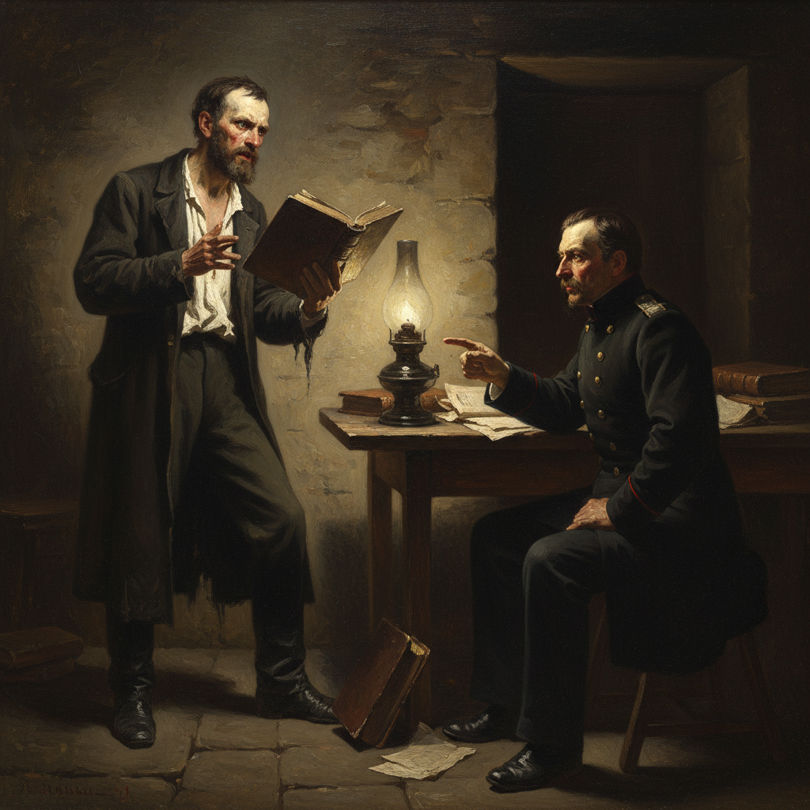

# Ge Art 盖艺术

> "Art must serve the great ideas of humanity." — Nikolai Ge

## 概述

盖艺术（Ge Art）是19世纪俄罗斯画家尼古拉·尼古拉耶维奇·盖（Nikolai Nikolayevich Ge, 1831-1894）创立的哲学-宗教绘画风格。盖是巡回展览画派的创始成员之一——他以深刻的哲学思考和强烈的道德激情，创作了一系列探讨人类精神困境的宗教和历史画作。晚年他成为托尔斯泰的挚友和追随者——将托尔斯泰的道德哲学融入了自己的艺术创作。

盖最著名的作品《最后的晚餐》（1863）以全新的视角重新诠释了这一经典题材——他将犹大置于阴影中，用强烈的明暗对比表现善与恶的对立。他晚期的"受难"系列——如《各各他》（1893）和《什么是真理？》（1890）——以近乎表现主义的手法表现基督的苦难，达到了令人震撼的精神深度。盖的晚期作品因其激进的表现手法而被审查禁止展出。

盖艺术的核心要素包括：1）哲学深度——对人类精神困境的思考；2）宗教题材——基督受难的重新诠释；3）道德激情——强烈的道德批判力量；4）光影戏剧——极端的明暗对比；5）表现主义先驱——晚期作品的表现主义倾向；6）托尔斯泰影响——道德哲学的艺术化；7）精神张力——画面中的精神紧张感。

## 核心特征

| 特征 | 描述 |
|------|------|
| 哲学深度 | 人类精神困境思考 |
| 宗教题材 | 基督受难重新诠释 |
| 道德激情 | 强烈道德批判力量 |
| 光影戏剧 | 极端明暗对比 |
| 表现主义先驱 | 晚期表现主义倾向 |
| 精神张力 | 画面精神紧张感 |

## 视觉特征

- **强烈明暗**：卡拉瓦乔式的极端明暗
- **人物特写**：聚焦人物面部和表情
- **暗色调**：以深色为主的色调
- **扭曲形体**：晚期作品中扭曲的形体
- **戏剧光源**：单一光源的戏剧效果
- **精神痛苦**：人物面部的精神痛苦

## 代表作品

| 作品 | 年代 | 意义 |
|------|------|------|
| *最后的晚餐* (The Last Supper) | 1863 | 成名作 |
| *什么是真理？* (What is Truth?) | 1890 | 哲学的巅峰 |
| *各各他* (Golgotha) | 1893 | 精神的极致 |
| *彼得大帝审问皇太子* (Peter I Interrogates Tsarevich) | 1871 | 历史画杰作 |
| *客西马尼园* (In the Garden of Gethsemane) | 1869 | 宗教冥想 |
| *良心* (Conscience, Judas) | 1891 | 道德审判 |

## 历史时间线

| 时期 | 事件 |
|------|------|
| 1831年 | 出生于沃罗涅日 |
| 1850-1857年 | 就读圣彼得堡美术学院 |
| 1863年 | 创作《最后的晚餐》 |
| 1870年 | 参与创立巡回展览画派 |
| 1882年 | 结识托尔斯泰 |
| 1890-1894年 | 创作"受难"系列 |
| 1894年 | 在农庄去世 |

## 中国语境

盖在中国的知名度不如列宾和希施金，但他的艺术理念对理解俄罗斯艺术的精神深度有重要意义。他将绑画作为哲学思考和道德批判工具的方法，与中国传统文人画"载道"的理念有深层的呼应。盖晚期作品中近乎表现主义的手法——扭曲的形体、极端的光影、痛苦的表情——预示了20世纪表现主义的到来，这一艺术史转折对理解现代艺术的起源有重要价值。他与托尔斯泰的友谊和精神交流，展现了19世纪俄罗斯文学与绘画之间深刻的互动关系——这种跨领域的精神对话在中国文化传统中同样有着悠久的历史。

## 概念图

## 与其他风格的关系

- **Peredvizhniki** → 巡回展览画派（创始人）
- **Kramskoi** → 克拉姆斯柯依（同道）
- **Expressionism** → 表现主义（先驱）
- **Caravaggio** → 卡拉瓦乔（光影影响）
- **Tolstoy** → 托尔斯泰（精神导师）
- **Religious Art** → 宗教艺术传统

---

*浮光艺志 | Chronicle of Artistry*
