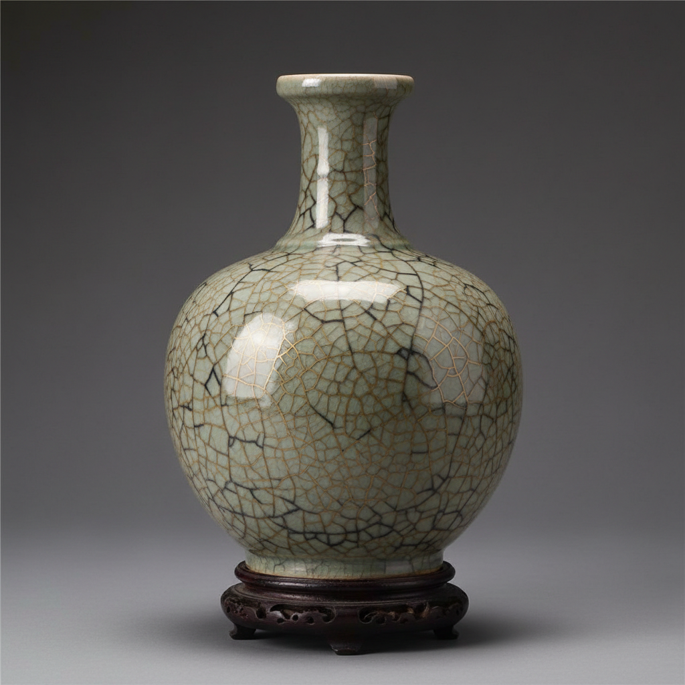

# Ge Ware Art 哥窑艺术

> "Ge ware is imperfection perfected — a glaze deliberately crackled into a web of golden and dark lines that the Chinese call 'golden thread and iron wire,' each crack a controlled failure that becomes ornament, the ceramic equivalent of finding beauty in broken things centuries before the Japanese named it wabi-sabi, a surface that looks ancient the moment it leaves the kiln." — Unknown

## 概述

哥窑艺术（Ge Ware Art）是中国宋代五大名窑之一，以其独特的"金丝铁线"开片纹理著称于世。哥窑的最大特色是釉面布满大小不一的开片纹——大开片呈深色（铁线），小开片呈金黄色（金丝），两种纹路交织形成"金丝铁线"的独特美感。哥窑将釉面开裂这一通常被视为缺陷的现象转化为独特的装饰效果，体现了中国美学中"化腐朽为神奇"的智慧。

哥窑艺术的核心要素包括：1）金丝铁线——大小开片的交织纹理；2）开片美学——将缺陷转化为美；3）釉色温润——灰青或米黄的釉色；4）紫口铁足——口沿和足底的特征；5）厚釉质感——多层施釉的厚实感；6）宋代审美——宋代含蓄的审美理想；7）传世珍品——存世极少的珍贵。

## 核心特征

| 特征 | 描述 |
|------|------|
| 金丝铁线 | 大小开片交织纹理 |
| 开片美学 | 将缺陷转化为美 |
| 釉色温润 | 灰青或米黄釉色 |
| 紫口铁足 | 口沿足底特征 |
| 厚釉质感 | 多层施釉厚实 |
| 传世珍品 | 存世极少珍贵 |

## 视觉特征

- **金丝铁线**：金色细纹与黑色粗纹交织
- **开片网络**：布满釉面的开片网络
- **灰青釉色**：温润的灰青或米黄色
- **厚釉质感**：厚实温润的釉面
- **紫口**：口沿处釉薄露出深色胎
- **铁足**：足底露出深色胎骨

## 代表作品

| 作品 | 艺术家/文化 | 年代 | 意义 |
|------|-------------|------|------|
| *哥窑鱼耳炉* | 宋代哥窑 | 宋代 | 哥窑经典器形 |
| *哥窑贯耳瓶* | 宋代哥窑 | 宋代 | 金丝铁线的典范 |
| *哥窑八方杯* | 宋代哥窑 | 宋代 | 精致的小器 |
| *传世哥窑* | 宋代 | 宋代 | 故宫藏品 |
| *仿哥釉* | 明清 | 明清 | 后世的仿制 |

## 历史时间线

| 时期 | 事件 |
|------|------|
| 宋代 | 哥窑的创烧和鼎盛 |
| 元代 | 哥窑的延续 |
| 明代 | 仿哥釉的大量生产 |
| 清代 | 仿哥釉的精致化 |
| 当代 | 哥窑的研究和复烧 |

## 中国语境

哥窑是中国陶瓷美学中最具哲学意味的品种之一。它将釉面开裂——一种通常被视为烧制缺陷的现象——转化为独特的装饰美感，体现了中国美学中"以拙为巧"、"化腐朽为神奇"的智慧。关于哥窑的起源有一个著名的传说——章生一和章生二兄弟分别创烧了哥窑和弟窑（龙泉窑），哥窑因开片而得名。哥窑的"金丝铁线"在中国文人看来如同冰裂、如同古玉的沁色——它赋予器物一种古朴苍老的气质。哥窑存世极少，是中国陶瓷收藏中最珍贵的品种之一。哥窑的开片美学影响了后世无数的仿制——明清景德镇大量生产仿哥釉器物，证明了这种美学的持久魅力。

## AI生成概念图

## 与其他风格的关系

- **Song Dynasty Kilns** → 宋代名窑
- **Crackle Glaze** → 开片釉
- **Guan Ware** → 官窑
- **Wabi-Sabi** → 侘寂美学
- **Chinese Aesthetics** → 中国美学
- **Monochrome Glaze** → 单色釉

---

*浮光艺志 | Chronicle of Artistry*
