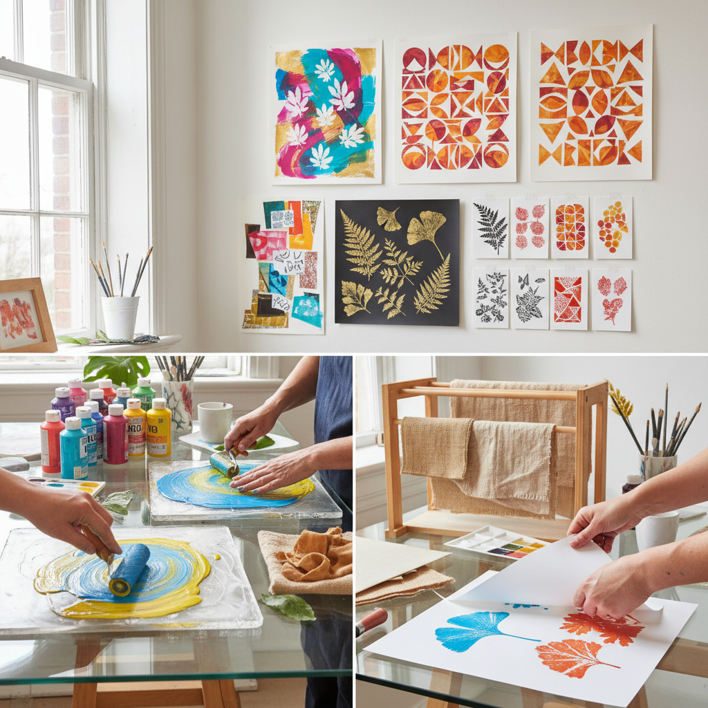

# Gelatin Printing 明胶版印刷

> "Gelatin printing is the most democratic of printmaking methods — a simple plate of kitchen gelatin becomes a press, accepting ink, texture, and stencils with equal generosity, producing monoprints of surprising sophistication from the humblest of materials." — Unknown

## 概述

明胶版印刷（Gelatin Printing，也称Gelli Printing）是一种使用明胶板（gelatin plate）作为印刷表面的单版印刷（monoprint）技法。明胶板是一块光滑、有弹性的明胶凝胶——在其表面涂上丙烯颜料或油墨，放置模板、纹理材料或物体，然后将纸张压在上面转印图像。每次印刷都会产生独特的效果，因此属于单版印刷。

明胶版印刷的魅力在于其"即兴性"和"可及性"——不需要昂贵的设备或专业训练，可以使用厨房明胶自制印版，也可以购买商业明胶版（如Gelli Arts品牌）。明胶版印刷可以创造出丰富的层次、纹理和色彩效果——通过多次叠印、使用不同的模板和纹理工具，可以创作出从抽象到具象的各种作品。

## 核心特征

| 特征 | 描述 |
|------|------|
| 明胶 | 明胶凝胶印版 |
| 单版 | 每次印刷独特 |
| 即兴 | 即兴创作性强 |
| 层次 | 多层叠印 |
| 可及 | 材料简单易得 |
| 纹理 | 丰富的纹理效果 |

## 视觉特征

- **层次**：多层叠印的深度
- **纹理**：丰富的纹理效果
- **色彩**：鲜艳的丙烯色彩
- **有机**：有机的、偶然的效果
- **抽象**：倾向抽象表达
- **即兴**：即兴的创作痕迹

## 代表作品

| 作品 | 艺术家 | 年代 | 意义 |
|------|--------|------|------|
| *Gelli plate prints* | Various | 当代 | 商业明胶版印刷 |
| *Gelatin monoprints* | Various | 当代 | 明胶单版印刷 |
| *Layered gelatin prints* | Various | 当代 | 多层明胶版印刷 |
| *Mixed media gelatin art* | Various | 当代 | 混合媒介明胶版 |
| *Botanical gelatin prints* | Various | 当代 | 植物明胶版印刷 |

## 历史时间线

| 时期 | 事件 |
|------|------|
| 19世纪 | 明胶印刷的早期实验 |
| 20世纪中期 | 艺术教育中的应用 |
| 2000年代 | 商业明胶版的出现 |
| 2010年代 | 社交媒体推动的流行 |
| 当代 | 明胶版印刷的全球普及 |

## 中国语境

明胶版印刷在中国的艺术教育和手工创作社区中有快速的发展。中国的美术教育机构和儿童艺术课程中引入明胶版印刷作为版画入门技法——其安全、简单、效果丰富的特点特别适合教学。中国的手工创作者和艺术爱好者通过社交媒体（小红书、抖音等）分享明胶版印刷作品和教程。中国的一些艺术家将明胶版印刷与中国传统图案和水墨美学结合。

## AI生成概念图

## 与其他风格的关系

- **Monoprint** → 单版印刷
- **Screen Printing** → 丝网印刷
- **Collagraph** → 拼贴版画
- **Stencil Art** → 模板艺术
- **Mixed Media** → 混合媒介
- **Abstract Art** → 抽象艺术

---

*浮光艺志 | Chronicle of Artistry*
