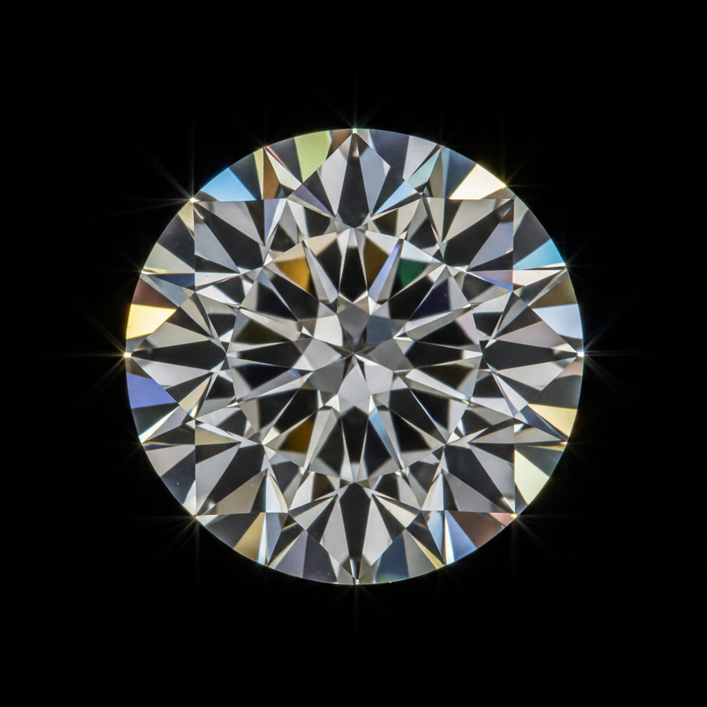

# Gem Cutting Art 宝石切割艺术

> "Gem cutting is the art of revealing light — a rough crystal pulled from the earth is studied, planned, and then precisely cut and polished to unlock the fire, brilliance, and color that lay hidden within. Every facet is a calculated window, angled to capture light, bounce it through the stone's interior, and return it to the eye as sparkle and spectrum. The gem cutter is part geologist, part mathematician, part artist, transforming raw mineral into concentrated beauty." — Unknown

## 概述

宝石切割艺术（Gem Cutting Art）是将天然宝石原石通过切割、研磨和抛光转化为精美刻面宝石的传统工艺——通过精确计算的角度和比例最大化宝石的光学效果（火彩、亮度和闪烁）。宝石切割（也称lapidary）是珠宝艺术的基础，决定了宝石最终的美感和价值。

宝石切割艺术的实践包括：1）刻面切割——创造多个平面反射光线；2）弧面切割（cabochon）——磨成光滑的弧面；3）阶梯切割——矩形的阶梯式刻面；4）明亮式切割——圆形的多刻面切割；5）花式切割——各种创意形状的切割；6）幻彩切割——在宝石内部创造光学效果；7）当代宝石切割——将传统技法与现代设计结合的创作。

## 核心特征

| 特征 | 描述 |
|------|------|
| 光学 | 精确的光学计算 |
| 精密 | 极其精密的角度 |
| 数学 | 数学般的精确性 |
| 转化 | 原石到宝石的转化 |
| 火彩 | 释放宝石的火彩 |
| 价值 | 决定宝石的价值 |

## 视觉特征

- **火彩**：彩虹般的光谱分散
- **亮度**：强烈的光线反射
- **闪烁**：移动时的闪烁效果
- **对称**：精确的几何对称
- **透明**：晶莹剔透的质感
- **色彩**：宝石的天然色彩

## 代表作品

| 作品 | 艺术家/文化 | 年代 | 意义 |
|------|-------------|------|------|
| *Koh-i-Noor diamond* | 印度/英国 | 重切于1852年 | 光之山钻石 |
| *Hope Diamond* | 法国/美国 | 17世纪 | 希望钻石 |
| *Tolkowsky ideal cut* | 比利时 | 1919年 | 理想切割理论 |
| *John Dyer fantasy cuts* | 美国 | 当代 | 幻彩切割大师 |
| *Contemporary precision cuts* | 当代 | 当代 | 当代精密切割 |

## 历史时间线

| 时期 | 事件 |
|------|------|
| 古代 | 宝石的简单打磨和弧面切割 |
| 14世纪 | 欧洲刻面切割的开始 |
| 17世纪 | 明亮式切割的发展 |
| 1919年 | Tolkowsky理想切割理论 |
| 当代 | 计算机辅助的精密切割 |

## 中国语境

宝石切割艺术在中国有独特的发展路径。中国传统的玉石加工以弧面切割和雕刻为主——与西方的刻面切割传统不同。中国的宝石切割产业主要集中在广东和云南——大量的彩色宝石在中国加工。中国的梧州是世界最大的人造宝石切割中心——生产全球大部分的合成宝石。中国当代的宝石切割师开始学习和发展精密刻面切割——将西方的光学理论与中国的加工传统结合。中国的珠宝教育中，宝石切割作为重要的专业课程被教授——培养新一代的宝石切割师。中国的一些独立宝石切割师开始创作幻彩切割和艺术切割——将宝石切割提升为独立的艺术表达。

## AI生成概念图

## 与其他风格的关系

- **Cameo Carving** → 浮雕宝石
- **Intaglio** → 凹雕宝石
- **Jewelry** → 珠宝艺术
- **Lapidary** → 宝石加工
- **Optical Art** → 光学艺术
- **Mathematical Art** → 数学艺术

---

*浮光艺志 | Chronicle of Artistry*
