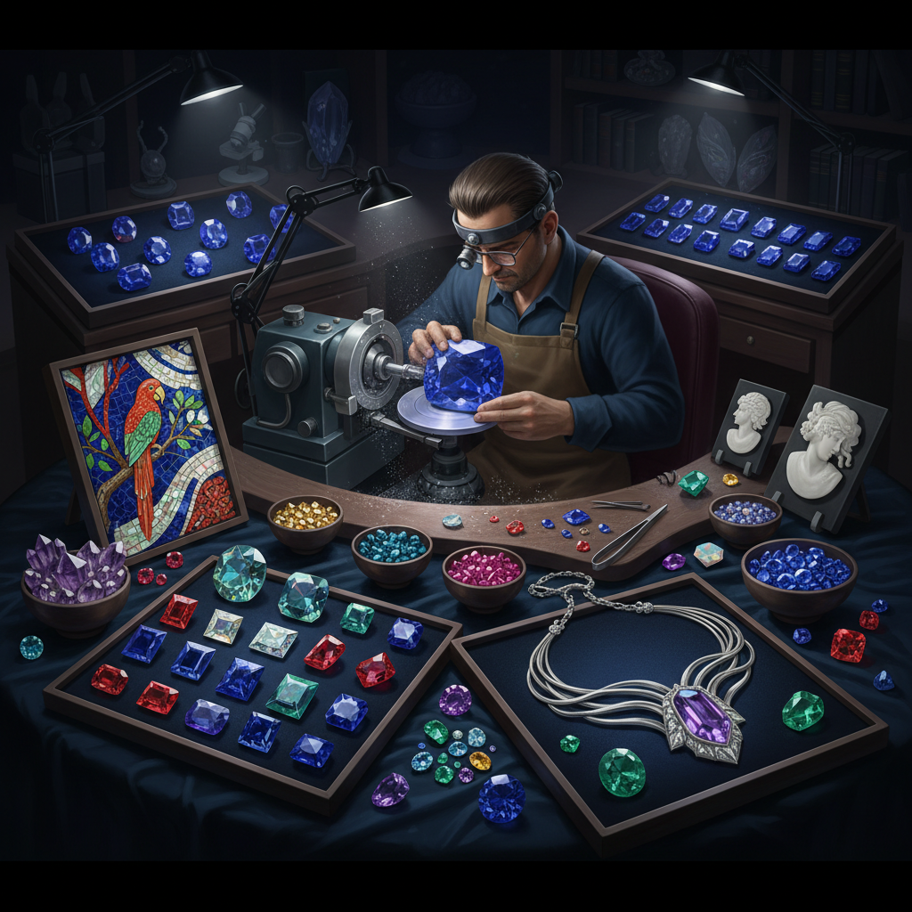

# Gemstone Art 宝石艺术

> "A gemstone is a miracle of geology — carbon atoms arranged under unimaginable pressure become diamond, aluminum oxide with traces of chromium becomes ruby, and beryllium silicate with a touch of iron becomes emerald. Each gem is a message from deep time, a crystal that grew in darkness for millions of years before being brought to light. The gem cutter's art is to find the angle that releases the fire trapped inside." — Unknown

## 概述

宝石艺术（Gemstone Art）是以天然或人造宝石为材料进行艺术创作的实践——涵盖宝石切割、宝石雕刻、宝石镶嵌和宝石拼贴等多种艺术形式。宝石艺术利用宝石的色彩、透明度、硬度、折射率和稀有性创造珍贵的艺术品。

宝石艺术的实践包括：1）宝石切割（faceting）——通过精确的角度切割释放宝石的火彩；2）宝石雕刻（glyptics）——在宝石表面雕刻图案（凹雕intaglio和浮雕cameo）；3）宝石镶嵌——将宝石镶嵌在金属中制作首饰；4）硬石镶嵌（pietra dura）——用不同颜色的宝石拼贴成图画；5）宝石马赛克——用宝石碎片拼贴成图案；6）幻彩切割——创新的宝石切割方式产生特殊光学效果；7）宝石微雕——在极小的宝石上进行微雕。

## 核心特征

| 特征 | 描述 |
|------|------|
| 珍贵 | 材料的稀有和珍贵 |
| 色彩 | 自然界最纯净的色彩 |
| 硬度 | 极高的硬度 |
| 光学 | 折射、色散、多色性 |
| 永恒 | 宝石的永恒性 |
| 精密 | 切割的极致精密 |

## 视觉特征

- **色彩**：纯净饱和的宝石色彩
- **火彩**：切割产生的彩虹闪光
- **透明**：宝石的透明和半透明
- **光泽**：不同类型的光泽效果
- **深度**：宝石内部的视觉深度
- **闪耀**：多面切割的闪耀效果

## 代表作品

| 作品 | 艺术家 | 年代 | 意义 |
|------|--------|------|------|
| *Hope Diamond* | Unknown | 古代 | 著名蓝钻 |
| *Florentine pietra dura* | 佛罗伦萨工坊 | 16世纪至今 | 硬石镶嵌 |
| *Fabergé eggs* | Fabergé | 1885-1917 | 宝石装饰艺术 |
| *Roman intaglios* | 古罗马 | 古代 | 宝石凹雕 |
| *Fantasy cuts* | Various | 当代 | 幻彩切割 |

## 历史时间线

| 时期 | 事件 |
|------|------|
| 古代 | 最早的宝石加工 |
| 古罗马 | 宝石雕刻的黄金时代 |
| 文艺复兴 | 硬石镶嵌的发展 |
| 17世纪 | 现代宝石切割的发明 |
| 当代 | 计算机辅助宝石设计 |

## 中国语境

宝石艺术在中国有独特而深厚的传统。中国传统的玉石文化——将玉视为"石之美者"——是世界上最悠久的宝石艺术传统之一。中国的翡翠雕刻以其精湛的技艺和深厚的文化内涵著称。中国传统的"百宝嵌"工艺——将各种宝石、珊瑚、玛瑙等镶嵌在漆器或木器表面——是中国独特的宝石镶嵌艺术。中国当代的宝石艺术涵盖了从传统玉雕到现代宝石设计的广泛领域——中国的宝石切割和加工技术在全球占有重要地位。中国的彩色宝石市场（红宝石、蓝宝石、祖母绿等）近年来快速增长，推动了宝石艺术的发展。

## AI生成概念图

## 与其他风格的关系

- **Jewelry Art** → 首饰艺术
- **Crystal Art** → 水晶艺术
- **Lapidary Art** → 宝石加工艺术
- **Mosaic Art** → 马赛克艺术
- **Miniature Art** → 微型艺术
- **Light Art** → 光艺术

---

*浮光艺志 | Chronicle of Artistry*
