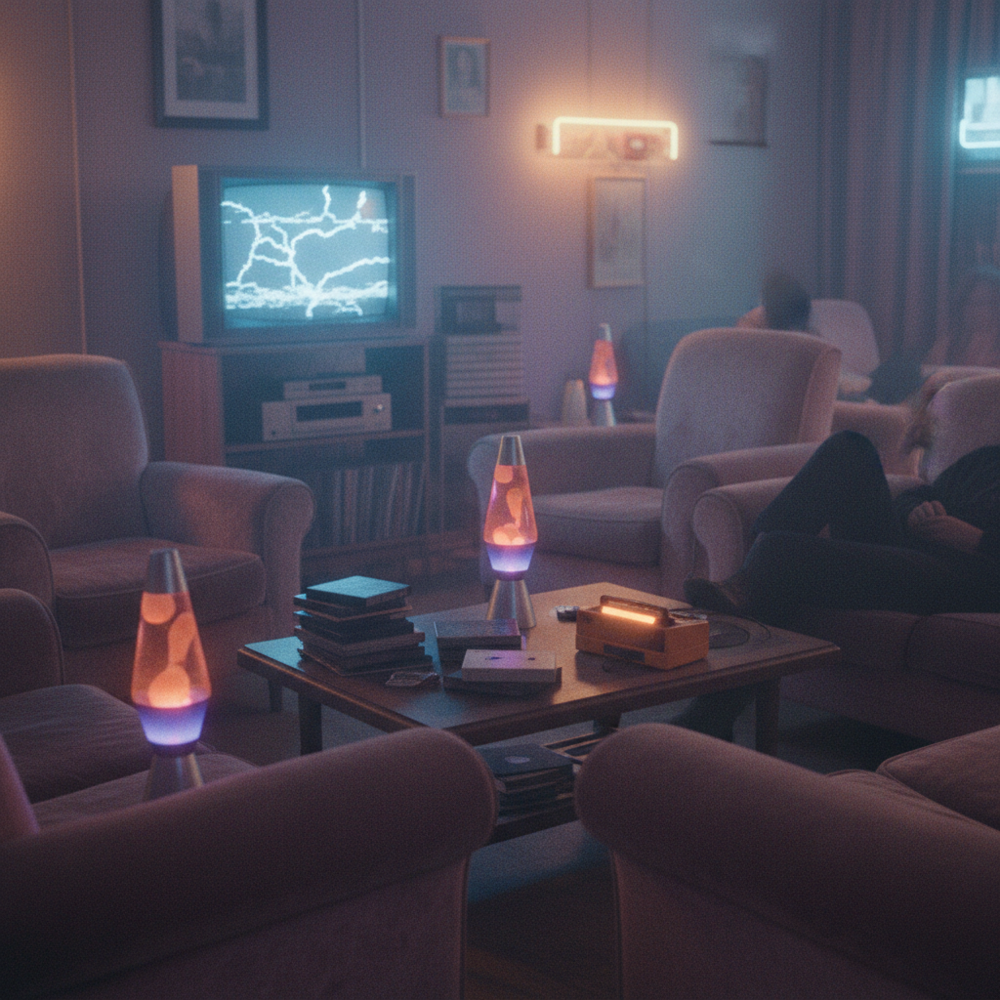
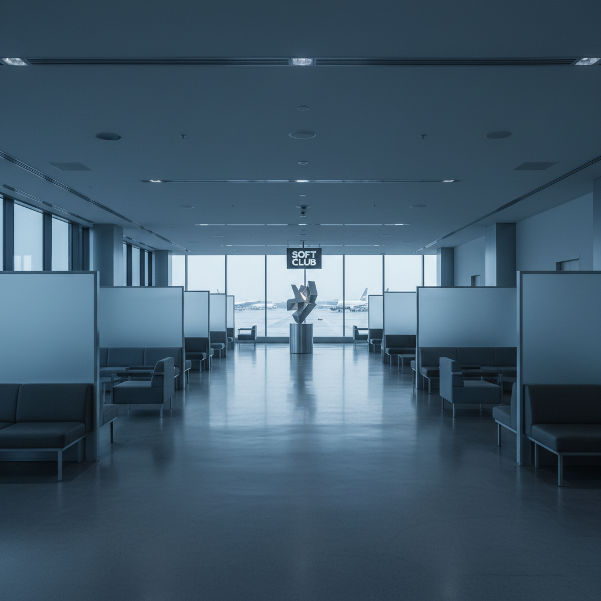

# Gen X Soft Club | X世代柔和俱乐部

> 机场候机厅、地铁站台、蓝绿色调的极简空间——Y2K 的安静另一面。

## 概述

- **时间跨度**：1990年代末 – 2000年代初
- **发源地**：全球化都市空间（机场、酒店、地铁）
- **核心理念**：Y2K未来主义的"安静版"——用冷色极简传达都市游牧者的疏离优雅
- **别名**：Airport Core（非正式）、Corporate Liminal

## 历史背景

Gen X Soft Club 是 Y2K 美学家族中最容易被忽视的成员。当 Y2K Futurism 用铬银和泡泡糖粉高调宣告未来已来时，Gen X Soft Club 则安静地存在于机场候机厅的蓝灰色灯光下、地铁站台的不锈钢扶手旁、商务酒店大堂的磨砂玻璃隔断后面。

这个名称由消费者美学研究所（CARI）命名，"Gen X"指向X世代（1965-1980年出生）的审美偏好，"Soft Club"则暗示一种柔和的、非对抗性的都市夜生活氛围——不是汗水淋漓的锐舞派对，而是鸡尾酒吧里的 Ambient 电子乐。

### 时代背景

1990年代末是全球化的黄金时代：
- 廉价航空兴起，频繁飞行成为中产阶级的新常态
- 跨国公司扩张，"世界公民"成为一种身份认同
- 互联网泡沫尚未破裂，科技行业充满乐观
- 极简主义设计（Jil Sander、Helmut Lang）主导时尚界

在这个背景下，机场不再只是交通枢纽，而成为一种**生活方式的象征**——它代表着流动、效率、国际化和一种优雅的无根感。

## 视觉特征

| 维度 | 典型元素 |
|------|----------|
| 色彩 | 冷蓝、薄荷绿、灰白、银色、雾面质感 |
| 空间 | 机场、地铁、酒店大堂、空旷的现代建筑 |
| 人物 | 极简穿搭、中性色系、独自行走的都市人 |
| 摄影 | 冷色调、低对比、大量留白、运动模糊 |
| 设计 | 极简排版、Helvetica/Futura 字体、大面积负空间 |
| 情绪 | 疏离、平静、略带忧郁的优雅 |
| 材质 | 磨砂玻璃、不锈钢、混凝土、白色塑料 |
| 光线 | 荧光灯管、蓝色LED、凌晨的自然光 |

### 核心空间类型

1. **机场航站楼**：关西国际机场（Renzo Piano）、香港赤鱲角、戴高乐2E航站楼
2. **地铁/轻轨站**：斯德哥尔摩地铁、毕尔巴鄂地铁（Norman Foster）
3. **商务酒店**：W Hotel 早期设计、Aman 极简度假村
4. **企业大堂**：90年代末科技公司总部的极简接待区

## 文化语境

- 90 年代末的全球化乐观：频繁飞行、跨国生活成为中产阶级的新常态
- 极简主义设计的第一波浪潮（Jil Sander、Helmut Lang、Calvin Klein）
- 电子音乐中的 Ambient/Downtempo 分支（Boards of Canada、Air）
- 村上春树小说中的都市疏离感
- Marc Augé 的"非场所"（Non-Places）理论——机场、高速公路、连锁酒店作为现代性的象征空间

## 代表案例

| 领域 | 代表 | 说明 |
|------|------|------|
| 电影 | 《迷失东京》(2003) | 索菲亚·科波拉的东京酒店疏离感 |
| 电影 | 《在云端》(Up in the Air, 2009) | 机场作为生活方式 |
| 电影 | 《搏击俱乐部》(1999) | 宜家目录式公寓的空虚 |
| 时装 | Helmut Lang 1998-2004 | 极简、中性、都市 |
| 时装 | Jil Sander 90s | "极简女王"的冷感优雅 |
| 广告 | Calvin Klein CK One (1994) | 中性香水的极简广告 |
| 音乐 | Air - Moon Safari (1998) | 法式电子的冷静优雅 |
| 音乐 | Boards of Canada | 怀旧Ambient的阈限感 |
| 建筑 | 关西国际机场 (1994) | Renzo Piano的流线型航站楼 |
| 文学 | 村上春树《海边的卡夫卡》 | 都市漂泊者的内心风景 |

## 与其他风格的关系

| 对比 | 说明 |
|------|------|
| **vs Y2K Futurism** | Y2K 是闪亮的科技乐观，Gen X Soft Club 是安静的都市漂泊 |
| **vs Frutiger Aero** | Frutiger Aero 是数字界面的温暖，Gen X Soft Club 是物理空间的冷感 |
| **vs Normcore (2014+)** | Gen X Soft Club 可以被视为 Normcore 的精神前身 |
| **vs Liminal Space (2019+)** | Liminal Space 继承了它的空间感，但加入了恐怖/超现实元素 |
| **vs Corporate Memphis** | 都是企业美学，但 Gen X Soft Club 冷静克制，Corporate Memphis 假装活泼 |

## 文化内核

Gen X Soft Club 的情感核心是一种**优雅的疏离**。它不是愤怒的反叛（那是朋克），不是狂热的乐观（那是Y2K），而是一种安静的、略带忧郁的接受——接受现代生活的流动性、匿名性和短暂性。

这种美学在2001年9·11事件后逐渐消退。机场从"自由流动的象征"变成了"安全焦虑的场所"，全球化的乐观叙事开始动摇。Gen X Soft Club 的那种"在任何地方都像在家"的感觉，被"在任何地方都不安全"的焦虑所取代。

### 为什么现在有人怀念它？

2020年代，当人们在社交媒体上分享"阈限空间"（Liminal Spaces）照片时，他们怀念的部分正是 Gen X Soft Club 的遗产——那些空旷、安静、没有人的公共空间，在疫情后获得了新的情感意义。

## 图库

| | |
|:---:|:---:|
|  |  |
| *Gen X Soft Club 概念* | *凌晨机场候机厅 · 冷色极简* |

**推荐图片来源：**
- https://aesthetics.fandom.com/wiki/Gen_X_Soft_Club
- Pinterest 搜索 "gen x soft club aesthetic liminal"
- 90 年代末 Calvin Klein / Helmut Lang 广告存档

## 延伸阅读

- [Aesthetics Wiki: Gen X Soft Club](https://aesthetics.fandom.com/wiki/Gen_X_Soft_Club)
- [Aesthetics Wiki (中文): Y2K 页面中的 Gen X Soft Club 条目](https://aesthetics.fandom.com/zh/wiki/Y2K)
- Marc Augé,《非场所：超现代性人类学导论》(Non-Places, 1995)

---

[← Electropop 08](electropop-08.md) | [→ Vectorheart](vectorheart.md) | [↑ 返回目录](README.md)
