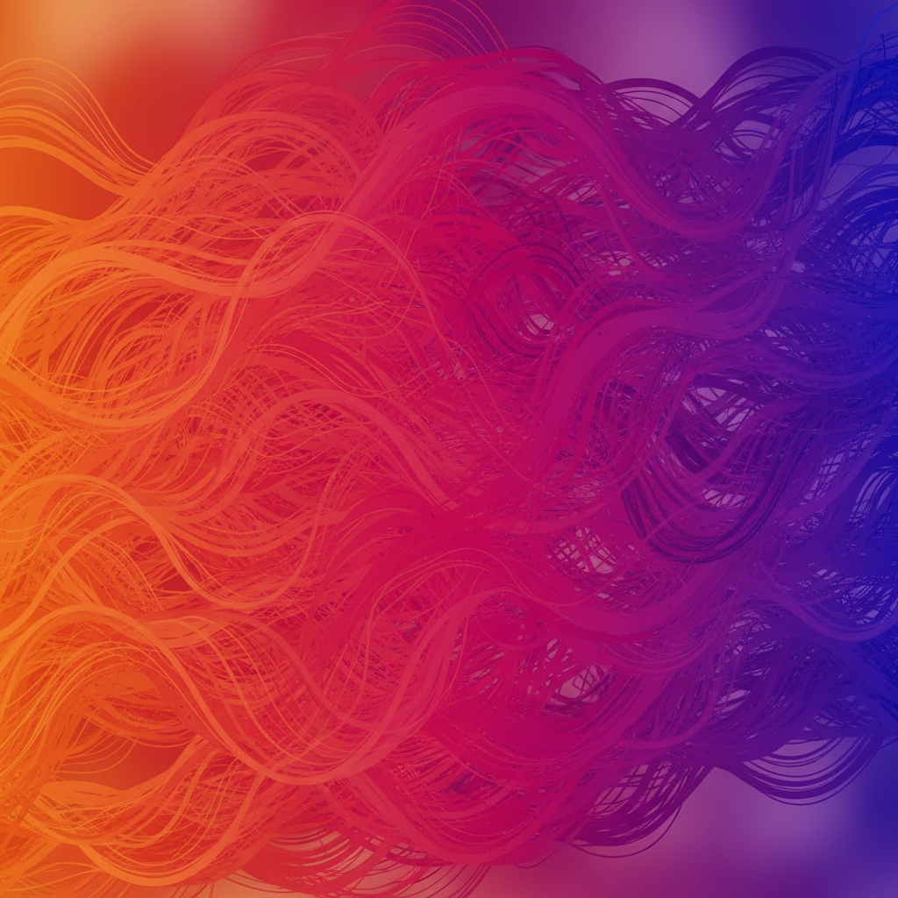

# Generative Art 生成艺术



> **"写代码而不是拿画笔——让算法成为你的合作者。"**

## 概述

| 维度 | 描述 |
|------|------|
| 时期 | 1960s–至今 |
| 别名 | Generative Art, Algorithmic Art, Creative Coding, 算法艺术 |
| 核心色彩 | 无固定——由算法决定（常见：渐变、噪声色彩） |
| 关键元素 | 算法生成、随机性、规则系统、代码即画笔 |
| 代表人物 | Vera Molnár, Casey Reas, Tyler Hobbs, Manolo Gamboa Naon |
| 关联风格 | Op Art, Minimalism, Data Art, Glitch Art, NFT Art |

---

## 历史脉络

| 年份 | 事件 |
|------|------|
| 1960s | Vera Molnár——最早的计算机艺术家之一 |
| 1965 | Georg Nees "Schotter"——早期生成艺术经典 |
| 2001 | Processing 语言发布——创意编程民主化 |
| 2010s | openFrameworks, p5.js——工具爆发 |
| 2021 | Tyler Hobbs "Fidenza"——NFT生成艺术天价 |
| 2022 | Art Blocks——链上生成艺术平台 |
| 2023+ | AI + 生成艺术的融合 |

### 核心哲学

生成艺术的精神是**"设定规则，然后放手——让系统自己创造惊喜"**：
- 规则 = 自由（"限制越精确——结果越意外"）
- 随机 = 合作（"随机数是你的合作者"）
- 代码 = 画笔（"for循环比画笔更有表现力"）
- 系统 = 美（"涌现的复杂性比设计的复杂性更美"）
- "生成艺术家不创造作品——创造创造作品的系统"

---

## 视觉语法

### 色彩系统

```
常见策略：
  Perlin噪声色彩 — 自然渐变
  HSB色轮遍历 — 彩虹系统
  限定调色板 — 规则内的变化
  黑白 — 纯结构

经典配色：
  暖色渐变 — 橙→粉→紫
  冷色系 — 蓝→青→白
  单色变化 — 同色相不同明度
  对比系 — 深背景+亮线条

规则：
  - 色彩由算法生成
  - 每次运行结果不同
  - 规则内的无限变化
  - 数学函数决定色彩分布

质感：
  矢量 — 清晰、数学
  噪声 — 有机、自然
  粒子 — 流动、聚散
  网格 — 秩序、变异
```

### 标志性元素

| 类别 | 元素 |
|------|------|
| 结构 | 网格变异、流场、粒子系统、分形 |
| 形状 | 圆、线、多边形、曲线 |
| 行为 | 随机游走、群集、生长、衰变 |
| 工具 | Processing, p5.js, GLSL, TouchDesigner |
| 输出 | 静态图、动画、实时交互、打印 |
| 态度 | 系统性、实验性、数学美、涌现 |

---

## 与千禧怀旧的关系

### NFT时代的爆发
- 2021: Art Blocks 让生成艺术进入主流收藏
- Fidenza, Ringers, Chromie Squiggle——天价NFT
- "代码即艺术" 从小众变成百万美元市场
- 生成艺术 = Web3时代的"原生"艺术形式

### 创意编程的民主化
- Processing → p5.js → 人人可以写生成艺术
- Creative Coding 社区的全球化
- "你不需要美术学位——你需要好奇心和一个for循环"

---

## 中国语境

- 中国创意编程社区的发展
- 中国数字艺术家的生成艺术实践
- 中国美术院校的"新媒体艺术"教育
- 中国NFT平台上的生成艺术

---

## 设计应用

| 场景 | 应用方式 |
|------|----------|
| NFT | 链上生成+限量+收藏+社区 |
| 品牌 | 动态标识+生成视觉系统+唯一性 |
| 装置 | 实时交互+投影+空间+声音 |
| 印刷 | 限量版画+每张唯一+算法签名 |

---

## 相关风格

← [Glitch Art 故障艺术](glitch-art.md) | [Data Art 数据艺术](data-art.md) →

↑ [返回千禧怀旧目录](README.md) | [返回总目录](../README.md)
