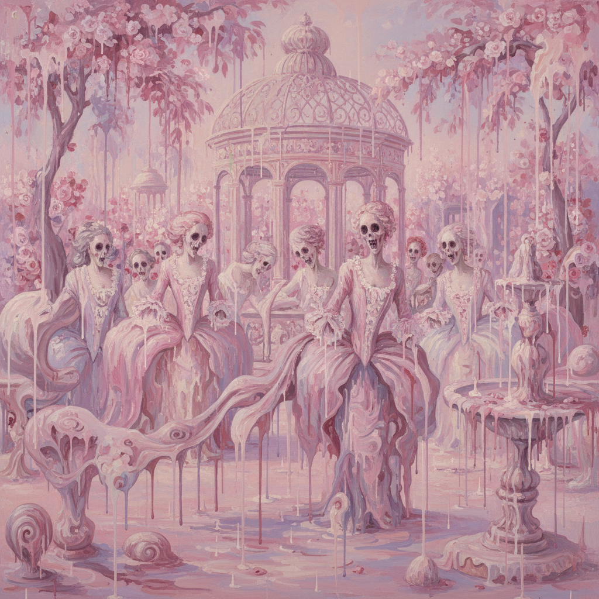

# Genieve Figgis 吉妮薇·菲吉斯

> **时期：** 1972–至今  
> **关键词：** 融化肖像、黑色幽默、洛可可颠覆、爱尔兰当代

## 概述

Genieve Figgis 是爱尔兰当代画家，以对18世纪贵族肖像和室内场景的怪诞重新诠释闻名。她的作品将优雅的洛可可构图溶解为滴淌、融化的颜料，人物面孔扭曲如同恐怖片中的幽灵，在美与恐怖之间制造出独特的黑色幽默。

## 风格特征

- **融化效果**：颜料大量稀释后任其流淌，人物如同正在溶解
- **洛可可引用**：构图来源于18世纪贵族肖像和室内场景
- **恐怖幽默**：面孔扭曲变形，眼睛空洞，微笑诡异，既可怕又好笑
- **粉色主调**：大量使用粉红、淡紫和奶油白，与恐怖内容形成反差
- **快速执行**：画面保持即兴感，拒绝过度修饰

## 代表作品

- *Pink Ladies*（2015）
- *The Wedding*（2017）
- *Figures in a Garden*（2016）
- *The Dance*（2019）

## 历史意义

Figgis 通过Twitter被艺术家Richard Prince发现并推广，代表了社交媒体时代艺术家崛起的新路径。她的作品将"坏画"美学与艺术史知识结合，证明了技法的"失败"可以是一种有意识的表达策略。

## 概念图

