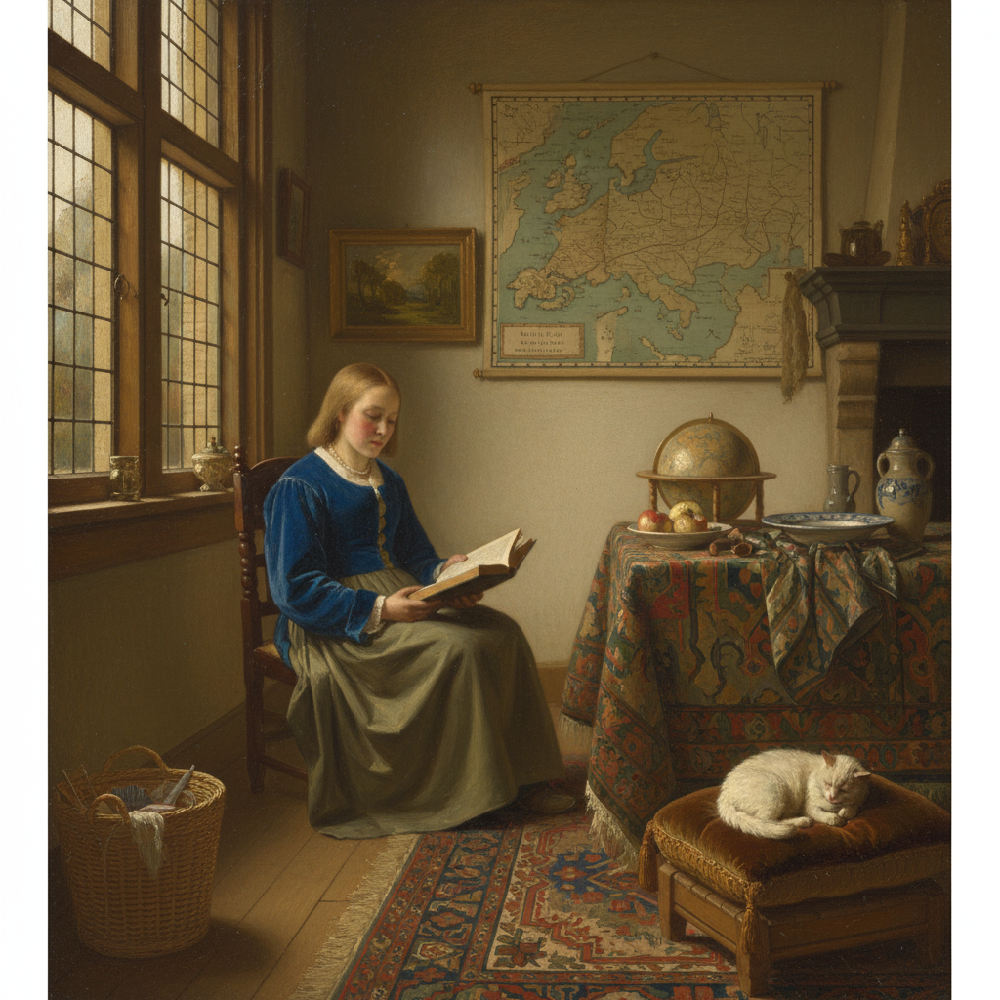

# Genre Painting 风俗画

> **时期：** 16世纪–至今  
> **关键词：** 日常生活、普通人、室内场景、叙事细节、社会记录

## 概述

Genre Painting（风俗画）描绘普通人的日常生活场景——农民的宴会、市场的喧嚣、室内的阅读、孩子的游戏。在17世纪荷兰黄金时代达到巅峰，维米尔的光线、斯滕的喧闹、德·霍赫的庭院，将平凡生活升华为永恒的诗意。它是没有英雄的史诗，记录的是一个时代的呼吸。

## 风格特征

- **日常题材**：普通人的普通时刻
- **叙事细节**：物品和姿态暗示故事
- **室内光线**：窗户光的精妙运用
- **社会观察**：阶层、职业、习俗的记录
- **小尺幅**：适合私人收藏的亲密尺度

## 代表人物与作品

- 约翰内斯·维米尔《倒牛奶的女仆》
- 扬·斯滕《欢乐家庭》
- 彼得·德·霍赫 庭院场景
- 让-巴蒂斯特·夏尔丹 厨房场景

## 概念图

