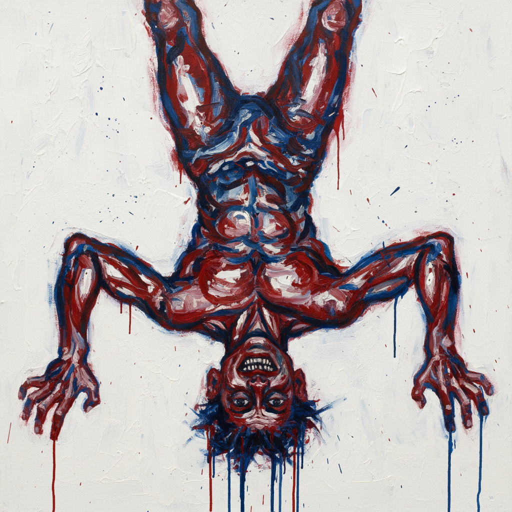

# Georg Baselitz 格奥尔格·巴塞利茨

> **流派**: 新表现主义  
> **时期**: 1938–至今 德国  
> **关键词**: 倒置画面、粗犷笔触、德国身份、反传统构图

## 概述

格奥尔格·巴塞利茨以其标志性的"倒置绘画"闻名——自1969年起，他将所有画面主题上下颠倒，迫使观者关注绘画本身而非叙事内容。他的粗犷笔触和原始力量使他成为德国新表现主义的核心人物。

## 视觉特征

- **倒置构图**: 所有形象上下颠倒呈现
- **粗犷笔触**: 宽大有力的笔触，保留绘画的物质性
- **原始色彩**: 浓烈的红、蓝、黑，不追求和谐
- **人物主题**: 英雄、农民、自画像等反复出现
- **木刻版画**: 大量粗犷有力的木刻作品

## 代表作品

- 《倒置的晚餐》(1969)
- 《橙色食者》系列 (1980s)
- 《英雄》系列 (1960s)
- 木雕系列 (1980s–至今)

## 历史影响

巴塞利茨通过倒置这一简单策略，彻底改变了观看绘画的方式。他证明了具象绘画可以同时是激进的和传统的，影响了整个新表现主义运动。

## 相关风格

- [Neo-Expressionism 新表现主义](neo-expressionism.md)
- [Anselm Kiefer 安塞尔姆·基弗](anselm-kiefer.md)
- [Willem de Kooning 威廉·德·库宁](willem-de-kooning.md)
