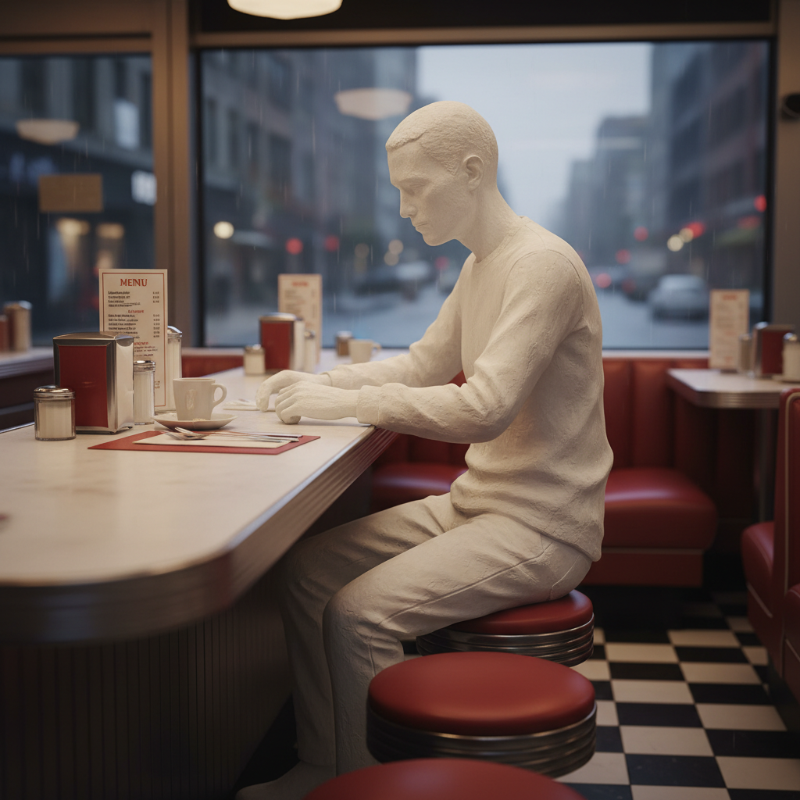

# George Segal 乔治·西格尔

> **时期：** 1924–2000  
> **关键词：** 石膏人体铸模、日常场景、白色幽灵、波普现实主义

## 概述

George Segal 是美国雕塑家，以用石膏绷带直接从真人身上翻模的白色人物雕塑闻名。这些幽灵般的白色人物被放置在真实的日常环境中——公交车站、餐厅柜台、加油站——创造出既熟悉又疏离的场景。

## 风格特征

- **石膏直接翻模**：从活人身上用石膏绷带直接取模
- **白色统一**：人物保持石膏的原始白色，如同幽灵或记忆
- **真实环境**：人物被放置在真实的家具、器具和建筑元素中
- **日常瞬间**：捕捉等车、用餐、行走等普通生活时刻
- **孤独感**：即使在群像中，每个人物都显得孤立和沉默

## 代表作品

- *Bus Riders*（1962）
- *The Diner*（1964-1966）
- *The Gas Station*（1963）
- *The Holocaust*（1982）

## 概念图

