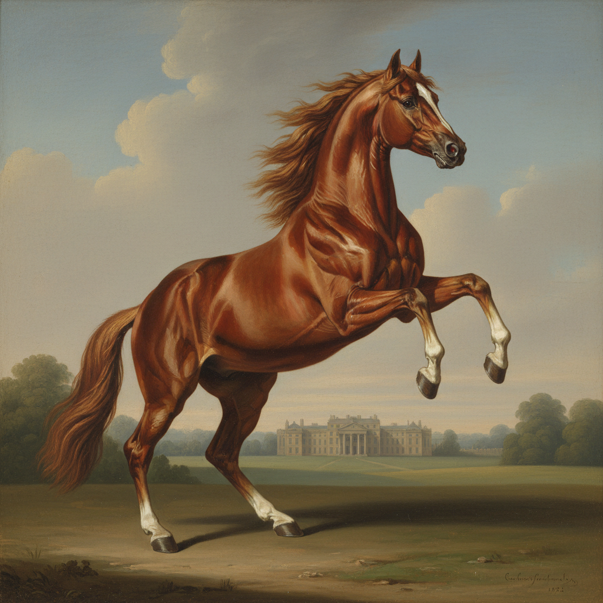

# George Stubbs 乔治·斯塔布斯

> "Nature is superior to art." — George Stubbs

## 概述

乔治·斯塔布斯（George Stubbs，1724–1806）是英国画家，以精确描绘马匹闻名，被誉为"马的画家"。他不仅是杰出的动物画家，更是一位科学家——亲自解剖马匹并出版了《马的解剖学》，将科学精确与艺术优雅完美结合，创造了英国绘画中独特的自然主义传统。

## 核心特征

| 特征 | 描述 |
|------|------|
| 马匹肖像 | 精确的马匹解剖与姿态 |
| 科学精神 | 解剖学知识的视觉应用 |
| 英国田园 | 贵族庄园的优雅风景 |
| 动物戏剧 | 狮子与马的搏斗场景 |
| 光滑表面 | 珐琅般的精细画面 |
| 自然主义 | 观察先于想象 |

## 代表作品

| 作品 | 年代 | 意义 |
|------|------|------|
| *Whistlejacket* | 1762 | 马匹肖像的巅峰 |
| *The Anatomy of the Horse* | 1766 | 科学与艺术的融合 |
| *Mares and Foals in a Landscape* | 1763–68 | 田园中的马群 |
| *A Lion Attacking a Horse* | 1770 | 自然的崇高与恐怖 |

## AI生成概念图

## 与其他风格的关系

- **British Sporting Art** → 英国运动画的奠基人
- **Natural History** → 科学插图的艺术化
- **Reynolds** → 同代英国画家
- **Romanticism** → 狮马搏斗预示浪漫主义
