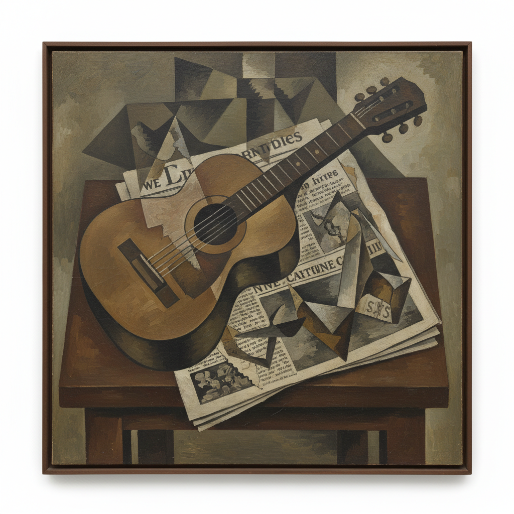

# Georges Braque 乔治·布拉克

> "Art is meant to disturb, science reassures." — Georges Braque

## 概述

乔治·布拉克（Georges Braque，1882–1963）是法国画家和雕塑家，与毕加索共同创立了立体主义。他以分析立体主义的静物画闻名——将吉他、报纸、酒瓶等日常物品分解为几何面，从多个角度同时呈现，用克制的褐色调和拼贴技法重新定义了绘画的空间观念。

## 核心特征

| 特征 | 描述 |
|------|------|
| 多视角 | 同时呈现物体的多个面 |
| 几何分解 | 将形体拆解为平面 |
| 褐色调 | 克制的赭石、灰色调色板 |
| 拼贴发明 | papier collé的创始人 |
| 静物主题 | 吉他、报纸、酒瓶 |
| 触觉空间 | 可触摸的浅浮雕空间 |

## 代表作品

| 作品 | 年代 | 意义 |
|------|------|------|
| *Houses at l'Estaque* | 1908 | 立体主义的起源 |
| *Violin and Candlestick* | 1910 | 分析立体主义的经典 |
| *Fruit Dish and Glass* | 1912 | 第一件papier collé |
| *The Studio* series | 1949–56 | 晚期的空间冥想 |

## AI生成概念图

## 与其他风格的关系

- **Cubism** → 立体主义的联合创始人
- **Picasso** → 最亲密的艺术伙伴
- **Cézanne** → 受塞尚几何化的启发
- **Collage** → 拼贴艺术的发明者
