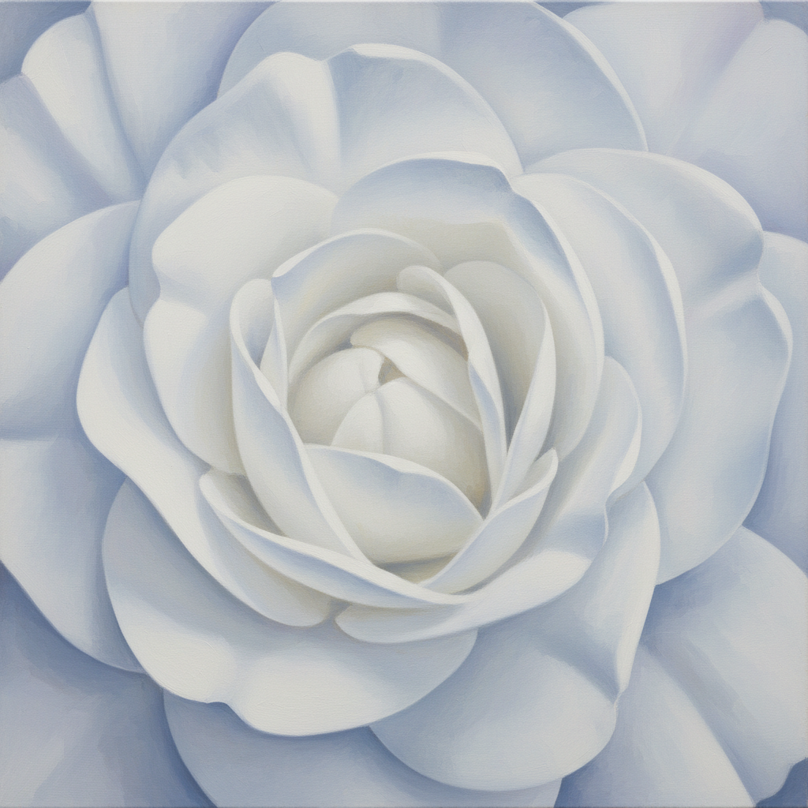

# Georgia O'Keeffe 乔治亚·奥基弗

> "I found I could say things with color and shapes that I couldn't say any other way." — Georgia O'Keeffe

## 概述

乔治亚·奥基弗（Georgia O'Keeffe，1887–1986）是美国现代主义之母，以巨幅花卉特写和新墨西哥沙漠风景闻名。她将自然形态放大到抽象的边缘，创造出既感性又精神性的视觉语言。

## 核心特征

| 特征 | 描述 |
|------|------|
| 花卉特写 | 将花朵放大至充满整个画面 |
| 沙漠骨骼 | 动物骨骼与荒漠的精神景观 |
| 有机抽象 | 自然形态的简化与放大 |
| 纯净色彩 | 干净、饱和、层次分明 |
| 极简构图 | 去除一切多余细节 |
| 精神性 | 通过自然形态表达超越性 |

## 代表作品

| 作品 | 年代 | 意义 |
|------|------|------|
| *Jimson Weed/White Flower No. 1* | 1932 | 花卉特写的极致 |
| *Ram's Head White Hollyhock and Little Hills* | 1935 | 沙漠精神的象征 |
| *Sky Above Clouds IV* | 1965 | 从飞机上看到的无限 |
| *Black Iris* | 1926 | 花卉与抽象的边界 |

## AI生成概念图

## 与其他风格的关系

- **American Modernism** → 美国现代主义的核心人物
- **Abstract Art** → 从具象到抽象的桥梁
- **Minimalism** → 极简美学的先驱
- **Stieglitz Circle** → 与摄影师斯蒂格利茨的艺术伙伴关系
