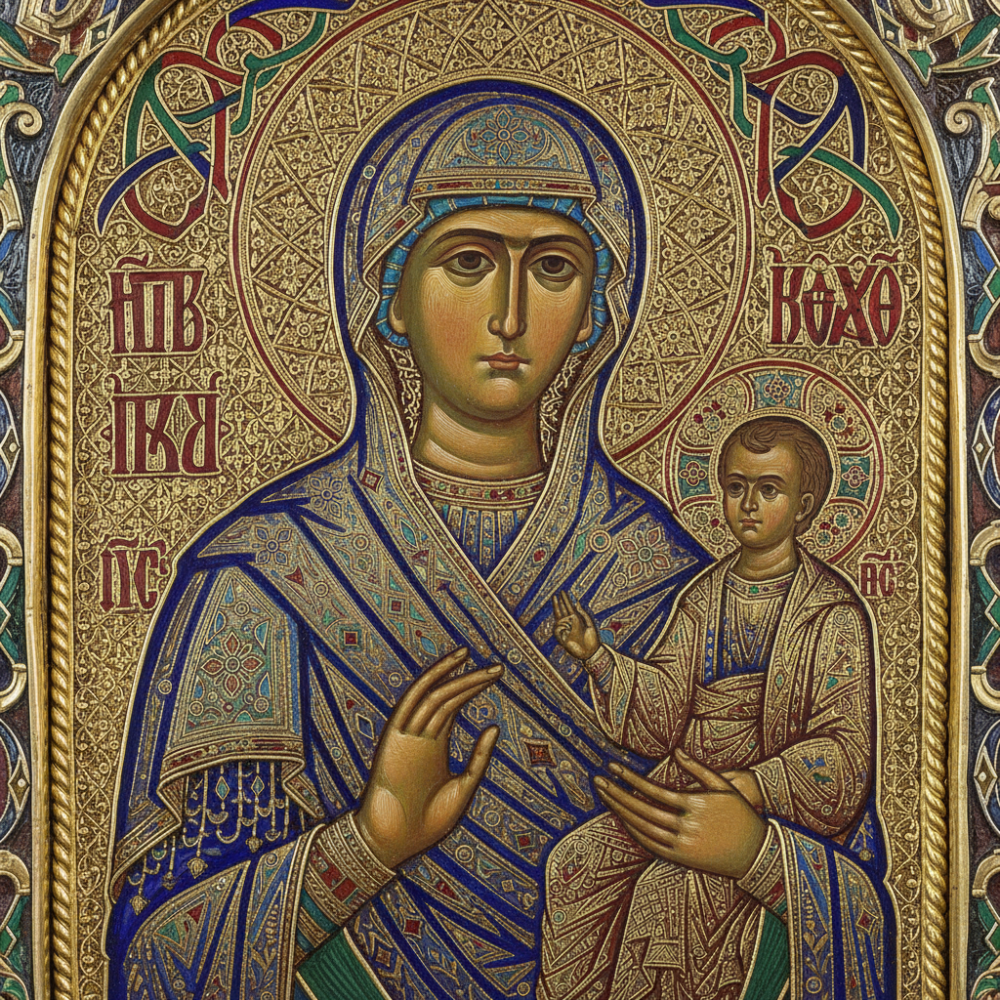

# Georgian Cloisonné Enamel 格鲁吉亚掐丝珐琅

> **"金丝围出的色彩宇宙——高加索山脉中的拜占庭光辉。"**

## 概述

格鲁吉亚掐丝珐琅（ქართული მინანქარი / Georgian Cloisonné Enamel）是中世纪格鲁吉亚最辉煌的艺术成就之一，在8至12世纪达到巅峰。这种技艺将极细的金丝焊接在金属底板上形成隔间（cloisons），再填入彩色玻璃粉烧制而成。格鲁吉亚珐琅以其色彩的纯净度、金丝的精细度和构图的优雅著称，被认为是中世纪世界最精美的珐琅艺术之一。哈赫利圣像（Khakhuli Triptych）是现存最大的中世纪珐琅作品。

## 核心技法

1. **金底板准备**：纯金薄板作为基底
2. **金丝弯曲**：极细金丝（0.3mm）弯成图案轮廓
3. **焊接固定**：金丝焊接到底板上形成隔间
4. **填充珐琅**：研磨的彩色玻璃粉填入隔间
5. **高温烧制**：800°C以上烧制使玻璃粉熔化
6. **多次烧制**：通常需要3-5次烧制达到理想效果
7. **打磨抛光**：最终打磨至光滑平面

## 色彩体系

| 颜色 | 特征 |
|------|------|
| 深蓝 | 格鲁吉亚珐琅的标志色，极纯净 |
| 翠绿 | 透明质感，宝石般光泽 |
| 红色 | 不透明朱红，用于衣饰 |
| 白色 | 不透明，用于面部和高光 |
| 金色 | 金丝本身和金底板的光泽 |
| 紫色 | 稀有色，用于皇室和神圣主题 |

## 主要作品

| 作品 | 时期 | 特征 |
|------|------|------|
| 哈赫利三联画 Khakhuli | 12世纪 | 现存最大中世纪珐琅，115块珐琅片 |
| 马尔特维利圣母 | 10世纪 | 精美的圣母像珐琅 |
| 贝迪亚圣杯 Bedia Chalice | 11世纪 | 格鲁吉亚国王奉献 |
| 各类圣像框 | 8–12世纪 | 装饰圣像画的珐琅边框 |

## 视觉特征

- 极细金丝勾勒的精密轮廓
- 纯净透明的宝石般色彩
- 金色底板的温暖光泽
- 圣人面容的程式化但优雅的表现
- 植物纹和几何纹的精美边框
- 小尺寸中的极高精细度

## 与其他风格的关系

| 风格 | 关系 |
|------|------|
| 拜占庭珐琅 | 共享技术传统，格鲁吉亚独立发展 |
| 亚美尼亚金属工艺 | 高加索地区的姊妹传统 |
| 中国景泰蓝 | 共享掐丝珐琅技法（独立发明） |
| 日本七宝烧 | 共享珐琅技术的东方变体 |
| 利摩日珐琅 | 西欧的珐琅传统 |

## 概念图

---

*浮光艺志 | Chronicle of Artistry*
