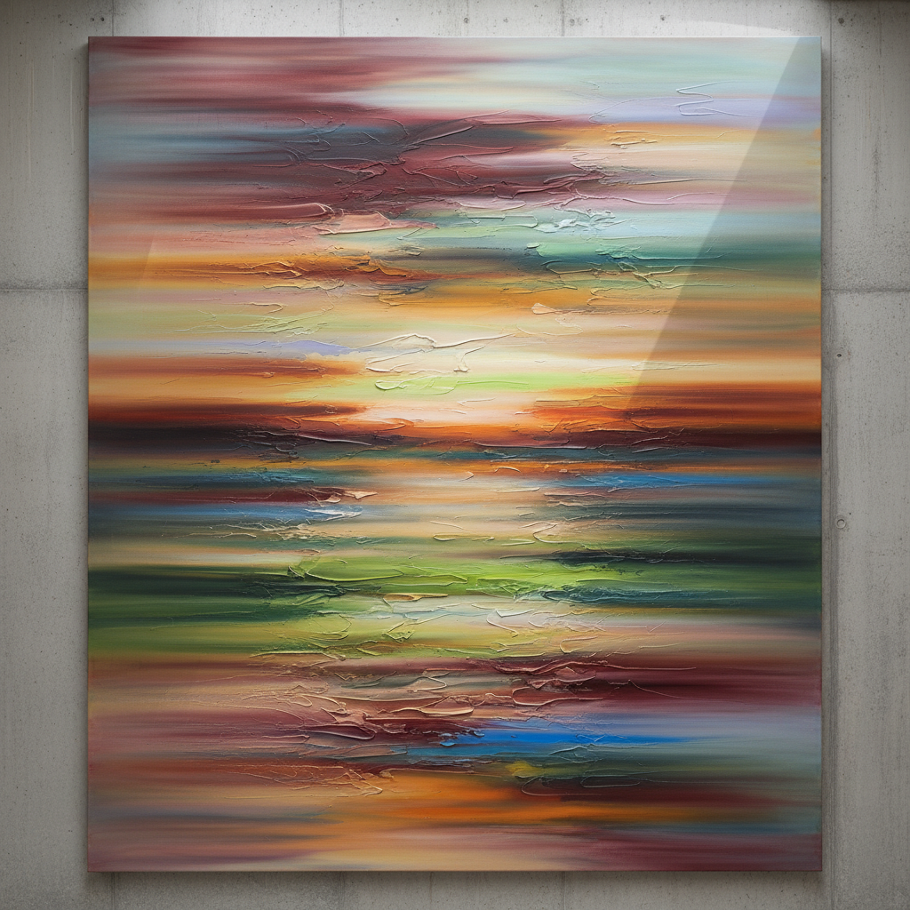

# Gerhard Richter 格哈德·里希特

> "I have nothing to say and I am saying it." — Gerhard Richter

## 概述

格哈德·里希特（Gerhard Richter，1932–）是德国画家，被广泛认为是在世最重要的艺术家之一。他以极端的风格多样性闻名——从照片写实主义到纯粹抽象，从灰色单色画到彩色刮刀画，系统性地质疑绘画、摄影和图像之间的关系，拒绝任何单一风格的束缚。

## 核心特征

| 特征 | 描述 |
|------|------|
| 照片绘画 | 模糊的照片写实主义 |
| 刮刀抽象 | 巨型刮板创造的色彩层 |
| 灰色画 | 单色灰的虚无主义 |
| 风格跳跃 | 系统性地拒绝固定风格 |
| 图像怀疑 | 质疑所有图像的真实性 |
| 色表 | Color Chart系列的随机色彩 |

## 代表作品

| 作品 | 年代 | 意义 |
|------|------|------|
| *Betty* | 1988 | 照片绘画的经典 |
| *Abstract Painting (809-4)* | 1994 | 刮刀抽象的巅峰 |
| *October 18, 1977* | 1988 | 历史与图像的沉重对话 |
| *4096 Colours* | 1974 | 色彩的系统性排列 |

## AI生成概念图

## 与其他风格的关系

- **Photo-Realism** → 照片绘画的独特路径
- **Abstract Expressionism** → 刮刀画的抽象传统
- **Conceptual Art** → 系统性的图像质疑
- **Pop Art** → 对大众图像的冷静处理
