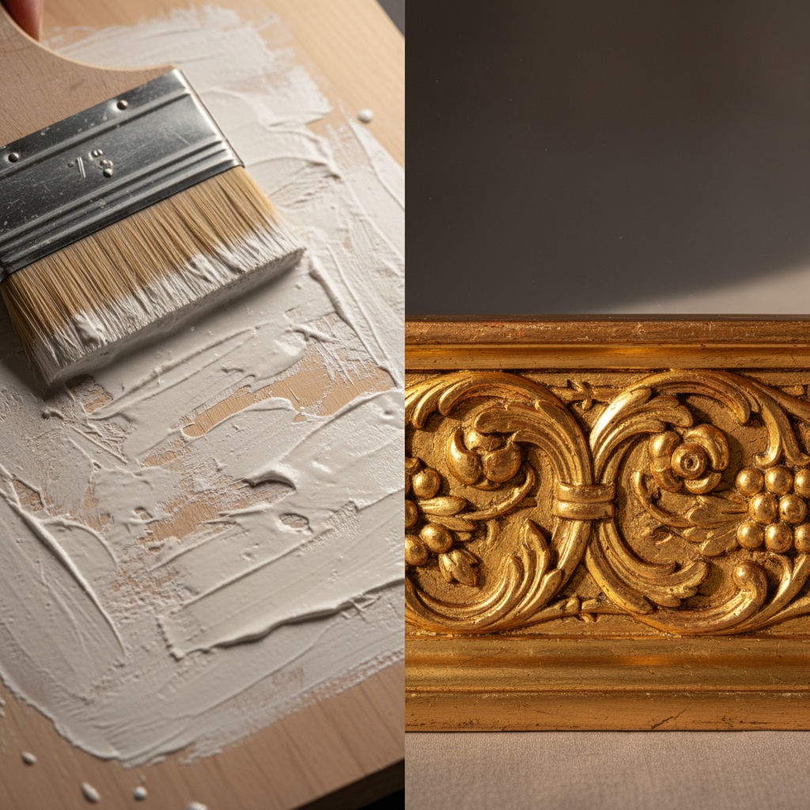

# Gesso Art 石膏底料艺术

> "Gesso is the silent foundation — layers of chalk and glue brushed onto wood or canvas create a luminous white ground that accepts paint with a brilliance impossible on raw material. But gesso is also a medium in its own right: carved, molded, and gilded, it becomes the raised ornament on altarpieces and frames, transforming flat surfaces into sculptural fields of light." — Unknown

## 概述

石膏底料艺术（Gesso Art）是一种使用石膏底料（gesso，由石膏粉或白垩粉与胶水混合制成）作为绘画底层或独立装饰材料的艺术技法。石膏底料既是绘画的基础准备层——为油画和蛋彩画提供光滑白色的底面，也是一种独立的装饰媒介——通过雕刻、模塑和镀金创造浮雕装饰。

石膏底料艺术的实践包括：1）底层涂布——在木板或画布上涂布多层石膏底料；2）打磨——将石膏层打磨至光滑；3）雕刻石膏——在厚石膏层上雕刻图案；4）模塑石膏——用模具压制浮雕图案；5）镀金底层——作为贴金箔的底层；6）纹理创造——用石膏创造各种表面纹理；7）当代石膏艺术——将传统技法与现代创作结合。

## 核心特征

| 特征 | 描述 |
|------|------|
| 基础 | 绘画的基础底层 |
| 白色 | 纯白的发光底面 |
| 可塑 | 可雕刻和模塑 |
| 镀金 | 贴金箔的底层 |
| 多层 | 多层涂布和打磨 |
| 传统 | 数百年的传统 |

## 视觉特征

- **白色**：纯白发光的底面
- **光滑**：光滑如瓷的表面
- **浮雕**：雕刻的浮雕效果
- **纹理**：各种表面纹理
- **金色**：与金箔的结合
- **深度**：多层创造的深度

## 代表作品

| 作品 | 艺术家/文化 | 年代 | 意义 |
|------|-------------|------|------|
| *Italian altarpiece grounds* | 意大利 | 中世纪-文艺复兴 | 意大利祭坛画底层 |
| *Gilded frame gesso* | 欧洲 | 文艺复兴起 | 镀金画框石膏装饰 |
| *Icon painting grounds* | 拜占庭/俄罗斯 | 中世纪 | 圣像画石膏底层 |
| *Contemporary gesso art* | 国际 | 当代 | 当代石膏艺术 |
| *Mixed media gesso* | 国际 | 当代 | 混合媒体石膏 |

## 历史时间线

| 时期 | 事件 |
|------|------|
| 古埃及 | 石膏底层的早期使用 |
| 中世纪 | 蛋彩画石膏底层的标准化 |
| 文艺复兴 | 石膏底层技法的完善 |
| 20世纪 | 丙烯石膏底料的发明 |
| 当代 | 石膏作为独立艺术媒介 |

## 中国语境

石膏底料在中国的绘画和装饰中有一定的应用。中国传统绘画以宣纸和绢为底——不使用西方式的石膏底料，但中国的漆器底层（灰底）与石膏底料有相似的功能。中国的油画教育中，石膏底料作为油画准备的基础技法——在各大美术院校教授。中国当代的综合材料艺术家将石膏底料作为创作媒介——利用其纹理和可塑性进行创作。中国的古建筑修复中，石灰和石膏——用于壁画和装饰的底层修复。中国的画框制作中，石膏底料——用于制作镀金画框的浮雕装饰。

## AI生成概念图

## 与其他风格的关系

- **Gilding** → 镀金
- **Tempera** → 蛋彩画
- **Oil Painting** → 油画
- **Relief** → 浮雕
- **Icon Painting** → 圣像画
- **Mixed Media** → 混合媒体

---

*浮光艺志 | Chronicle of Artistry*
