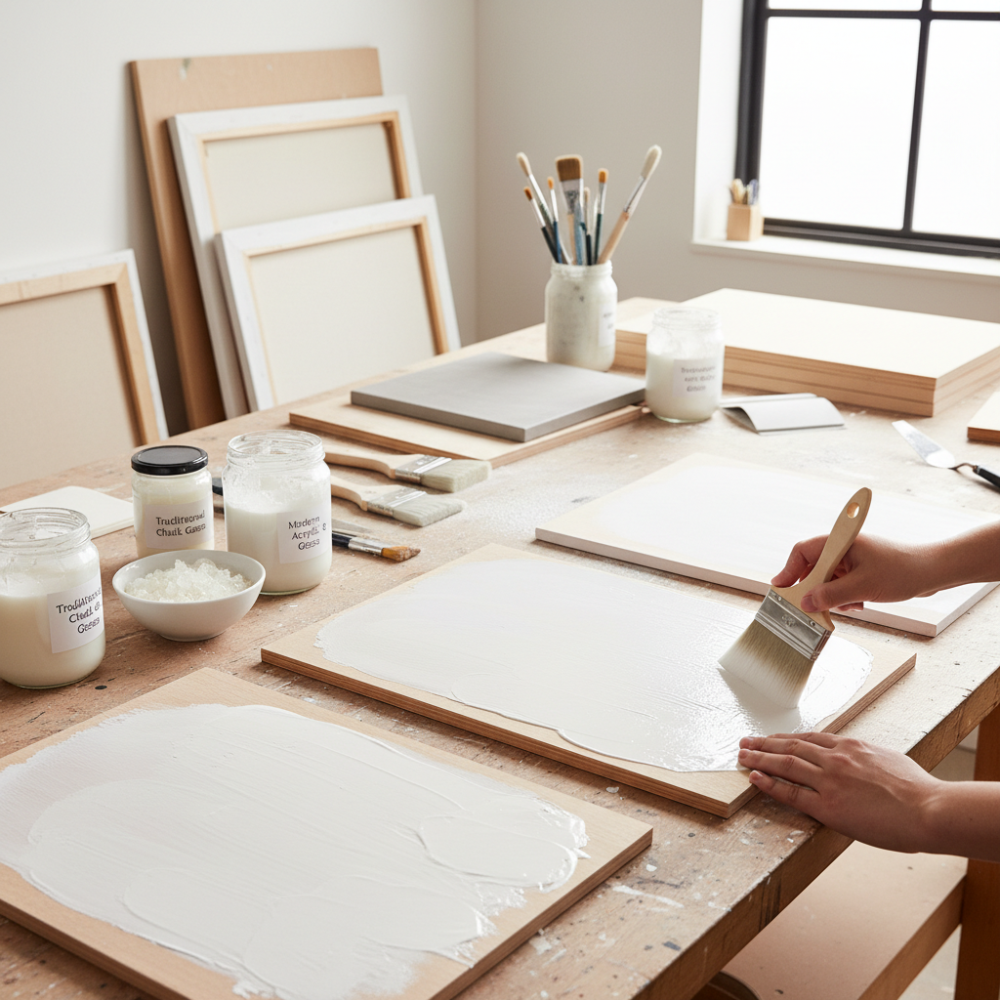

# Gesso Preparation 石膏底准备

> "Gesso is the painter's foundation — a luminous white ground that transforms raw canvas or wood into a surface worthy of receiving paint, its absorbency and tooth determining how every subsequent layer will behave for centuries to come." — Unknown

## 概述

石膏底准备（Gesso Preparation）是绑画前在画布、木板或其他支撑物上涂覆底料的准备工艺。传统石膏底（true gesso）由动物胶（rabbit skin glue）和白垩粉（chalk/whiting）或石膏粉（gypsum）混合而成，涂覆在木板上形成光滑、坚硬、吸收性强的白色表面。现代丙烯石膏底（acrylic gesso）由丙烯聚合物、碳酸钙和二氧化钛组成，可以用于画布和木板。

石膏底的作用是：保护支撑物不受颜料中油脂或酸性物质的侵蚀、提供适当的吸收性和"牙口"（tooth）使颜料能附着、提供明亮的白色基底使颜料色彩更加鲜艳。石膏底的质量直接影响画作的耐久性——许多古代画作能保存数百年，很大程度上归功于精心准备的石膏底。

## 核心特征

| 特征 | 描述 |
|------|------|
| 底料 | 绘画的底层准备 |
| 白色 | 明亮的白色基底 |
| 保护 | 保护支撑物 |
| 附着 | 提供颜料附着力 |
| 耐久 | 确保画作耐久 |
| 基础 | 所有绘画的基础 |

## 视觉特征

- **白色**：明亮的白色表面
- **光滑**：光滑或有纹理
- **均匀**：均匀的涂层
- **吸收**：适当的吸收性
- **牙口**：适当的表面粗糙度
- **发光**：底层的发光感

## 代表作品

| 作品 | 艺术家 | 年代 | 意义 |
|------|--------|------|------|
| *Medieval panel paintings* | Various | 中世纪 | 传统石膏底的典范 |
| *Renaissance panels* | Various | 15-16世纪 | 文艺复兴石膏底 |
| *Icon painting grounds* | Various | 传统 | 圣像画石膏底 |
| *Contemporary gesso art* | Various | 当代 | 石膏底作为艺术元素 |
| *Textured gesso surfaces* | Various | 当代 | 纹理石膏底 |

## 历史时间线

| 时期 | 事件 |
|------|------|
| 古代 | 早期底料的使用 |
| 中世纪 | 传统石膏底的标准化 |
| 文艺复兴 | 石膏底技法的完善 |
| 19世纪 | 商业预制画布的出现 |
| 1950s | 丙烯石膏底的发明 |
| 当代 | 多种石膏底产品的选择 |

## 中国语境

石膏底准备在中国的油画教育中是基础课程之一。中国的美术院校油画系教授传统和现代石膏底的制作方法。中国的油画家对石膏底的质量有较高要求——一些画家自己制作石膏底以获得理想的表面效果。中国市场上有多种丙烯石膏底品牌。中国的一些当代艺术家将石膏底本身作为艺术表达的元素——利用石膏底的纹理和层次创作作品。

## AI生成概念图

## 与其他风格的关系

- **Imprimatura** → 有色底层
- **Oil Painting** → 油画
- **Tempera Painting** → 蛋彩画
- **Icon Painting** → 圣像画
- **Canvas Preparation** → 画布准备
- **Panel Painting** → 木板画

---

*浮光艺志 | Chronicle of Artistry*
