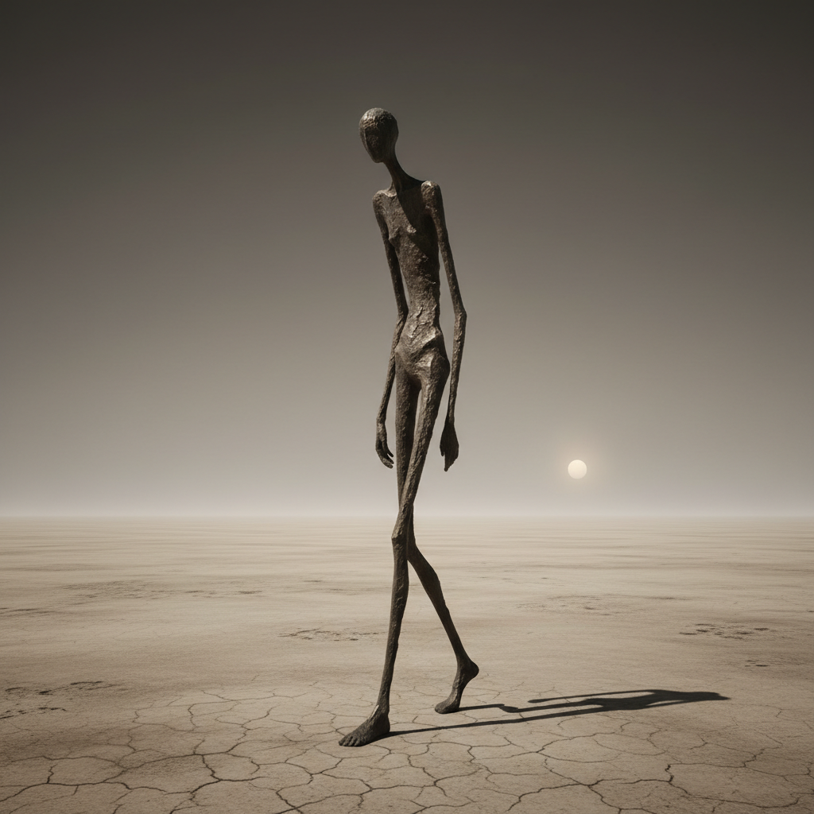

# Alberto Giacometti 贾科梅蒂

> "The more I work, the more I see things differently." — Alberto Giacometti

## 概述

阿尔贝托·贾科梅蒂（Alberto Giacometti，1901–1966）是瑞士雕塑家和画家，以极度细长的人物雕塑闻名。他的作品捕捉了战后人类的存在焦虑——孤独的、被空间吞噬的、永远在远处的人形，成为存在主义哲学的视觉化身。

## 核心特征

| 特征 | 描述 |
|------|------|
| 极度细长 | 人物被拉伸至几乎消失 |
| 粗糙表面 | 布满指痕和刮痕的青铜 |
| 孤独感 | 单独或彼此疏离的人物 |
| 空间吞噬 | 巨大的底座强调渺小 |
| 行走姿态 | 永远在走却永远到不了 |
| 正面凝视 | 画作中巨大的眼睛 |

## 代表作品

| 作品 | 年代 | 意义 |
|------|------|------|
| *Walking Man I* | 1960 | 存在主义的视觉象征 |
| *City Square* | 1948 | 都市中的孤独群体 |
| *The Chariot* | 1950 | 移动中的静止 |
| *Diego (bust)* | 1954 | 对弟弟的无尽凝视 |

## AI生成概念图

## 与其他风格的关系

- **Existentialism** → 萨特称他为存在主义艺术家
- **Surrealism** → 早期参与超现实主义运动
- **Rodin** → 继承并颠覆了罗丹的雕塑传统
- **Francis Bacon** → 同代人，共享对人体的焦虑表达
