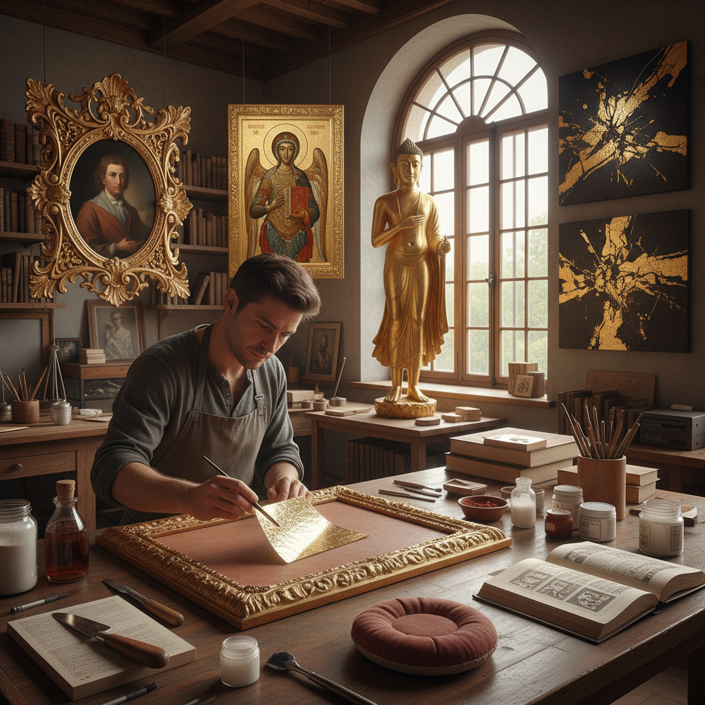

# Gilding Art 鎏金艺术

> "Gilding is the art of making the ordinary transcendent — applying the thinnest possible layer of gold to surfaces of wood, metal, or stone, transforming humble materials into objects that catch and hold light like captured sunlight, each leaf so thin it floats on breath yet so permanent it outlasts the centuries, proving that beauty needs only the merest touch of precious metal to become eternal." — Unknown

## 概述

鎏金艺术（Gilding）是一种将极薄的金层（金箔、金粉或金汞合金）附着在其他材料表面的装饰技法。Gilding的目的是赋予物体金色的外观和光泽，而不需要使用实心金材料。Gilding有多种技法：水鎏金（water gilding，使用金箔和胶水）、油鎏金（oil gilding，使用金箔和油性粘合剂）、火鎏金（fire gilding/mercury gilding，使用金汞合金）和电镀金（electrogilding）。

Gilding的历史极其悠久——古埃及人在公元前2000年就已经掌握了金箔鎏金技术。在几乎所有的古代文明中，鎏金都被用于宗教建筑、雕塑、家具和书籍装饰。水鎏金是最精细的技法——需要先涂多层石膏底（gesso），然后涂红色底漆（bole），用水润湿后贴上金箔，最后用玛瑙石抛光（burnishing），使金箔呈现镜面般的光泽。

## 核心特征

| 特征 | 描述 |
|------|------|
| 金层 | 极薄的金属层 |
| 装饰 | 装饰性的表面处理 |
| 光泽 | 金色的光泽效果 |
| 多技法 | 多种鎏金技法 |
| 永久 | 金不氧化不褪色 |
| 神圣 | 宗教和皇家象征 |

## 视觉特征

- **金色**：纯金的色彩
- **光泽**：镜面般的光泽
- **温暖**：温暖的金色调
- **神圣**：神圣的视觉效果
- **对比**：金色与底色的对比
- **永恒**：永不褪色的金色

## 代表作品

| 作品 | 艺术家 | 年代 | 意义 |
|------|--------|------|------|
| *Egyptian gilded sarcophagi* | 古埃及工匠 | 公元前14世纪 | 图坦卡蒙金棺 |
| *Byzantine gold icons* | 拜占庭工匠 | 6-15世纪 | 拜占庭金色圣像 |
| *Versailles gilded interiors* | 法国工匠 | 17世纪 | 凡尔赛宫鎏金装饰 |
| *Illuminated manuscripts* | 中世纪抄写员 | 中世纪 | 泥金手抄本 |
| *Japanese gold lacquer* | 日本工匠 | 传统 | 日本莳绘金漆 |

## 历史时间线

| 时期 | 事件 |
|------|------|
| 公元前2000年 | 古埃及鎏金的起源 |
| 古希腊罗马 | 火鎏金技术的发展 |
| 中世纪 | 泥金手抄本和教堂鎏金 |
| 文艺复兴-巴洛克 | 鎏金装饰的鼎盛 |
| 当代 | 鎏金的传承与创新 |

## 中国语境

鎏金在中国有极其悠久和辉煌的传统。中国的火鎏金（金汞合金鎏金）技术在战国时期就已经成熟。中国的佛教造像大量使用鎏金——"金身"是佛像的标准装饰。中国的宫殿建筑（如故宫）中有大量鎏金装饰。中国的漆器传统中有"描金"和"洒金"技法。中国的鎏金铜器是重要的文物品类。当代中国的古建筑修复中仍然使用传统鎏金技法。

## AI生成概念图

## 与其他风格的关系

- **Gold Leaf** → 金箔
- **Illumination** → 泥金装饰
- **Lacquerwork** → 漆器
- **Decorative Arts** → 装饰艺术
- **Religious Art** → 宗教艺术
- **Metalwork** → 金属工艺

---

*浮光艺志 | Chronicle of Artistry*
