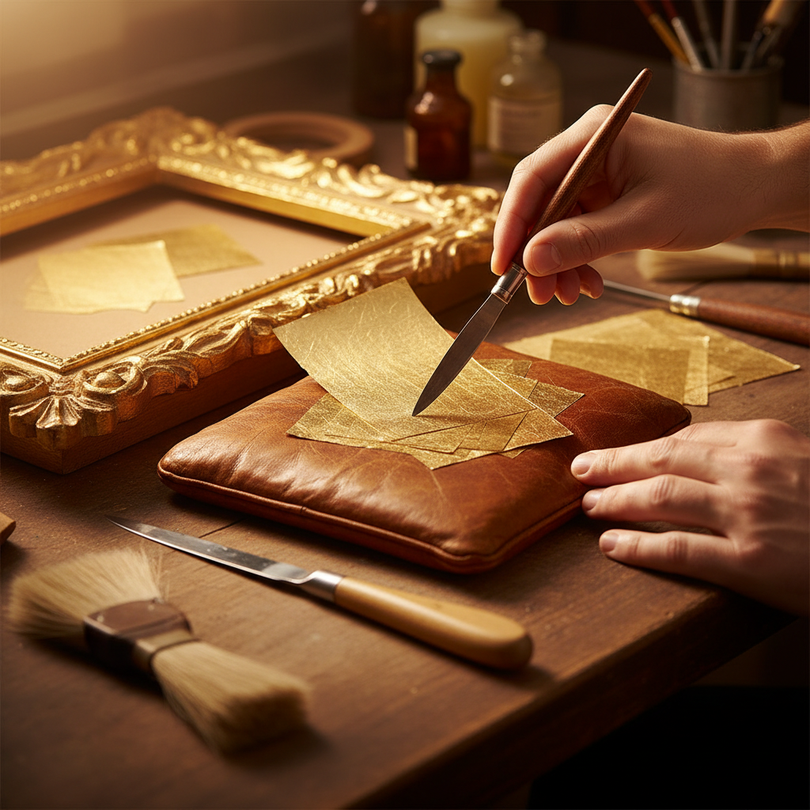

# Gilding 鎏金术

> "Gold is the light of the sun made solid — gilding brings that light to art." — Unknown

## 概述

鎏金术（Gilding）是将极薄的金箔或金粉应用到物体表面的装饰技法。从古埃及法老的面具到拜占庭的圣像画，从文艺复兴的祭坛画到日本的金阁寺，从中世纪手抄本的金色字母到当代艺术家的金箔实验，鎏金术以其永恒的光泽和神圣的象征意义贯穿了人类文明的始终。

鎏金的哲学在于：金是不朽的——它不氧化、不褪色、不腐蚀，因此成为永恒、神圣和至高价值的完美象征。

## 核心特征

| 特征 | 描述 |
|------|------|
| 金箔 | 使用极薄的金箔（约0.1微米） |
| 光泽 | 永恒的金色光泽 |
| 神圣 | 象征神圣和永恒 |
| 精细 | 极其精细的操作 |
| 持久 | 金不氧化不褪色 |
| 装饰 | 强烈的装饰效果 |

## 视觉特征

- **光泽**：金属的温暖光泽
- **反射**：随角度变化的反射
- **对比**：金色与其他颜色的对比
- **质感**：金箔的微妙褶皱质感
- **神圣**：神圣和庄严的氛围
- **温暖**：温暖的金色调

## 代表作品

| 作品 | 艺术家 | 年代 | 意义 |
|------|--------|------|------|
| *Tutankhamun's mask* | 匿名 | 公元前1323年 | 古埃及鎏金 |
| *Byzantine icons* | 匿名 | 6-15世纪 | 金底圣像画 |
| *Book of Kells* | 匿名 | 约800年 | 手抄本鎏金 |
| *The Kiss* | Gustav Klimt | 1907-08 | 现代金箔绘画 |
| *Kinkaku-ji* | — | 1397 | 日本金阁寺 |
| *Contemporary gold leaf* | Various | 2000s+ | 当代金箔艺术 |

## 历史时间线

| 时期 | 事件 |
|------|------|
| 古埃及 | 最早的鎏金实践 |
| 古罗马 | 建筑和雕塑的鎏金 |
| 中世纪 | 手抄本和圣像的金底 |
| 文艺复兴 | 祭坛画的金色背景 |
| 巴洛克 | 教堂和宫殿的大量鎏金 |
| 1900s | Klimt——现代金箔绘画 |
| 当代 | 金箔在当代艺术中的复兴 |

## 中国语境

鎏金在中国有极其悠久的历史——中国的鎏金铜器可追溯到战国时期。中国传统的贴金、描金、洒金等技法广泛应用于佛像、建筑、漆器和书画。故宫的金碧辉煌就是鎏金术的集大成。当代中国艺术家也在探索金箔与当代艺术的结合。

## AI生成概念图

## 与其他风格的关系

- **Icon Painting** → 圣像画大量使用金底
- **Illuminated Manuscript** → 手抄本的金色装饰
- **Byzantine Art** → 拜占庭的金色马赛克
- **Art Nouveau** → 新艺术运动的金色装饰（Klimt）
- **Lacquerware** → 漆器的描金和洒金
- **Religious Art** → 宗教艺术的神圣象征

---

*浮光艺志 | Chronicle of Artistry*
