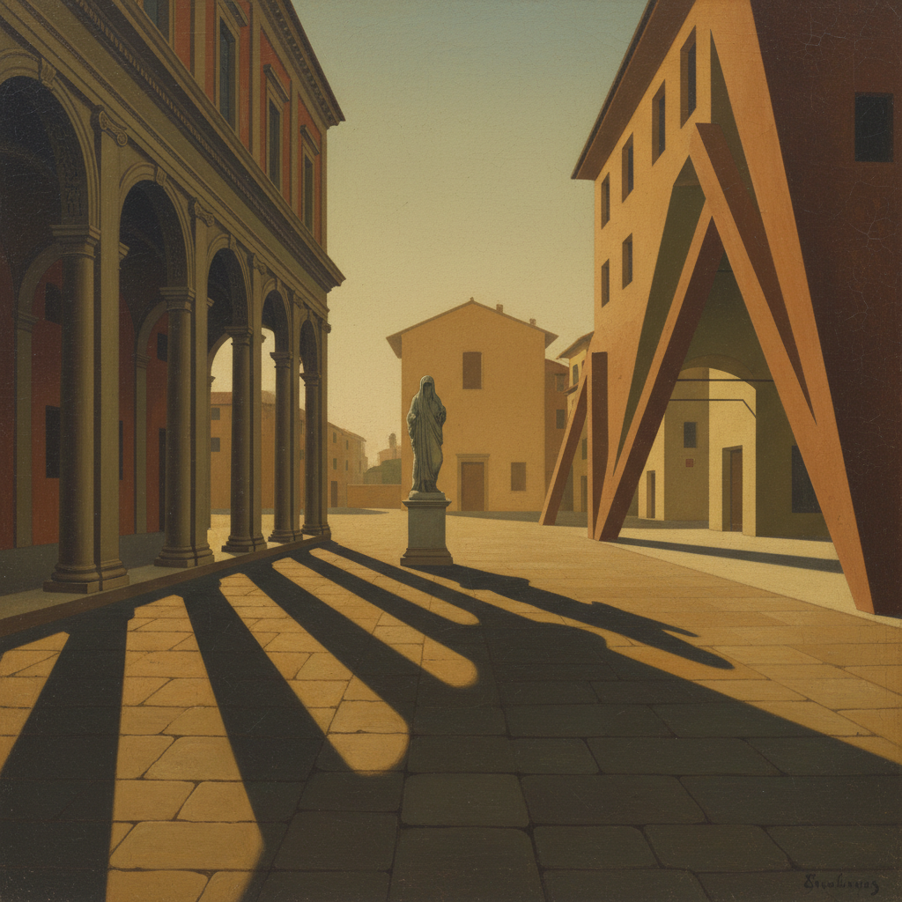

# Giorgio de Chirico 基里科

> "To become truly immortal, a work of art must escape all human limits." — Giorgio de Chirico

## 概述

乔治·德·基里科（Giorgio de Chirico，1888–1978）是意大利画家，形而上绘画（Pittura Metafisica）的创始人。他以描绘空旷的意大利广场闻名——长长的阴影、古典拱廊、孤独的雕像和不合逻辑的透视，创造出一种梦境般的不安感，直接启发了超现实主义运动。

## 核心特征

| 特征 | 描述 |
|------|------|
| 空旷广场 | 无人的意大利城市空间 |
| 长阴影 | 午后斜阳的不安感 |
| 古典拱廊 | 文艺复兴建筑的幽灵 |
| 不合逻辑 | 矛盾的透视和比例 |
| 人体模型 | 无面孔的裁缝人偶 |
| 时间停滞 | 钟表和火车的静止 |

## 代表作品

| 作品 | 年代 | 意义 |
|------|------|------|
| *The Mystery and Melancholy of a Street* | 1914 | 形而上绘画的经典 |
| *The Song of Love* | 1914 | 超现实主义的预言 |
| *The Disquieting Muses* | 1917 | 人体模型的不安 |
| *Piazza d'Italia* series | 1913–15 | 空旷广场的系列 |

## AI生成概念图

## 与其他风格的关系

- **Metaphysical Art** → 形而上绘画的创始人
- **Surrealism** → 直接启发了超现实主义
- **Dalí/Magritte** → 影响了达利和马格利特
- **Postmodernism** → 后现代建筑的视觉源头
