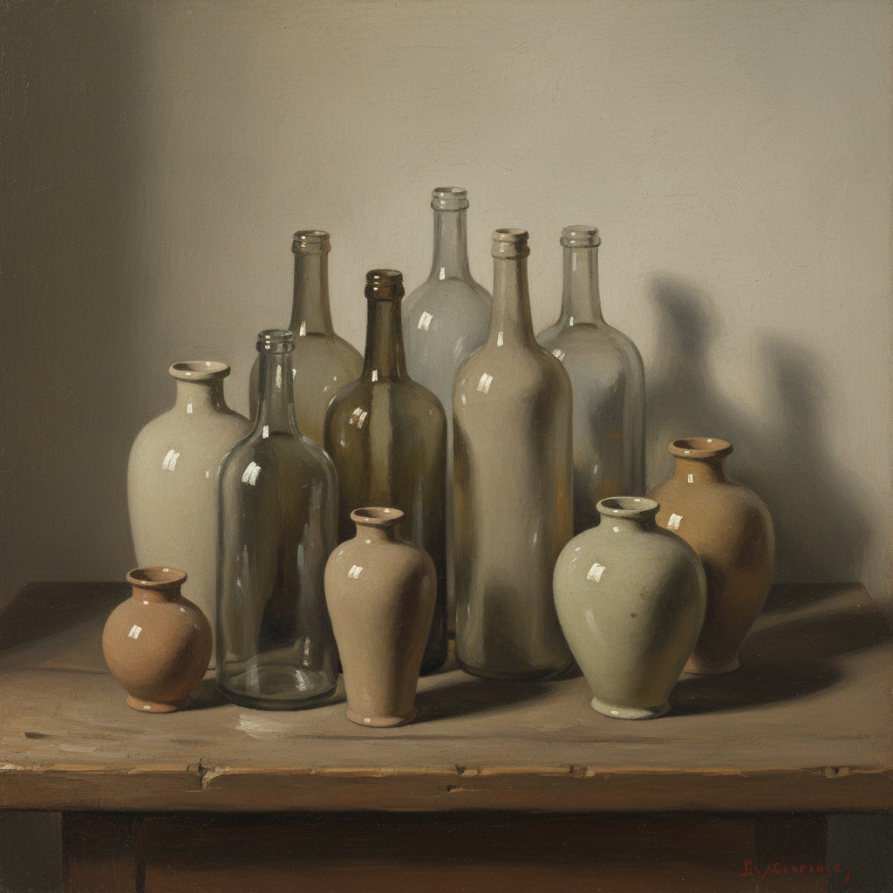

# Giorgio Morandi 乔治·莫兰迪

> **流派**: 形而上画派 · 静物画  
> **时期**: 1890–1964 意大利  
> **关键词**: 瓶罐静物、灰调色彩、沉默诗意、极简构图

## 概述

莫兰迪一生几乎只画一个主题——工作室里的瓶子、罐子和盒子。他用极其微妙的灰色调和精密的构图，将这些日常物品转化为冥想般的存在。他的"莫兰迪色"已成为当代设计和室内装饰的经典色彩体系。

## 视觉特征

- **灰调色彩**: 所有颜色都被加入灰度，形成柔和统一的调性
- **瓶罐主题**: 反复描绘相同的几何形瓶子和容器
- **紧密排列**: 物体彼此靠近，形成整体的建筑感
- **柔和光线**: 均匀的漫射光，没有强烈的明暗对比
- **沉默感**: 画面极度安静，时间仿佛凝固

## 代表作品

- 《静物》系列 (1920s–1960s)
- 《风景》系列 (1930s–1960s)
- 版画作品 (1920s–1960s)

## 历史影响

莫兰迪证明了伟大的艺术不需要宏大的主题。他的色彩哲学深刻影响了当代设计、建筑和室内装饰领域，"莫兰迪色"已成为一种全球性的审美语言。

## 相关风格

- [Giorgio de Chirico 乔治·德·基里科](giorgio-de-chirico.md)
- [Minimalism 极简主义](minimalism.md)
- [Wabi-Sabi 侘寂](wabi-sabi.md)
