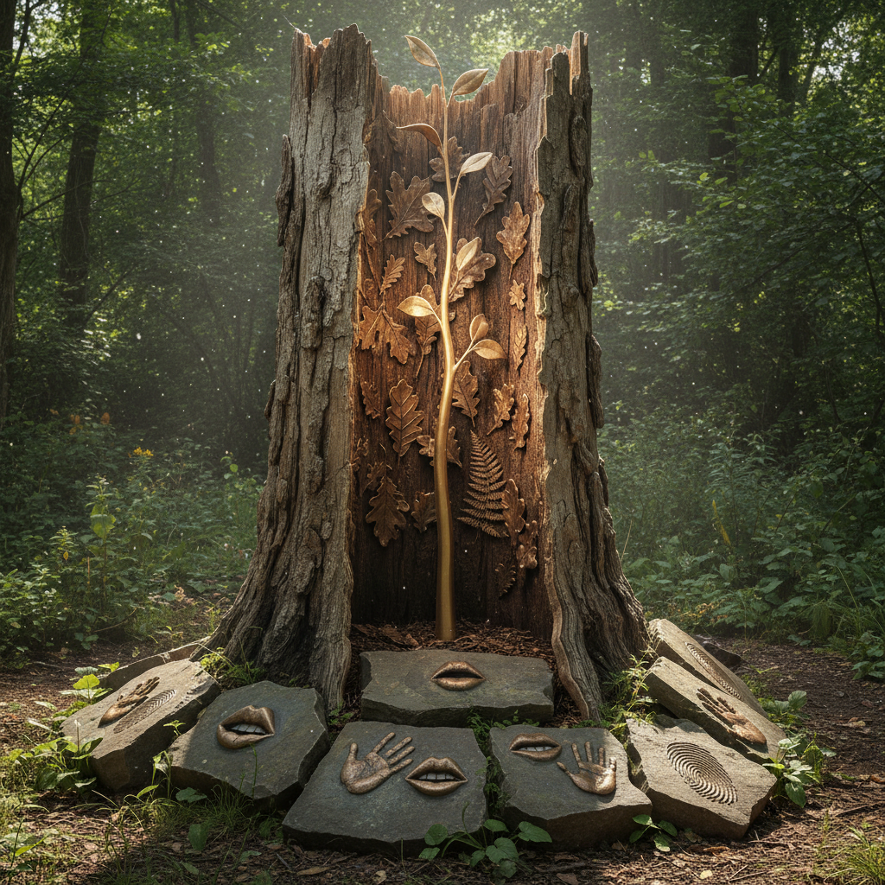

# Giuseppe Penone 朱塞佩·佩诺内

> **时期：** 1947–至今  
> **关键词：** 贫穷艺术、树木雕塑、身体印记、自然过程

## 概述

Giuseppe Penone 是意大利艺术家，贫穷艺术（Arte Povera）运动的核心成员。他的作品探索人体与自然之间的深层联系——将树木雕刻回其年轻时的形态、用青铜铸造呼吸、在石头上留下手指的压痕——揭示生长、时间和触觉的诗意。

## 风格特征

- **树木雕塑**：从工业木材中雕刻出隐藏的年轻树木
- **身体印记**：手指、皮肤、呼吸在材料上留下痕迹
- **自然过程**：生长、侵蚀、光合作用成为创作手段
- **触觉诗学**：触摸作为认知世界的方式
- **时间可见化**：让不可见的时间流逝变得可触可感

## 代表作品

- *Alpi Marittime*（1968）
- *Albero di 12 metri*（1980–2012）
- *Respirare l'ombra*（1999）
- *Idee di pietra*（2003–至今）

## 概念图

