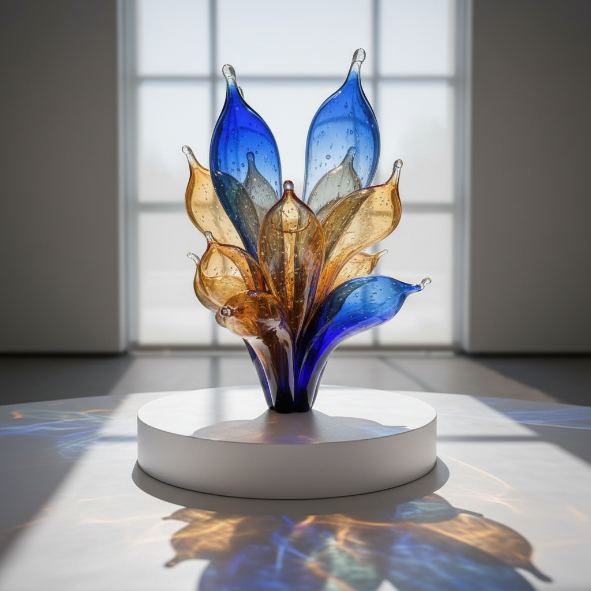

# Glass Art 玻璃艺术

> "Glass is the most magical of all materials. It transmits light in a special way." — Dale Chihuly

## 概述

玻璃艺术（Glass Art / Studio Glass）是以玻璃为主要媒介的艺术创作，包括吹制、铸造、熔融、冷加工、彩绘等多种技法。玻璃的独特性在于它同时是透明和有色的、坚硬和脆弱的、液态和固态的——这种矛盾性使它成为极具表现力的艺术媒介。

1962年Harvey Littleton和Dominick Labino发起的"工作室玻璃运动"（Studio Glass Movement）将玻璃从工厂带入艺术家的个人工作室，开启了玻璃作为独立艺术媒介的新时代。

## 核心特征

| 特征 | 描述 |
|------|------|
| 光的媒介 | 玻璃与光的互动是其核心魅力 |
| 矛盾性 | 透明/有色、坚硬/脆弱、液态/固态 |
| 高温创作 | 1000°C+的熔融状态下塑形 |
| 时间压力 | 热玻璃冷却迅速——必须快速决断 |
| 团队协作 | 大型吹制需要多人配合 |
| 技术门槛 | 需要专业设备和长期训练 |

## 视觉特征

- **透明性**：光穿透玻璃产生的折射和色彩
- **色彩**：从水晶般的透明到宝石般的深色
- **形态**：有机的、流动的、凝固的液态感
- **表面**：光滑如镜、磨砂、纹理、气泡
- **光影**：玻璃投射的彩色阴影是作品的延伸
- **尺度**：从珠宝大小到建筑尺度的装置

## 代表作品

| 作品 | 艺术家 | 年代 | 意义 |
|------|--------|------|------|
| *Chihuly Over Venice* | Dale Chihuly | 1996 | 威尼斯上空的玻璃花园 |
| *Persian Ceiling* | Dale Chihuly | 1990s+ | 天花板上的玻璃花海 |
| *Waterman* | Kiki Smith | 2014 | 玻璃与身体的诗意 |
| *Blown Glass* | Lino Tagliapietra | 1990s+ | 威尼斯传统的当代转化 |
| *Glass Sculptures* | Toots Zynsky | 1980s+ | 玻璃丝的编织雕塑 |
| *Nijima Floats* | Dale Chihuly | 1991 | 漂浮在水面的玻璃球 |

## 历史时间线

| 时期 | 事件 |
|------|------|
| 前3500年 | 最早的玻璃制品（美索不达米亚） |
| 前1世纪 | 罗马人发明吹制玻璃 |
| 13世纪 | 威尼斯穆拉诺岛——玻璃工艺的巅峰 |
| 中世纪 | 哥特教堂彩色玻璃窗——光的神学 |
| 1890s | 蒂芙尼——新艺术运动的玻璃 |
| 1962 | Studio Glass Movement——工作室玻璃运动开始 |
| 1970s-80s | Dale Chihuly——玻璃艺术的全球化 |
| 1990s | 玻璃艺术进入主流当代艺术 |
| 2000s-至今 | 玻璃与其他媒介的跨界融合 |

## 子类型

| 子类型 | 特征 |
|--------|------|
| 吹制玻璃 | Chihuly——热玻璃的有机形态 |
| 铸造玻璃 | 模具铸造的雕塑性作品 |
| 彩色玻璃 | 教堂窗户传统的当代延续 |
| 灯工玻璃 | 火焰加工的精细作品 |
| 冷加工 | 切割、研磨、抛光的光学玻璃 |
| 玻璃装置 | 建筑尺度的玻璃空间作品 |

## 中国语境

中国的玻璃艺术（琉璃）有悠久历史，从战国蜻蜓眼到清代料器。当代中国玻璃艺术在上海、北京等地发展迅速，中国美术学院等设立了玻璃艺术专业。琉璃工房等品牌将传统琉璃技艺与当代设计结合。中国的玻璃艺术家如庄小蔚、王建中等在国际上获得认可。中国丰富的琉璃传统为当代玻璃艺术提供了独特的文化资源。

## 争议与遗产

- **争议**：玻璃是工艺还是艺术？装饰性是否限制了深度？
- **Chihuly争议**：不再亲手吹制——艺术家还是品牌？
- **技术门槛**：高昂的设备成本是否限制了参与？
- **遗产**：证明了材料的物理特性可以成为艺术表达的核心
- **当代回响**：建筑玻璃、光纤艺术、3D打印玻璃

## AI生成概念图

## 与其他风格的关系

- **Light Art** → 光艺术与玻璃艺术共享光作为核心媒介
- **Art Nouveau** → 新艺术运动的蒂芙尼玻璃是重要先驱
- **Ceramic Art** → 陶瓷艺术共享火的转化和工艺身份
- **Installation Art** → 大型玻璃装置是装置艺术的重要分支
- **Minimalism** → 极简主义影响了当代玻璃的纯净美学
- **Kinetic Art** → 光穿透玻璃的动态效果与动态艺术相通

---

*浮光艺志 | Chronicle of Artistry*
