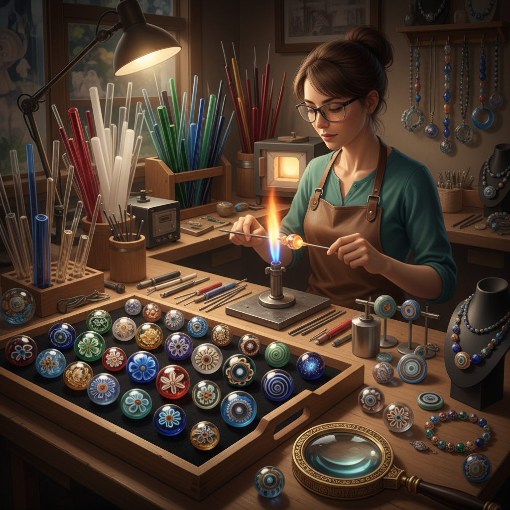

# Glass Bead Art 玻璃珠艺术

> "A glass bead is a universe in miniature — within its tiny sphere, an artist can layer colors, embed patterns, trap air bubbles like frozen galaxies, and create optical effects that make the bead seem to glow from within. The lampwork bead maker works at the intersection of chemistry, physics, and art, manipulating molten glass on a mandrel while gravity, surface tension, and thermal expansion all have their say." — Unknown

## 概述

玻璃珠艺术（Glass Bead Art）是以玻璃珠的制作和装饰为核心的艺术形式——通过灯工（lampwork）、拉丝、镶嵌等技法创造精美的玻璃珠，以及用玻璃珠进行串珠、编织和镶嵌创作。玻璃珠是人类最古老的装饰品之一，有超过三千年的历史。

玻璃珠艺术的实践包括：1）灯工珠——用火焰在金属棒上熔化玻璃棒制作珠子；2）千花珠（millefiori）——将多色玻璃棒切片嵌入珠中；3）威尼斯珠——穆拉诺岛传统的精美玻璃珠；4）非洲贸易珠——历史上用于贸易的装饰玻璃珠；5）日本蜻蜓玉（tonbo-dama）——日本传统灯工珠；6）串珠艺术——用玻璃珠编织和串联的装饰艺术；7）玻璃珠镶嵌——用玻璃珠作为马赛克材料。

## 核心特征

| 特征 | 描述 |
|------|------|
| 微型 | 微小空间中的艺术 |
| 透明 | 玻璃的透明和折射 |
| 色彩 | 极其丰富的色彩 |
| 火焰 | 用火焰塑形 |
| 耐久 | 玻璃的永久性 |
| 装饰 | 装饰和佩戴功能 |

## 视觉特征

- **透明**：玻璃的透明和半透明
- **色彩**：鲜艳丰富的色彩
- **光泽**：玻璃的光滑光泽
- **图案**：内部的复杂图案
- **球形**：珠子的完美球形
- **微观**：微小空间中的细节

## 代表作品

| 作品 | 艺术家 | 年代 | 意义 |
|------|--------|------|------|
| *Murano glass beads* | 威尼斯传统 | 13世纪至今 | 穆拉诺玻璃珠 |
| *Millefiori beads* | 威尼斯传统 | 古代至今 | 千花珠 |
| *African trade beads* | Various | 15-19世纪 | 非洲贸易珠 |
| *Tonbo-dama* | 日本传统 | 古代至今 | 日本蜻蜓玉 |
| *Contemporary lampwork* | Various | 当代 | 当代灯工珠 |

## 历史时间线

| 时期 | 事件 |
|------|------|
| 公元前1500年 | 最早的玻璃珠（埃及/美索不达米亚） |
| 13世纪 | 威尼斯穆拉诺玻璃珠产业 |
| 15-19世纪 | 玻璃珠作为贸易货币 |
| 20世纪 | 灯工珠的艺术复兴 |
| 当代 | 玻璃珠作为当代艺术媒介 |

## 中国语境

玻璃珠艺术在中国有独特的历史和当代发展。中国古代的"琉璃珠"——战国时期的蜻蜓眼琉璃珠是中国最早的玻璃珠艺术，其多层同心圆图案与地中海地区的玻璃珠有文化交流的痕迹。中国博山的琉璃（玻璃）制作有数百年传统，是中国重要的玻璃工艺产地。中国当代的灯工珠艺术家群体在快速成长——他们将中国传统美学（如水墨、山水、花鸟）融入微型玻璃珠创作，在极小的空间中展现中国艺术的意境。中国的"料器"——北京传统的玻璃工艺品——也包含精美的玻璃珠制作。

## AI生成概念图

## 与其他风格的关系

- **Glass Art** → 玻璃艺术
- **Jewelry Art** → 首饰艺术
- **Mosaic Art** → 马赛克艺术
- **Miniature Art** → 微型艺术
- **Lampwork Art** → 灯工艺术
- **Textile Art** → 纺织艺术

---

*浮光艺志 | Chronicle of Artistry*
