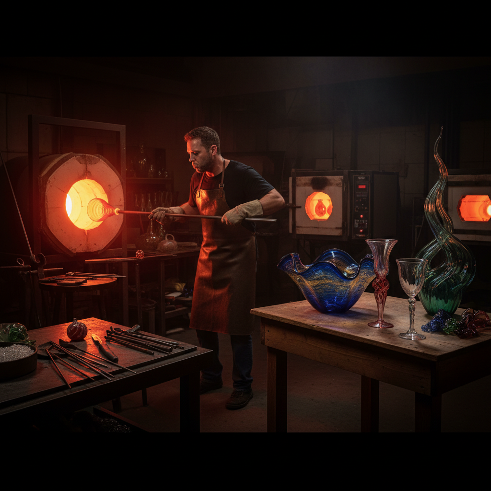

# Glass Blowing Art 玻璃吹制艺术

> "Glass blowing is breath made solid — a bubble of air trapped inside molten glass, expanded by human lungs into a vessel, a sculpture, a universe of color and light. The glassblower works at the edge of chaos, shaping a material that is simultaneously liquid and solid, transparent and opaque, fragile and eternal. Every piece is a frozen moment of transformation, caught between the furnace and the cooling air." — Unknown

## 概述

玻璃吹制艺术（Glass Blowing Art）是通过向熔融玻璃中吹入空气使其膨胀成型的艺术形式——玻璃工匠用吹管从熔炉中取出熔融玻璃，通过吹气、旋转、塑形和工具操作，将炽热的玻璃液塑造成各种器皿和雕塑。玻璃吹制是最具戏剧性和技术性的手工艺之一。

玻璃吹制艺术的实践包括：1）器皿吹制——花瓶、碗、杯等玻璃器皿；2）玻璃雕塑——吹制的艺术玻璃雕塑；3）威尼斯玻璃——穆拉诺岛的传统玻璃工艺；4）工作室玻璃运动——当代艺术玻璃创作；5）科学玻璃——实验室玻璃器具的吹制；6）灯工玻璃——用火焰加热玻璃管的小型吹制；7）大型玻璃装置——Dale Chihuly式的大型玻璃装置。

## 核心特征

| 特征 | 描述 |
|------|------|
| 透明 | 玻璃的透明特性 |
| 高温 | 在极高温下操作 |
| 流动 | 熔融玻璃的流动性 |
| 色彩 | 丰富的玻璃色彩 |
| 光线 | 与光线的互动 |
| 即时 | 必须即时完成造型 |

## 视觉特征

- **透明**：玻璃的透明和半透明
- **色彩**：内部的彩色玻璃层
- **光泽**：光滑的玻璃光泽
- **曲线**：有机的吹制曲线
- **气泡**：内部的装饰性气泡
- **折射**：光线的折射效果

## 代表作品

| 作品 | 艺术家 | 年代 | 意义 |
|------|--------|------|------|
| *Chihuly installations* | Dale Chihuly | 1980s至今 | 大型玻璃装置 |
| *Murano glass* | 威尼斯传统 | 13世纪至今 | 威尼斯玻璃传统 |
| *Studio glass* | Harvey Littleton | 1962至今 | 工作室玻璃运动 |
| *Glass sculptures* | Lino Tagliapietra | 当代 | 当代玻璃雕塑 |
| *Blown glass vessels* | Various | 古代至今 | 吹制玻璃器皿 |

## 历史时间线

| 时期 | 事件 |
|------|------|
| 公元前1世纪 | 玻璃吹制技术的发明（叙利亚） |
| 13世纪 | 威尼斯穆拉诺岛玻璃传统 |
| 19世纪 | 工业化玻璃生产 |
| 1962 | 工作室玻璃运动的开始 |
| 当代 | 玻璃作为当代艺术媒介 |

## 中国语境

玻璃吹制艺术在中国有独特的发展历程。中国古代虽然有琉璃（铅钡玻璃）的传统，但吹制玻璃技术主要是从西方传入的。中国的博山（山东）是中国传统琉璃的重要产地——博山琉璃有数百年的历史。中国当代的玻璃艺术在近几十年快速发展——一些美术院校设立了玻璃艺术专业。中国的一些当代玻璃艺术家在国际上获得了认可——将中国传统美学融入现代玻璃创作。中国的上海玻璃博物馆是亚洲重要的玻璃艺术展示空间——展出国内外玻璃艺术家的作品。中国的玻璃工业规模巨大——但艺术玻璃作为独立的创作领域正在蓬勃发展。中国的一些旅游景点提供玻璃吹制体验——让公众了解这一古老的工艺。

## AI生成概念图

## 与其他风格的关系

- **Glass Art** → 玻璃艺术
- **Murano Glass** → 穆拉诺玻璃
- **Sculpture** → 雕塑
- **Craft Art** → 工艺美术
- **Light Art** → 光艺术
- **Installation Art** → 装置艺术

---

*浮光艺志 | Chronicle of Artistry*
