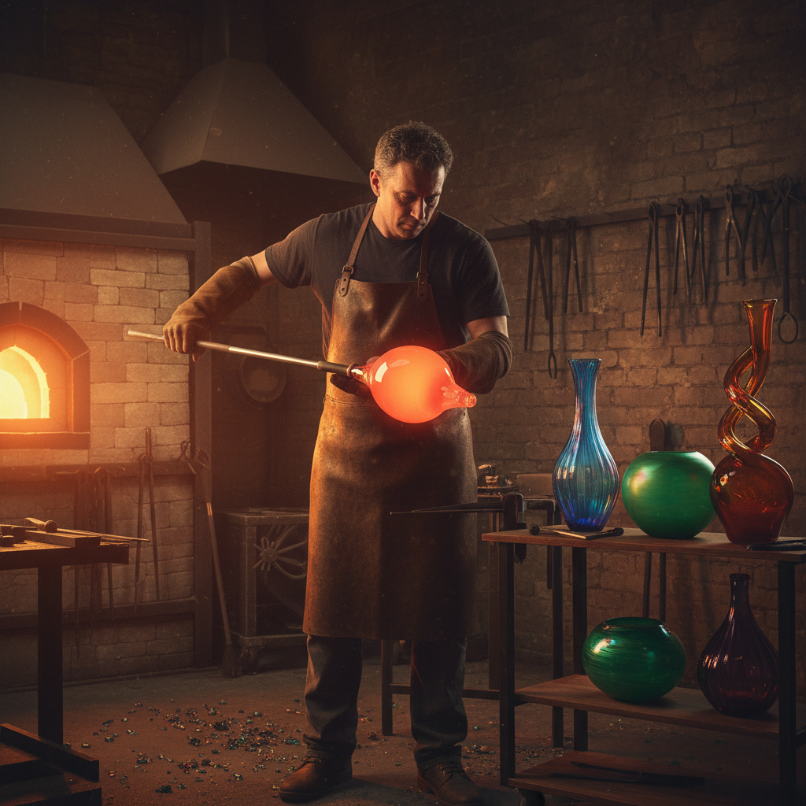

# Glass Blowing 玻璃吹制

> "Glass is the most magical of all materials — it is liquid frozen in time." — Dale Chihuly

## 概述

玻璃吹制（Glass Blowing）是通过吹管将熔融玻璃塑造成各种形态的古老工艺艺术。公元前1世纪在叙利亚-巴勒斯坦地区发明以来，玻璃吹制彻底改变了玻璃制品的生产方式——从奢侈品变为日常用品，同时也催生了无数令人叹为观止的艺术杰作。从威尼斯穆拉诺岛的传统工坊到Dale Chihuly的巨型装置，玻璃吹制在实用与艺术之间架起了一座光与火的桥梁。

玻璃吹制的魅力在于：它是与时间赛跑的艺术——熔融玻璃只给艺术家几秒钟的窗口，每一次呼吸都是不可逆的创造。

## 核心特征

| 特征 | 描述 |
|------|------|
| 透明 | 玻璃的透明与半透明 |
| 光线 | 折射、反射光线 |
| 流动 | 熔融状态的流动形态 |
| 色彩 | 金属氧化物着色 |
| 脆弱 | 材料的脆弱与永恒 |
| 即时 | 必须在短时间内完成 |

## 视觉特征

- **透明**：光线穿透的透明质感
- **色彩**：鲜艳的内部色彩
- **流线**：有机的流线形态
- **光泽**：表面的玻璃光泽
- **气泡**：内部的装饰性气泡
- **层次**：多层玻璃的色彩叠加

## 代表作品

| 作品 | 艺术家 | 年代 | 意义 |
|------|--------|------|------|
| *Portland Vase* | 匿名 | 公元前1世纪 | 罗马浮雕玻璃杰作 |
| *Murano chandeliers* | 匿名 | 文艺复兴 | 威尼斯玻璃传统 |
| *Chihuly Over Venice* | Dale Chihuly | 1996 | 当代玻璃装置 |
| *Lino Tagliapietra vessels* | Lino Tagliapietra | 1980s+ | 传统与现代的融合 |
| *Corning Museum collection* | Various | 多时期 | 玻璃艺术的百科全书 |

## 历史时间线

| 时期 | 事件 |
|------|------|
| 公元前1世纪 | 玻璃吹制术在叙利亚发明 |
| 罗马帝国 | 玻璃吹制在地中海传播 |
| 13世纪 | 威尼斯穆拉诺岛成为中心 |
| 文艺复兴 | 威尼斯玻璃的黄金时代 |
| 19世纪 | 工业化与艺术玻璃运动 |
| 1962 | 美国Studio Glass运动开始 |
| 当代 | 玻璃吹制作为当代艺术 |

## 中国语境

中国的玻璃（琉璃）制作历史悠久，战国时期已有琉璃珠。但中国传统更偏重铸造和模压技法，吹制技术主要在西方发展。当代中国的玻璃艺术正在快速发展，上海玻璃博物馆等机构推动了玻璃艺术的普及。中国艺术家如王建中等在国际玻璃艺术界有重要影响。博山琉璃是中国传统玻璃工艺的代表。

## AI生成概念图

## 与其他风格的关系

- **Murano Glass** → 威尼斯玻璃传统
- **Art Nouveau** → 新艺术运动的玻璃作品
- **Studio Craft** → 工作室工艺运动
- **Light Art** → 玻璃与光的互动
- **Millefiori** → 千花玻璃技法
- **Installation Art** → 大型玻璃装置

---

*浮光艺志 | Chronicle of Artistry*
