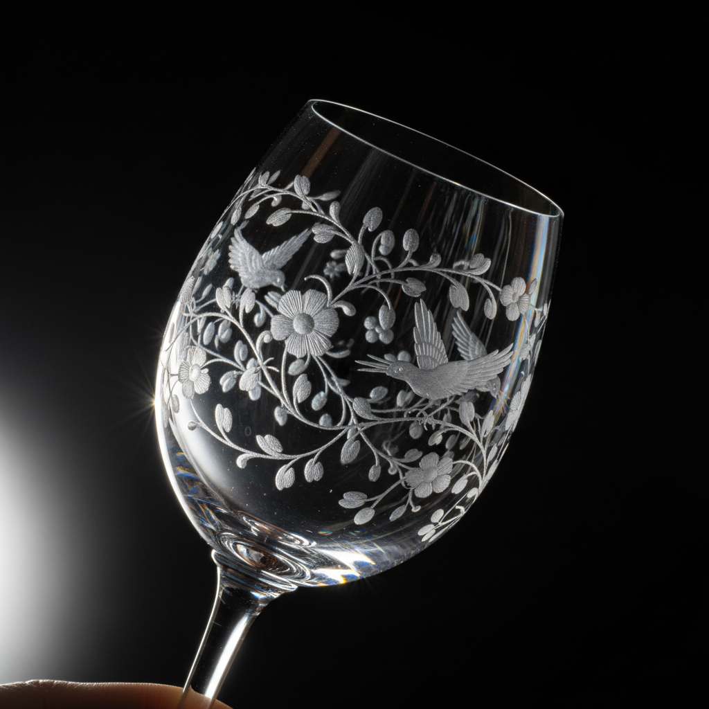

# Glass Engraving Art 玻璃雕刻艺术

> "Glass engraving is drawing with light — a rotating copper wheel or diamond point cuts into the surface of clear crystal, creating marks that scatter light and appear as frosted white lines against the transparent depth of the glass. The engraver works blind, unable to see the true effect until the piece is held up to the light, when suddenly the cut marks spring to life as luminous drawings suspended within the glass itself." — Unknown

## 概述

玻璃雕刻艺术（Glass Engraving Art）是使用旋转铜轮、钻石针或其他工具在玻璃表面切割、研磨或刻划图案的传统工艺——利用切割面对光线的散射效果创造出在透明玻璃中浮现的图案。玻璃雕刻是最精致的玻璃装饰技法之一，在波西米亚、英国和斯堪的纳维亚有悠久的传统。

玻璃雕刻艺术的实践包括：1）铜轮雕刻——使用旋转铜轮和研磨剂切割；2）钻石针雕刻——使用钻石针手工刻划；3）深雕——深度切割创造浮雕效果；4）浅雕——浅层切割创造线条图案；5）点刻——用钻石针点刻创造明暗效果；6）酸蚀——使用氢氟酸腐蚀创造图案；7）当代玻璃雕刻——将传统技法与现代设计结合的创作。

## 核心特征

| 特征 | 描述 |
|------|------|
| 光线 | 利用光线散射效果 |
| 透明 | 在透明材料上工作 |
| 精密 | 极其精密的操作 |
| 脆弱 | 在脆弱材料上雕刻 |
| 反转 | 需要反向思维 |
| 古老 | 数百年的传统 |

## 视觉特征

- **透明**：透明玻璃中的图案
- **光线**：光线散射的白色效果
- **精细**：极其精细的线条
- **深度**：透明中的视觉深度
- **闪烁**：切面的闪烁效果
- **优雅**：优雅精致的整体感

## 代表作品

| 作品 | 艺术家/文化 | 年代 | 意义 |
|------|-------------|------|------|
| *Bohemian engraved glass* | 波西米亚 | 17世纪至今 | 波西米亚雕刻玻璃 |
| *Steuben crystal* | 美国 | 20世纪 | 斯图本水晶 |
| *Orrefors engraving* | 瑞典 | 20世纪 | 奥利福斯雕刻 |
| *Laurence Whistler* | 英国 | 20世纪 | 英国钻石针雕刻 |
| *Contemporary glass engraving* | 当代 | 当代 | 当代玻璃雕刻 |

## 历史时间线

| 时期 | 事件 |
|------|------|
| 古罗马 | 玻璃雕刻的早期形式 |
| 16世纪 | 威尼斯钻石针雕刻 |
| 17世纪 | 波西米亚铜轮雕刻的兴起 |
| 18-19世纪 | 玻璃雕刻的黄金时代 |
| 当代 | 玻璃雕刻的艺术化发展 |

## 中国语境

玻璃雕刻艺术在中国有一定的发展。中国传统的"套料"玻璃（多层彩色玻璃的雕刻）是独特的中国玻璃雕刻传统——通过在不同颜色的玻璃层上雕刻露出下层颜色。中国的鼻烟壶制作中有精美的玻璃雕刻——内画鼻烟壶是中国独特的玻璃艺术形式。中国当代的玻璃艺术教育中，雕刻作为重要的装饰技法被教授——在多所美术学院的玻璃专业中。中国的一些玻璃艺术家开始探索铜轮雕刻和钻石针雕刻——将西方传统技法与中国美学结合。中国的水晶产业中，雕刻是重要的增值工艺——在水晶制品上雕刻装饰图案。

## AI生成概念图

## 与其他风格的关系

- **Glass Painting** → 玻璃绘画
- **Crystal Art** → 水晶艺术
- **Bohemian Glass** → 波西米亚玻璃
- **Sculpture** → 雕塑
- **Light Art** → 光艺术
- **Decorative Art** → 装饰艺术

---

*浮光艺志 | Chronicle of Artistry*
