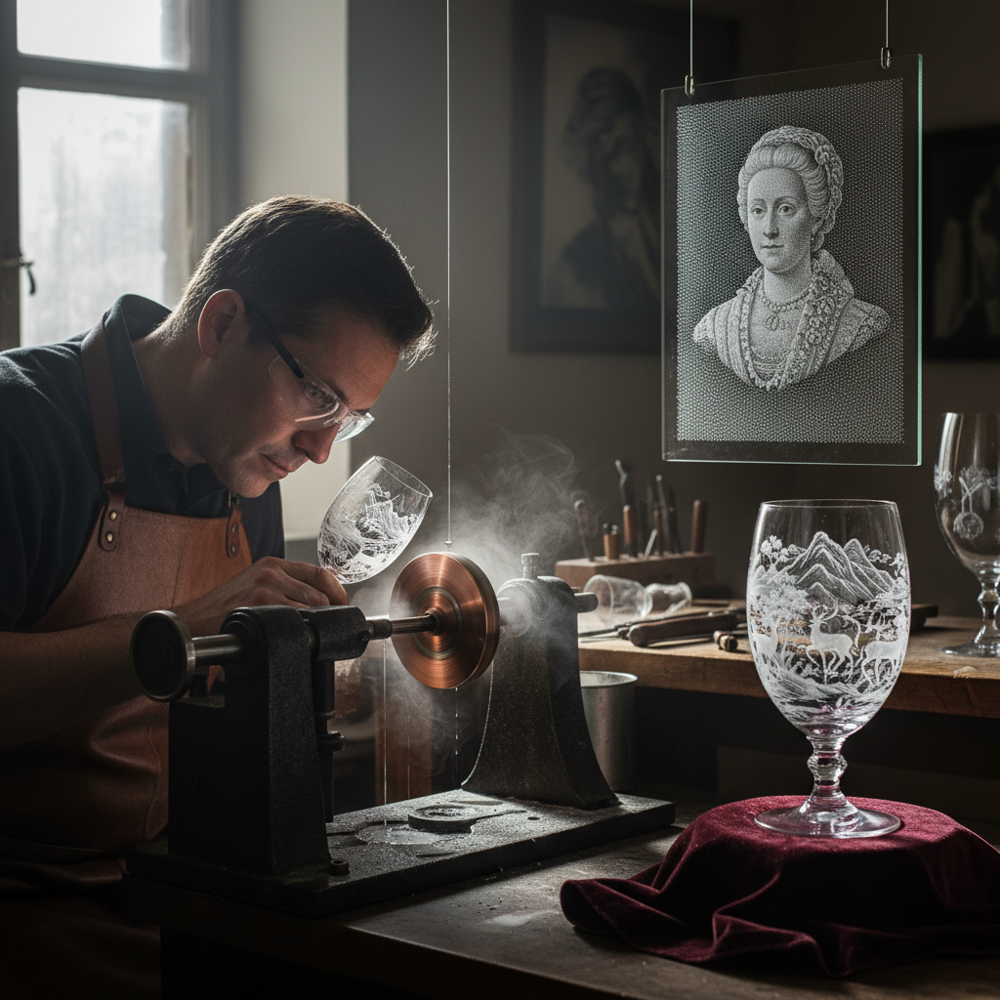

# Glass Engraving 玻璃雕刻

> "Glass engraving is drawing with a diamond point — each line catches light differently, creating images that breathe with illumination." — Unknown

## 概述

玻璃雕刻（Glass Engraving）是使用钻石点、铜轮、石轮或电动工具在玻璃表面刻划图案的精细艺术。这是最古老的玻璃装饰技法之一——从古罗马的笼杯到18世纪荷兰的钻石点雕刻，玻璃雕刻一直是最考验耐心和技巧的玻璃艺术形式。雕刻线条在光线下闪烁，创造出如同银针绘画般的精致效果。

玻璃雕刻的魅力在于：以线条捕捉光——每一条刻痕都是一个微小的棱镜，将光线折射成闪烁的白色线条，在透明的玻璃上创造出如同幽灵般的图像。

## 核心特征

| 特征 | 描述 |
|------|------|
| 刻划 | 在表面刻划线条 |
| 精细 | 极其精细的工艺 |
| 光线 | 依赖光线显现 |
| 工具 | 钻石点/铜轮/石轮 |
| 耐心 | 需要极大耐心 |
| 传统 | 悠久的传统 |

## 视觉特征

- **线条**：精细的刻划线条
- **闪烁**：光线下的闪烁效果
- **透明**：在透明玻璃上的图案
- **精密**：极其精密的细节
- **层次**：深浅不同的刻痕层次
- **优雅**：优雅精致的整体效果

## 代表作品

| 作品 | 艺术家 | 年代 | 意义 |
|------|--------|------|------|
| *Lycurgus Cup* | 匿名 | 4世纪 | 古罗马笼杯 |
| *Dutch diamond point* | Anna Roemers Visscher | 17世纪 | 荷兰钻石点雕刻 |
| *Bohemian wheel engraving* | Various | 17-18世纪 | 波西米亚轮雕 |
| *Laurence Whistler goblets* | Laurence Whistler | 20世纪 | 英国点刻大师 |
| *Alison Kinnaird panels* | Alison Kinnaird | 当代 | 当代玻璃雕刻 |

## 历史时间线

| 时期 | 事件 |
|------|------|
| 1世纪 | 古罗马轮雕玻璃 |
| 4世纪 | 笼杯（diatreta）的巅峰 |
| 16-17世纪 | 钻石点雕刻在荷兰兴起 |
| 17-18世纪 | 波西米亚铜轮雕刻的黄金期 |
| 20世纪 | Whistler等大师的复兴 |
| 当代 | 传统与现代工具的结合 |

## 中国语境

中国有悠久的玉雕和水晶雕刻传统，其技法与玻璃雕刻高度相关。中国的"套料"玻璃（overlay glass）雕刻是清代宫廷工艺的代表——在多层彩色玻璃上雕刻出精美图案。当代中国的水晶雕刻产业（如浦江水晶）也使用类似的轮雕技法。在艺术领域，中国玻璃艺术家正在将传统玉雕的审美理念应用于玻璃雕刻创作。

## AI生成概念图

## 与其他风格的关系

- **Cold Working** → 冷加工的一种
- **Engraving** → 金属雕刻（共享技法）
- **Sandblasting** → 喷砂（另一种表面处理）
- **Lapidary** → 宝石切割雕刻
- **Intaglio** → 凹雕版画
- **Crystal** → 水晶雕刻

---

*浮光艺志 | Chronicle of Artistry*
