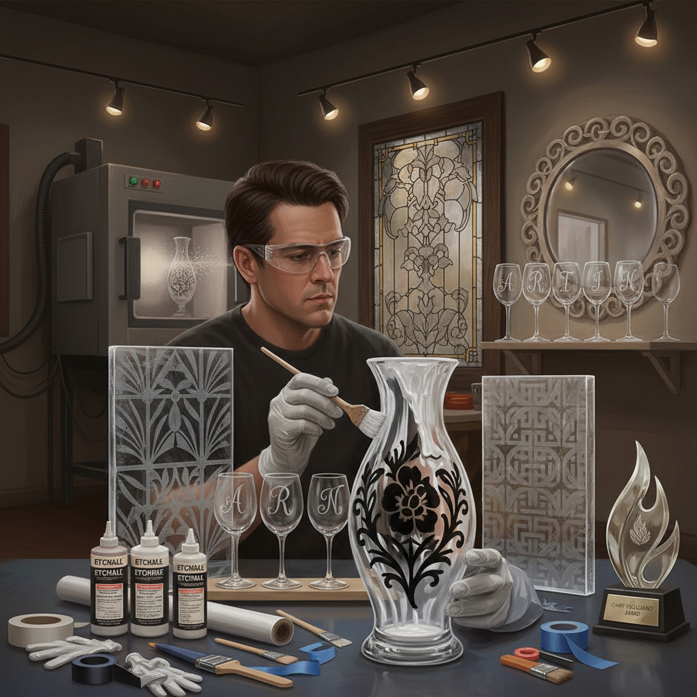

# Glass Etching 玻璃蚀刻

> "Glass etching turns transparency into mystery — where acid touches glass, clarity becomes frost, and from that controlled obscuring emerges image, pattern, and light made tangible." — Unknown

## 概述

玻璃蚀刻（Glass Etching）是使用化学腐蚀剂（如氢氟酸或蚀刻膏）或物理方法（如喷砂）在玻璃表面创造磨砂效果和图案的工艺。蚀刻后的玻璃表面变为半透明的磨砂状，与未蚀刻的透明区域形成对比，从而显现出图案。

玻璃蚀刻的方法主要有三种：化学蚀刻（使用含氟化合物的蚀刻膏或酸液）、喷砂蚀刻（使用高压砂粒冲击玻璃表面）、和激光蚀刻（使用激光在玻璃内部或表面创造标记）。化学蚀刻和喷砂蚀刻是最传统的方法——蚀刻膏（如Armour Etch）让业余爱好者也能在家进行简单的玻璃蚀刻。

## 核心特征

| 特征 | 描述 |
|------|------|
| 磨砂 | 创造磨砂效果 |
| 对比 | 透明与磨砂的对比 |
| 化学/物理 | 化学或物理方法 |
| 装饰 | 装饰性极强 |
| 光影 | 利用光线效果 |
| 永久 | 永久性的标记 |

## 视觉特征

- **磨砂**：半透明的磨砂面
- **对比**：透明与不透明的对比
- **光影**：光线穿透的效果
- **精细**：可实现精细图案
- **层次**：多层次的深浅变化
- **优雅**：优雅的视觉效果

## 代表作品

| 作品 | 艺术家 | 年代 | 意义 |
|------|--------|------|------|
| *Victorian etched glass* | 匿名 | 维多利亚时代 | 维多利亚蚀刻玻璃 |
| *Pub glass panels* | 匿名 | 19世纪 | 酒吧蚀刻玻璃 |
| *Art Nouveau etched glass* | Various | 新艺术运动 | 新艺术蚀刻玻璃 |
| *Sandblasted art glass* | Various | 当代 | 喷砂艺术玻璃 |
| *Architectural etched glass* | Various | 当代 | 建筑蚀刻玻璃 |

## 历史时间线

| 时期 | 事件 |
|------|------|
| 1670s | 氢氟酸对玻璃腐蚀的发现 |
| 18世纪 | 化学蚀刻玻璃的早期应用 |
| 19世纪 | 维多利亚时代蚀刻玻璃的繁荣 |
| 1870s | 喷砂技术的发明 |
| 20世纪 | 蚀刻膏的商业化 |
| 当代 | 激光蚀刻和数字化蚀刻 |

## 中国语境

玻璃蚀刻在中国主要应用于建筑装饰和工业领域——蚀刻玻璃（磨砂玻璃）广泛用于室内隔断、浴室门、办公室玻璃等。中国的玻璃加工行业大量使用喷砂和化学蚀刻技术。在艺术领域，一些中国的玻璃艺术家使用蚀刻作为创作手法。中国的手工爱好者也开始尝试使用蚀刻膏在玻璃器皿上创作个性化图案。中国的激光蚀刻技术在工业和礼品定制领域应用广泛。

## AI生成概念图

## 与其他风格的关系

- **Glass Engraving** → 玻璃雕刻
- **Sandblasting** → 喷砂
- **Stained Glass** → 彩色玻璃
- **Metal Etching** → 金属蚀刻
- **Frosted Glass** → 磨砂玻璃
- **Glassblowing** → 吹制玻璃

---

*浮光艺志 | Chronicle of Artistry*
