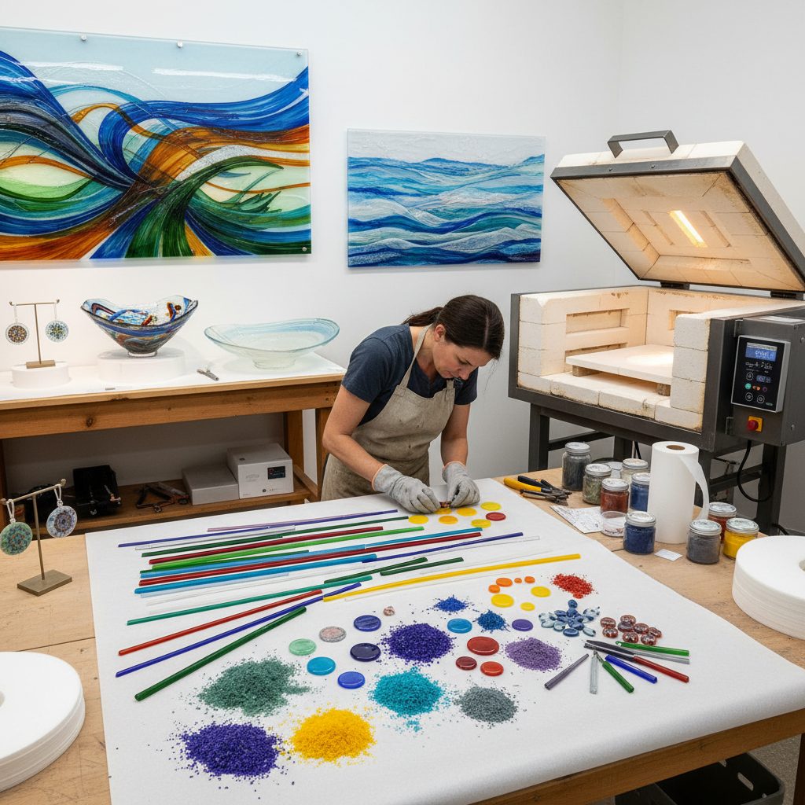

# Glass Fusing 玻璃熔合

> "Glass fusing is alchemy in a kiln — separate pieces of colored glass placed together on a shelf, then heated until they soften and merge into one, their boundaries dissolving like watercolors bleeding into each other, frozen forever at the moment of union." — Unknown

## 概述

玻璃熔合（Glass Fusing）是一种将多块玻璃片在窑炉中加热至熔化温度（通常700-850°C），使它们融合为一体的玻璃艺术技法。不同颜色、形状和纹理的玻璃片被精心排列在窑炉架上，加热后软化并融合在一起，冷却后形成一块完整的玻璃作品。玻璃熔合不需要吹制技术——是一种"平面"的玻璃加工方式。

玻璃熔合包括多种温度和效果：粘合（tack fusing，约730°C，玻璃片粘合但保留各自的形状和纹理）、完全熔合（full fusing，约800°C，玻璃片完全融合为平滑的一体）、弯曲成型（slumping，将熔合后的玻璃片在模具上加热弯曲成型）。玻璃熔合可以创造出从珠宝首饰到大型建筑装饰的各种作品。

## 核心特征

| 特征 | 描述 |
|------|------|
| 熔合 | 加热使玻璃融合 |
| 窑炉 | 使用窑炉加热 |
| 色彩 | 丰富的色彩组合 |
| 平面 | 平面的加工方式 |
| 温度 | 精确的温度控制 |
| 多样 | 多种效果可能 |

## 视觉特征

- **透明**：玻璃的透明质感
- **色彩**：丰富的色彩
- **光线**：光线穿透的效果
- **融合**：色彩的融合边界
- **质感**：不同的表面质感
- **光泽**：玻璃的光泽

## 代表作品

| 作品 | 艺术家 | 年代 | 意义 |
|------|--------|------|------|
| *Fused glass panels* | Various | 当代 | 熔合玻璃面板 |
| *Fused glass jewelry* | Various | 当代 | 熔合玻璃首饰 |
| *Architectural fused glass* | Various | 当代 | 建筑熔合玻璃 |
| *Fused glass sculpture* | Various | 当代 | 熔合玻璃雕塑 |
| *Fused glass vessels* | Various | 当代 | 熔合玻璃器皿 |

## 历史时间线

| 时期 | 事件 |
|------|------|
| 古代 | 早期玻璃熔合技术 |
| 古埃及 | 埃及的熔合玻璃珠 |
| 罗马时期 | 罗马的马赛克玻璃 |
| 中世纪 | 玻璃熔合技术的衰落 |
| 20世纪 | 工作室玻璃运动中的复兴 |
| 当代 | 玻璃熔合的全球普及 |

## 中国语境

玻璃熔合在中国的当代玻璃艺术中有快速的发展。中国的美术学院和设计学院开设玻璃艺术课程，其中包括玻璃熔合技法。中国的玻璃艺术工作室和体验课程中，玻璃熔合因其"色彩丰富、效果即时、适合初学者"的特点而受欢迎。中国的当代玻璃艺术家使用熔合技法创作装饰性和艺术性的作品。中国的建筑装饰和室内设计中也越来越多地使用熔合玻璃。

## AI生成概念图

## 与其他风格的关系

- **Glass Blowing** → 吹制玻璃
- **Stained Glass** → 彩色玻璃
- **Kiln Forming** → 窑制玻璃
- **Lampwork** → 灯工玻璃
- **Mosaic** → 马赛克
- **Jewelry Making** → 首饰制作

---

*浮光艺志 | Chronicle of Artistry*
