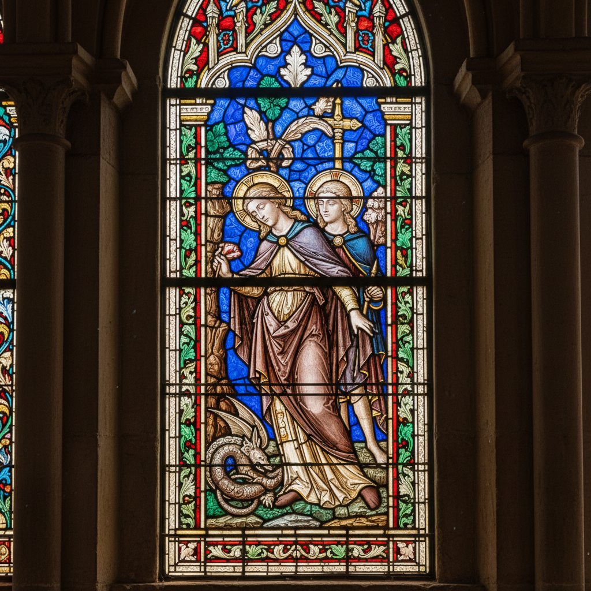

# Glass Painting Art 玻璃绘画艺术

> "Glass painting is painting with light itself — pigments are applied to glass not to be seen by reflected light like canvas paintings, but to be seen by transmitted light, transforming sunlight into color as it passes through. From medieval cathedral windows to Victorian decorative panels, glass painting creates images that glow from within, changing character with every shift of weather and time of day, alive in a way that no opaque painting can be." — Unknown

## 概述

玻璃绘画艺术（Glass Painting Art）是在玻璃表面使用特殊颜料（玻璃颜料、搪瓷颜料或冷绘颜料）进行绘画的传统工艺——创造出透光或不透光的装饰效果。玻璃绘画包括彩色玻璃窗的绘画细节、装饰性玻璃面板的绘制，以及各种在玻璃上进行的艺术创作。

玻璃绘画艺术的实践包括：1）彩色玻璃窗绘画——在彩色玻璃上添加细节；2）搪瓷绘画——使用搪瓷颜料在玻璃上绘画并烧制；3）冷绘——使用不需烧制的颜料；4）银染——使用银盐在玻璃上创造黄色；5）酸蚀——使用酸腐蚀创造图案；6）反面绘画——在玻璃背面绘画（透过玻璃观看）；7）当代玻璃绘画——将传统技法与现代设计结合的创作。

## 核心特征

| 特征 | 描述 |
|------|------|
| 透光 | 利用透射光的效果 |
| 色彩 | 光线穿透的色彩 |
| 变化 | 随光线变化的效果 |
| 建筑 | 建筑装饰的传统 |
| 宗教 | 宗教艺术的传统 |
| 精细 | 精细的绘画技法 |

## 视觉特征

- **发光**：从内部发光的效果
- **色彩**：透射光的鲜艳色彩
- **变化**：随时间变化的光影
- **精细**：精细的绘画细节
- **叙事**：叙事性的图案
- **神圣**：神圣庄严的氛围

## 代表作品

| 作品 | 艺术家/文化 | 年代 | 意义 |
|------|-------------|------|------|
| *Chartres Cathedral windows* | 法国 | 12-13世纪 | 沙特尔大教堂 |
| *Sainte-Chapelle* | 法国 | 13世纪 | 圣礼拜堂 |
| *William Morris windows* | 英国 | 19世纪 | 莫里斯彩色玻璃 |
| *Marc Chagall windows* | 法国 | 20世纪 | 夏加尔彩色玻璃 |
| *Contemporary glass painting* | 当代 | 当代 | 当代玻璃绘画 |

## 历史时间线

| 时期 | 事件 |
|------|------|
| 古代 | 玻璃绘画的早期形式 |
| 中世纪 | 哥特式大教堂彩色玻璃的黄金时代 |
| 文艺复兴 | 搪瓷绘画技法的发展 |
| 19世纪 | 艺术与工艺运动的复兴 |
| 当代 | 玻璃绘画的艺术化发展 |

## 中国语境

玻璃绘画艺术在中国有独特的发展路径。中国传统的"料器"（玻璃器）上有绘画装饰的传统——使用搪瓷颜料在玻璃上绘制图案。中国的内画艺术是独特的玻璃绘画形式——在鼻烟壶内壁用特制画笔反向绘画。中国近代的教堂建筑中引入了西方彩色玻璃窗——一些中国艺术家参与了彩色玻璃的设计和制作。中国当代的玻璃艺术教育中，绘画是重要的装饰技法——在玻璃专业中教授各种玻璃绘画技法。中国的一些玻璃艺术家将中国传统绘画与玻璃媒介结合——创造具有中国特色的玻璃绘画作品。中国的建筑装饰中，彩色玻璃窗和装饰玻璃面板正在获得更多应用——将传统与现代建筑美学结合。

## AI生成概念图

## 与其他风格的关系

- **Stained Glass** → 彩色玻璃
- **Glass Engraving** → 玻璃雕刻
- **Reverse Glass Painting** → 玻璃背画
- **Gothic Art** → 哥特艺术
- **Light Art** → 光艺术
- **Decorative Art** → 装饰艺术

---

*浮光艺志 | Chronicle of Artistry*
