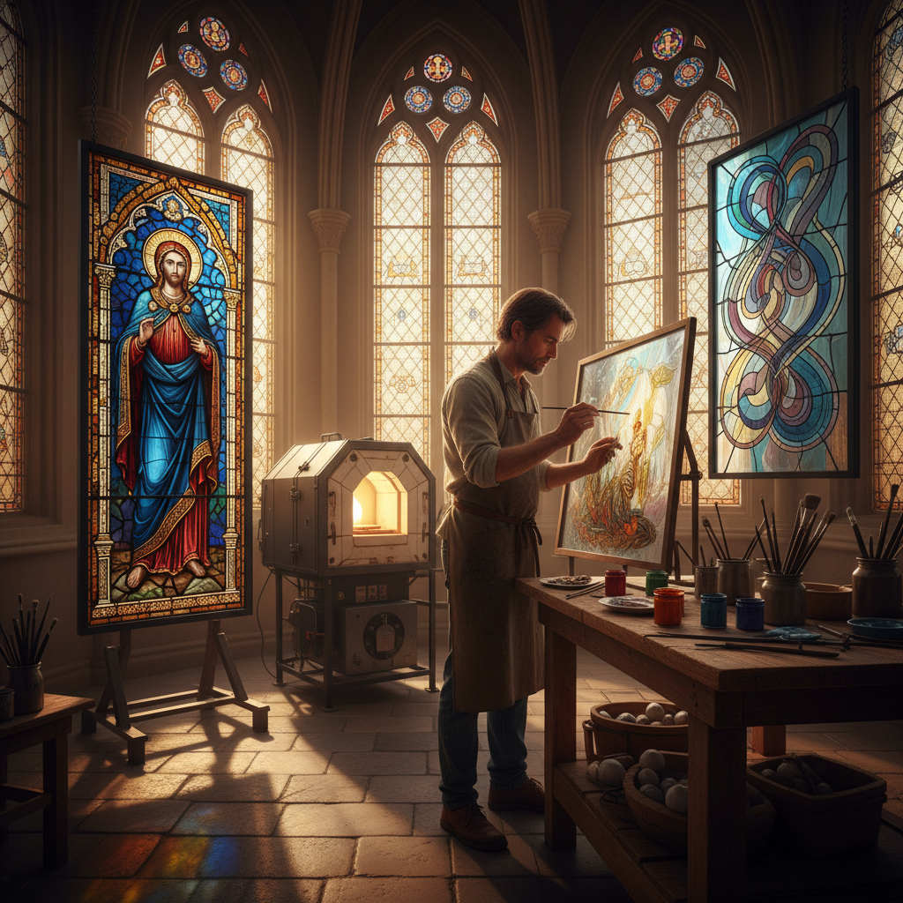

# Glass Painting 玻璃绘画

> "Glass painting captures light itself as a medium — pigments fused into glass become windows into another world." — Unknown

## 概述

玻璃绘画（Glass Painting）是使用专用玻璃颜料（含金属氧化物的釉料）在玻璃表面绑画，然后通过窑烧将颜料永久融合到玻璃表面的装饰技法。这是彩色玻璃窗（Stained Glass）的核心技法之一——中世纪的教堂玻璃窗上的面部细节、衣褶和文字都是通过玻璃绘画完成的。玻璃绘画可以在透明或彩色玻璃上进行，创造从精细写实到抽象表现的各种效果。

玻璃绘画的独特之处在于：以光为画布——颜料不是反射光线，而是过滤和着色透过的光线，创造出如同宝石般发光的色彩效果。

## 核心特征

| 特征 | 描述 |
|------|------|
| 釉料 | 使用玻璃釉料颜料 |
| 窑烧 | 通过窑烧固定 |
| 透光 | 利用透射光显色 |
| 细节 | 添加精细细节 |
| 永久 | 永久融合于玻璃 |
| 传统 | 中世纪的核心技法 |

## 视觉特征

- **透光**：光线透过的发光效果
- **色彩**：宝石般的色彩
- **细节**：精细的绘画细节
- **线条**：铅线般的轮廓线
- **层次**：多层烧制的色彩层次
- **叙事**：叙事性的图像

## 代表作品

| 作品 | 艺术家 | 年代 | 意义 |
|------|--------|------|------|
| *Chartres Cathedral windows* | 匿名 | 12-13世纪 | 沙特尔大教堂 |
| *Sainte-Chapelle windows* | 匿名 | 13世纪 | 圣礼拜堂 |
| *William Morris windows* | William Morris | 19世纪 | 工艺美术运动 |
| *Marc Chagall windows* | Marc Chagall | 20世纪 | 现代玻璃绘画 |
| *Judith Schaechter panels* | Judith Schaechter | 当代 | 当代玻璃绘画 |

## 历史时间线

| 时期 | 事件 |
|------|------|
| 9-10世纪 | 最早的彩绘玻璃窗 |
| 12-13世纪 | 哥特式教堂的黄金时代 |
| 14-15世纪 | 银染技法的发展 |
| 16世纪 | 珐琅彩玻璃绘画 |
| 19世纪 | 工艺美术运动的复兴 |
| 当代 | 当代玻璃绘画艺术 |

## 中国语境

中国传统上没有西方意义上的彩色玻璃窗传统，但近代以来随着教堂建筑的引入，中国也有了自己的玻璃绘画作品——如上海徐家汇天主教堂、广州石室圣心大教堂等都有精美的彩绘玻璃。当代中国的玻璃艺术家也在探索玻璃绘画的可能性，将中国传统绘画的意境与玻璃的透光特性结合。一些中国艺术家将工笔画技法应用于玻璃绘画，创造出独特的东方风格。

## AI生成概念图

## 与其他风格的关系

- **Stained Glass** → 彩色玻璃窗
- **Enamel** → 珐琅（类似的釉料技法）
- **Painting** → 绘画（在玻璃上）
- **Gothic Art** → 哥特式艺术
- **Reverse Glass Painting** → 玻璃反面画
- **Ceramics** → 陶瓷釉上彩（类似原理）

---

*浮光艺志 | Chronicle of Artistry*
