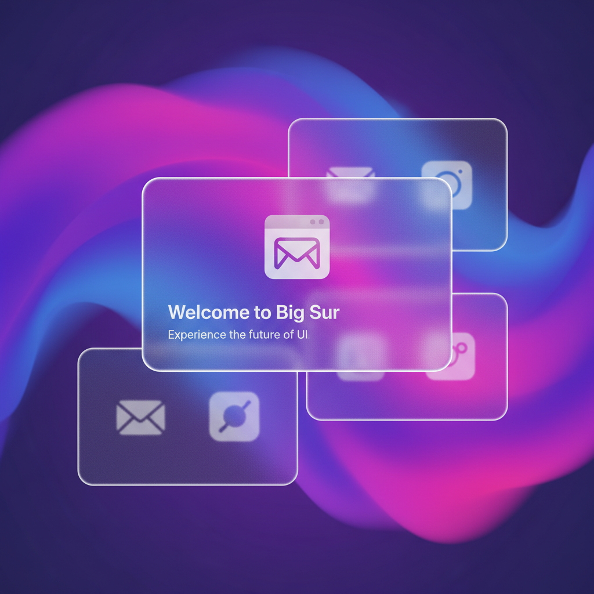

# Glassmorphism 玻璃拟态



> **"毛玻璃、模糊背景、半透明层叠——iOS设计语言的全面胜利。"**

## 概述

| 维度 | 描述 |
|------|------|
| 时期 | 2020–至今 |
| 别名 | Glassmorphism, Frosted Glass UI, Blur Effect |
| 核心色彩 | 半透明白、模糊渐变、彩色背景透出 |
| 关键元素 | 毛玻璃效果、背景模糊、半透明卡片、微妙边框 |
| 代表人物 | Apple (macOS Big Sur)、Microsoft (Fluent Design) |
| 关联风格 | Flat Design, Neumorphism, Frutiger Aero |

---

## 历史脉络

### 2020：从 macOS Big Sur 开始

| 年份 | 事件 |
|------|------|
| 2013 | iOS 7 首次引入毛玻璃效果 |
| 2017 | Microsoft Fluent Design 的 Acrylic 材质 |
| 2020 | macOS Big Sur 全面采用玻璃效果 |
| 2020 | "Glassmorphism" 一词被创造 |
| 2021–至今 | 成为主流 UI 设计趋势 |

### 设计史中的位置

```
拟物主义 (2007–2012) — 模拟真实材质
    ↓
扁平设计 (2012–2019) — 去掉一切装饰
    ↓
新拟物 (2019–2021) — 加回微妙深度（失败）
    ↓
玻璃拟态 (2020–至今) — 半透明层次感（成功）
```

### 为什么它成功了？

| 优势 | 解释 |
|------|------|
| 层次感 | 通过透明度创造空间深度 |
| 美观 | 毛玻璃效果天然好看 |
| 可用性 | 比新拟物的对比度更好 |
| 灵活性 | 适配亮色/暗色模式 |
| 现代感 | 让界面感觉"轻盈" |

---

## 视觉语法

### 色彩系统

```
主色：
  半透明白 (rgba(255,255,255,0.2)) — 卡片
  模糊背景 (backdrop-filter: blur) — 核心效果
  微妙边框 (rgba(255,255,255,0.3)) — 边缘

背景：
  渐变色 — 紫→蓝→粉 等
  图片 — 被模糊的背景图
  深色 — 暗色模式下的半透明黑

规则：
  - 背景必须有颜色/图案（否则看不出效果）
  - 模糊度通常 10–40px
  - 边框增加可见性
  - 微妙阴影增加层次

CSS 公式：
  background: rgba(255, 255, 255, 0.15);
  backdrop-filter: blur(20px);
  border: 1px solid rgba(255, 255, 255, 0.3);
  border-radius: 16px;
```

### 标志性元素

| 类别 | 元素 |
|------|------|
| 卡片 | 半透明毛玻璃卡片 |
| 导航 | 模糊背景的顶部/底部栏 |
| 弹窗 | 半透明对话框 |
| 侧边栏 | 毛玻璃侧边导航 |
| 图标 | 玻璃质感的圆角图标 |
| 整体 | 层叠的半透明面板 |

---

## 与千禧怀旧的关系

### Frutiger Aero 的精神继承者
- Frutiger Aero (2004–2013) = 水晶、透明、光泽
- Glassmorphism (2020–至今) = 毛玻璃、透明、层次
- 两者都热爱"透明"和"光"
- Glassmorphism 是 Frutiger Aero 的现代重生

### Windows Vista/7 的回响
- Vista 的 Aero Glass = 原始玻璃效果
- Big Sur 的毛玻璃 = 更成熟的版本
- 设计趋势是螺旋上升的

---

## 中国语境

- "毛玻璃效果"/"磨砂玻璃"在国内设计圈流行
- iOS/macOS 的设计语言影响国内 App
- 小红书、抖音等 App 的局部采用
- 与"弥散光"/"渐变"趋势的交叉

---

## 设计应用

| 场景 | 应用方式 |
|------|----------|
| UI | 卡片+导航+弹窗+侧边栏 |
| 品牌 | 半透明元素+渐变背景+现代感 |
| 网页 | Hero区域+卡片布局+模糊背景 |
| 注意 | 需要GPU支持、低端设备可能卡顿 |

---

## 相关风格

← [Neumorphism 新拟物](neumorphism.md) | [Flat Design 扁平设计](flat-design.md) →

↑ [返回千禧怀旧目录](README.md) | [返回总目录](../README.md)
