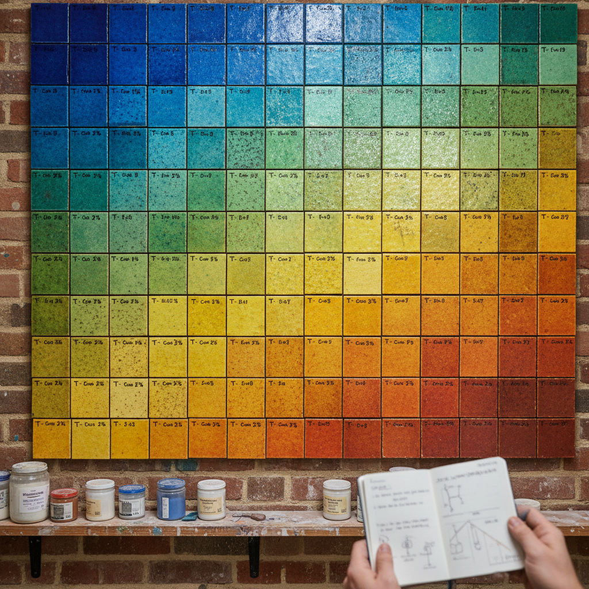

# Glaze Chemistry Art 釉料化学艺术

> "Glaze chemistry is painting with the periodic table — silica for glass, alumina for stiffness, flux to lower the melting point, colorants measured in fractions of a percent that shift from blue to green with a single degree of temperature change, each glaze recipe a formula that predicts nothing until fire transforms it, the potter as chemist mixing elements that only reveal their true nature at twelve hundred degrees." — Unknown

## 概述

釉料化学艺术（Glaze Chemistry Art）是一种以釉料配方的科学研究和创意开发为核心的陶瓷艺术形式。釉料化学将化学、物理学和美学结合——通过精确控制氧化物的比例、烧成温度和气氛来创造特定的色彩、质感和光学效果。釉料化学是陶瓷艺术中最具科学性的领域——每一种美丽的釉色背后都是精确的化学配方和物理过程。

釉料化学艺术的核心要素包括：1）氧化物配方——精确的化学成分比例；2）熔融温度——不同温度下的熔融行为；3）着色机理——金属氧化物的呈色原理；4）气氛效应——氧化/还原对颜色的影响；5）结晶控制——控制釉中晶体的生长；6）表面张力——釉料流动性的控制；7）实验精神——系统性的实验和记录。

## 核心特征

| 特征 | 描述 |
|------|------|
| 科学配方 | 精确的化学成分控制 |
| 着色机理 | 金属氧化物的呈色 |
| 温度敏感 | 温度变化影响效果 |
| 气氛效应 | 氧化还原的影响 |
| 实验方法 | 系统性的实验记录 |
| 科学与美 | 科学和美学的结合 |

## 视觉特征

- **色彩精确**：精确控制的色彩效果
- **质感多样**：从光滑到哑光到结晶
- **渐变效果**：温度梯度产生的渐变
- **结晶之美**：釉中晶体的美丽图案
- **流动痕迹**：釉料流动的自然痕迹
- **实验记录**：系统性的试片记录

## 代表作品

| 作品 | 艺术家/文化 | 年代 | 意义 |
|------|-------------|------|------|
| *中国古代名釉* | 中国各窑 | 各时期 | 经验化学的巅峰 |
| *Seger锥体系* | Hermann Seger | 19世纪 | 釉料化学的科学化 |
| *当代釉料研究* | 各地陶艺家 | 当代 | 釉料化学的艺术应用 |
| *结晶釉研究* | 各地陶艺家 | 当代 | 结晶控制的突破 |
| *特殊效果釉* | 当代陶艺家 | 当代 | 新型釉料效果 |

## 历史时间线

| 时期 | 事件 |
|------|------|
| 古代 | 经验性的釉料配方积累 |
| 19世纪 | Seger等人建立釉料化学体系 |
| 20世纪 | 釉料化学的系统化研究 |
| 当代 | 计算机辅助釉料设计 |
| 当代 | 新型功能釉料的开发 |

## 中国语境

中国是世界上最早掌握高温釉料技术的国家——从商代的原始青釉到宋代的各种名釉，中国古代窑工通过数千年的经验积累，创造了世界上最丰富的釉色体系。中国古代的釉料配方虽然是经验性的，但其精确程度令现代科学家惊叹——汝窑的天青釉、钧窑的窑变釉、建窑的兔毫釉，每一种都是化学和物理的完美结合。中国当代陶瓷科学家正在用现代分析手段解读古代名釉的秘密——通过X射线衍射、电子显微镜等工具揭示古代釉料的微观结构。中国的釉料化学研究将传统经验与现代科学结合，为陶瓷艺术提供了更精确的创作工具。

## AI生成概念图

## 与其他风格的关系

- **Crystalline Glaze** → 结晶釉
- **Ash Glaze** → 灰釉
- **Celadon** → 青瓷
- **Copper Red** → 铜红釉
- **Material Science** → 材料科学
- **Color Theory** → 色彩理论

---

*浮光艺志 | Chronicle of Artistry*
