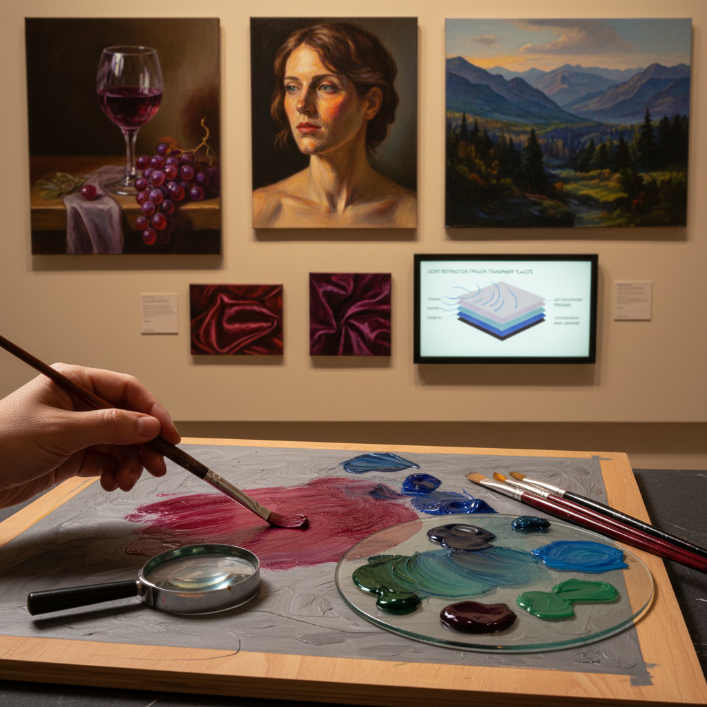

# Glazing Technique 罩染技法

> "Glazing is painting with light itself — each transparent layer acts as a colored filter, and when stacked one upon another over a luminous ground, they create a depth and richness of color that opaque paint can only dream of achieving." — Unknown

## 概述

罩染技法（Glazing Technique）是一种在已干燥的不透明颜料层上施加薄而透明的彩色颜料层的绘画技法。每一层罩染（glaze）都像一片有色玻璃——光线穿过透明的颜料层，到达下方的不透明层后反射回来，再次穿过透明层——这种"光学混色"产生的色彩比直接混合颜料更加深邃、丰富和发光。

罩染技法是古典油画的核心技法之一——从凡·艾克（Van Eyck）到伦勃朗（Rembrandt），从提香（Titian）到维米尔（Vermeer），几乎所有古典大师都使用罩染来建立色彩的深度和丰富度。罩染需要极大的耐心——每一层都必须完全干燥后才能施加下一层（油画中可能需要等待数天甚至数周）。但最终的效果是无与伦比的——宝石般的色彩深度和内在的发光感。

## 核心特征

| 特征 | 描述 |
|------|------|
| 透明 | 透明的颜料层 |
| 叠加 | 多层叠加 |
| 光学 | 光学混色原理 |
| 深邃 | 深邃的色彩 |
| 耐心 | 需要极大耐心 |
| 古典 | 古典油画核心技法 |

## 视觉特征

- **深邃**：深邃的色彩
- **发光**：内在的发光感
- **透明**：透明的色彩层次
- **宝石**：宝石般的质感
- **丰富**：丰富的色彩变化
- **光泽**：光泽的表面

## 代表作品

| 作品 | 艺术家 | 年代 | 意义 |
|------|--------|------|------|
| *Ghent Altarpiece* | Van Eyck | 1432 | 罩染技法的巅峰 |
| *Girl with a Pearl Earring* | Vermeer | 1665 | 罩染的光学效果 |
| *Bacchus and Ariadne* | Titian | 1520-23 | 威尼斯罩染 |
| *Self-portraits* | Rembrandt | 17世纪 | 罩染的深度 |
| *Contemporary glazing* | Various | 当代 | 当代罩染应用 |

## 历史时间线

| 时期 | 事件 |
|------|------|
| 15世纪 | Van Eyck完善油画罩染技法 |
| 16世纪 | 威尼斯画派的罩染发展 |
| 17世纪 | 荷兰和佛兰德斯画家的罩染 |
| 18-19世纪 | 学院派的罩染教学 |
| 20世纪 | 直接画法取代罩染的主导地位 |
| 当代 | 古典技法复兴中的罩染回归 |

## 中国语境

罩染技法在中国的油画教育中有重要地位。中国的美术院校油画系教授罩染作为古典油画技法的核心内容。中国的古典写实画家广泛使用罩染技法。中国传统工笔画中的"三矾九染"与罩染有相似之处——都是通过多层透明色彩的叠加来建立深度。中国的油画技法研究者对古典大师的罩染方法进行了深入研究。一些中国画家将油画罩染与中国传统绘画的"染"法进行比较和融合。

## AI生成概念图

## 与其他风格的关系

- **Imprimatura** → 有色底层
- **Verdaccio** → 绿灰底层画
- **Oil Painting** → 油画
- **Scumbling** → 干擦法
- **Underpainting** → 底层画
- **Classical Realism** → 古典写实

---

*浮光艺志 | Chronicle of Artistry*
