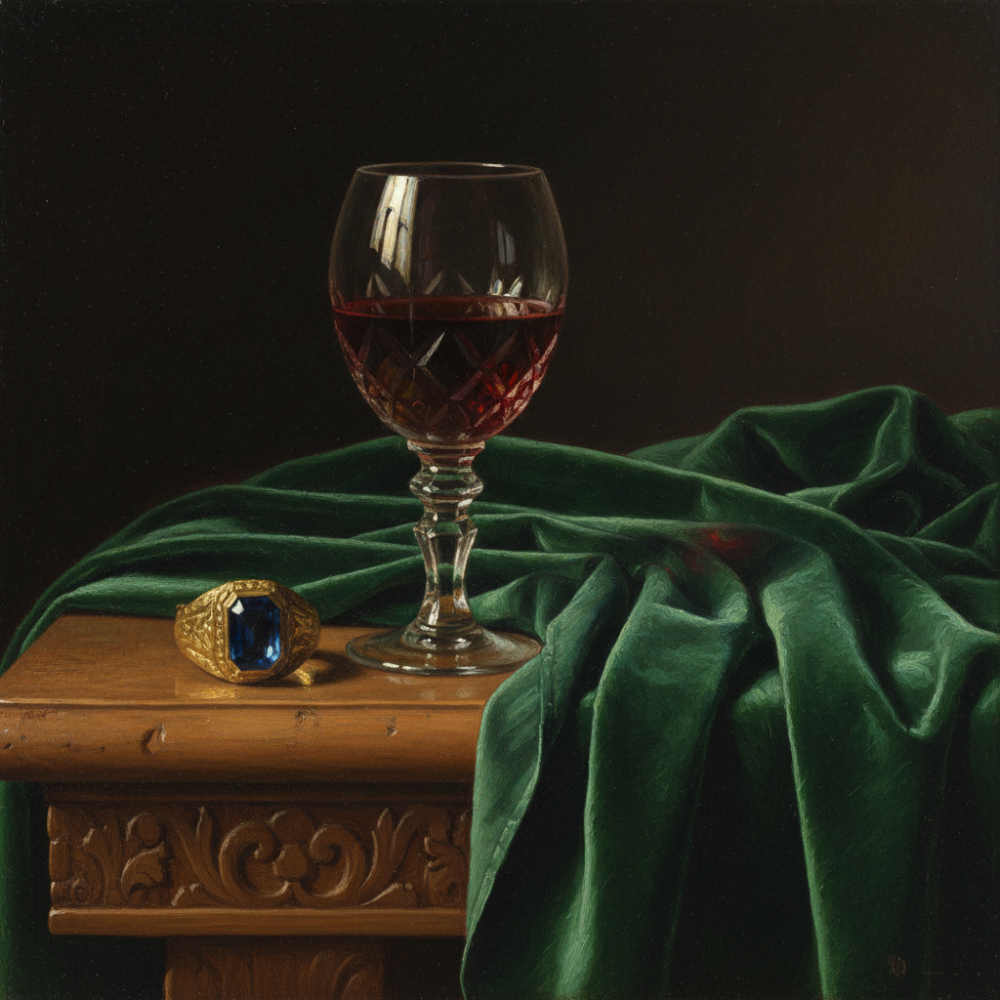

# Glazing 罩染法

> "The secret of the old masters lies in their glazes." — Max Doerner

## 概述

罩染法（Glazing）是一种通过在干燥的不透明底层上叠加多层极薄的透明或半透明颜料来创造深度、光泽和色彩丰富性的古典绘画技法。光线穿透透明色层到达底层后反射回来，产生一种从内部发光的宝石般效果——这是直接混色无法达到的。

从凡·艾克的佛兰德斯油画到提香的威尼斯画派，罩染法是文艺复兴和巴洛克时期大师们最核心的技法秘密。

## 核心特征

| 特征 | 描述 |
|------|------|
| 透明色层 | 每层颜料极薄且透明，可见底层 |
| 光学混色 | 色彩通过光线穿透多层产生，非物理混合 |
| 内发光 | 光线在层间反射产生宝石般的光泽 |
| 色彩深度 | 多层叠加产生无法直接调出的色彩复杂度 |
| 耐心工艺 | 每层必须完全干燥后才能叠加下一层 |
| 底层重要 | 底层的明暗关系决定最终效果 |

## 视觉特征

- **光泽**：宝石般的内发光效果
- **色彩**：深沉、饱和、层次丰富
- **表面**：光滑如瓷器，无可见笔触
- **深度**：色彩仿佛有物理深度
- **透明感**：暗部透明而非死黑
- **统一性**：整体色调和谐统一

## 技法步骤

| 步骤 | 描述 | 材料 |
|------|------|------|
| 1. 底稿 | 精确的素描转移到画布 | 炭笔/铅笔 |
| 2. 底色层 | 不透明的灰色调明暗关系（Grisaille） | 铅白+象牙黑 |
| 3. 死色层 | 不透明的基本色彩铺设 | 不透明颜料 |
| 4. 罩染 | 多层透明色叠加，建立色彩深度 | 透明颜料+介质 |
| 5. 高光 | 最后用不透明白色点出高光 | 铅白/钛白 |

## 代表人物

| 画家 | 罩染特点 | 时期 |
|------|---------|------|
| Jan van Eyck | 多达30+层罩染，宝石般光泽 | 早期佛兰德斯 |
| Titian | 温暖的红色和金色罩染 | 威尼斯画派 |
| Vermeer | 珍珠般的光泽效果 | 荷兰黄金时代 |
| Rembrandt | 暗部的透明深度 | 荷兰黄金时代 |
| J.M.W. Turner | 水彩式的透明油画罩染 | 浪漫主义 |

## 透明颜料选择

| 颜料 | 透明度 | 色相 |
|------|--------|------|
| Alizarin Crimson | 极透明 | 深红 |
| Ultramarine Blue | 透明 | 深蓝 |
| Viridian | 透明 | 翠绿 |
| Indian Yellow | 透明 | 金黄 |
| Burnt Sienna | 半透明 | 暖褐 |
| Raw Umber | 半透明 | 冷褐 |

## 与其他技法的关系

- **Sfumato** → 共享多层薄涂的原理，但 Sfumato 更强调边缘柔化
- **Impasto** → 互补关系——厚涂底层 + 透明罩染是经典组合
- **Flemish Painting** → 佛兰德斯画派的核心技法
- **Chiaroscuro** → 罩染是实现深沉暗部的关键手段
- **Watercolor** → 水彩的透明叠加原理与罩染相同

## 概念图

---

*浮光艺志 | Chronicle of Artistry*
