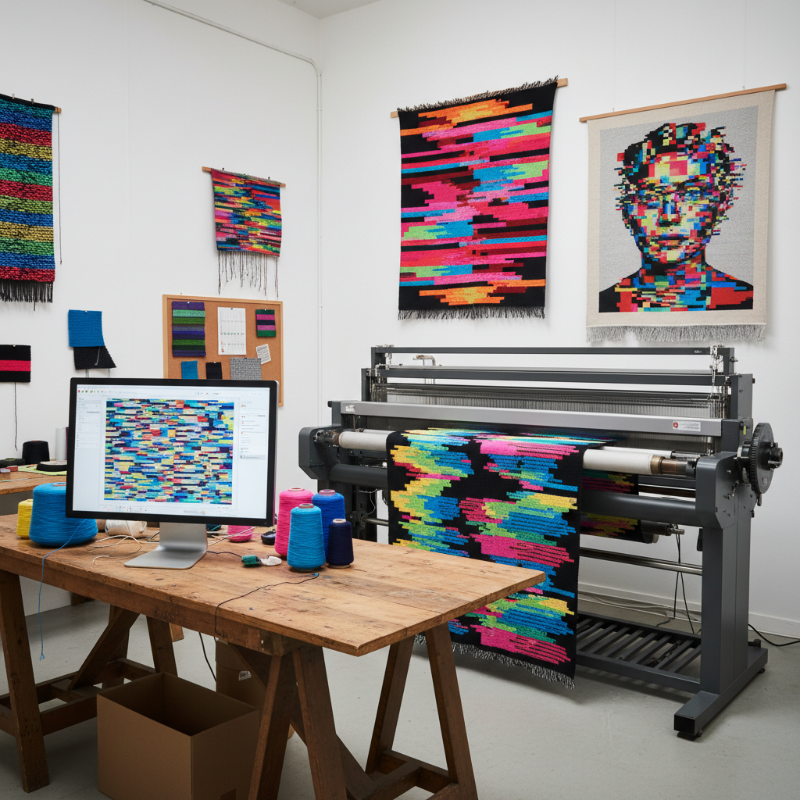

# Glitch Textiles Art 故障纺织艺术

> "Glitch textiles bring the digital error into the physical world — they translate the broken pixel, the corrupted file, the misread data into thread and fiber, weaving malfunction into fabric, knitting noise into garments, and printing digital decay onto silk. When a computer fails, it creates patterns of accidental beauty; when a textile artist recreates those patterns in cloth, they give permanence to the ephemeral, materiality to the virtual, and warmth to the cold logic of broken code." — Unknown

## 概述

故障纺织艺术（Glitch Textiles Art）是将数字故障美学（glitch aesthetics）——像素错位、数据损坏、信号干扰等数字错误的视觉效果——转化为纺织品和织物的艺术实践。这是数字艺术与传统纺织工艺的交叉领域。

故障纺织艺术的实践包括：1）故障编织——将故障图案编程到提花织机中，用线编织出像素化的故障效果；2）故障印花——将数字故障图像印刷到织物上；3）故障针织——用针织机创造模拟数据损坏的图案；4）故障刺绣——用刺绣重现屏幕故障的视觉效果；5）数据编织——将实际的损坏数据文件转化为编织图案；6）故障时装——将故障纺织品应用于时装设计。

## 核心特征

| 特征 | 描述 |
|------|------|
| 错误 | 数字错误的美学 |
| 物质 | 数字到物质的转化 |
| 编织 | 纺织工艺 |
| 像素 | 像素化的图案 |
| 噪声 | 视觉噪声 |
| 跨界 | 数字与手工的跨界 |

## 视觉特征

- **像素**：像素化的色块
- **条纹**：水平扫描线条纹
- **错位**：图像的错位和位移
- **噪点**：随机的色彩噪点
- **断裂**：图案的突然断裂
- **渐变**：故障中的色彩渐变

## 代表作品

| 作品 | 艺术家 | 年代 | 意义 |
|------|--------|------|------|
| *Glitch textiles* | Phillip Stearns | 2012 | 故障编织毯 |
| *Data knitting* | Various | 2010年代 | 数据针织 |
| *Glitch fashion* | Various | 2010年代 | 故障时装 |
| *Corrupted weaving* | Various | 2010年代 | 损坏数据编织 |
| *Digital jacquard* | Various | 当代 | 数字提花 |

## 历史时间线

| 时期 | 事件 |
|------|------|
| 1801 | Jacquard提花织机（编程织造） |
| 2000年代 | 故障艺术运动兴起 |
| 2012 | Stearns的故障编织毯 |
| 2010年代 | 故障纺织的独立发展 |
| 当代 | 数字织造技术的普及 |

## 中国语境

故障纺织艺术在中国有独特的技术和文化基础。中国是世界上最早发明提花织机的国家——中国的花本式提花机比Jacquard织机早了一千多年。中国的丝绸织造传统——云锦、蜀锦、宋锦等——代表了人类纺织技术的最高成就。中国当代的纺织产业高度数字化——数字提花织机在中国纺织工厂中广泛使用。中国当代的一些艺术家在探索故障纺织艺术：将中国传统织锦的图案进行"数字损坏"处理后重新编织、用中国丝绸的精细工艺来呈现故障美学的粗粝感、以及将中国传统纺织的"错版"（织造错误）重新定义为美学价值。

## AI生成概念图

## 与其他风格的关系

- **Glitch Art** → 故障艺术
- **Textile Art** → 纺织艺术
- **Digital Art** → 数字艺术
- **Weaving** → 编织艺术
- **Fashion Design** → 时装设计
- **Data Art** → 数据艺术

---

*浮光艺志 | Chronicle of Artistry*
