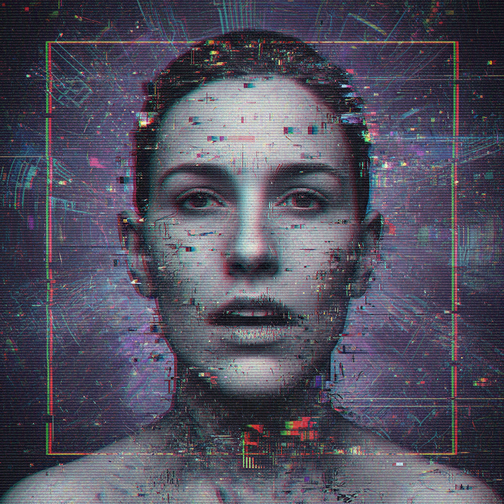

# Glitchcore 故障核



> **"像素撕裂、色彩偏移、数据崩溃——当错误本身成为美学。"**

## 概述

| 维度 | 描述 |
|------|------|
| 时期 | 2010s–至今 |
| 别名 | Glitchcore, Glitch Art, Databending, Digital Decay |
| 核心色彩 | RGB 三原色分离（红/绿/蓝）、黑色、白噪声 |
| 关键元素 | 像素撕裂、色彩通道偏移、数据弯曲、扫描线 |
| 代表人物 | Rosa Menkman、Jodi.org、Kanye West (Yeezus) |
| 关联风格 | Hyperpop, Acid Graphics, Vaporwave, Cyberpunk |

---

## 历史脉络

### 从错误到艺术

| 时代 | 故障美学表现 |
|------|-------------|
| 1960s–70s | Nam June Paik 的视频艺术干扰 |
| 1990s | Jodi.org 的网络艺术 |
| 2000s | Databending 作为艺术实践 |
| 2010s | Glitch 成为主流视觉语言 |
| 2013 | Kanye West《Yeezus》封面 = 故障美学主流化 |
| 2015+ | Hyperpop 将 Glitch 带入音乐视觉 |

### 文化基因

| 来源 | 贡献 |
|------|------|
| 视频艺术 | 信号干扰的美学 |
| 黑客文化 | 破坏系统 = 揭示真相 |
| 后现代主义 | 解构"完美" |
| 数字原住民 | 与技术错误共同成长 |
| 加速主义 | 拥抱崩溃而非抵抗 |

### 核心哲学

Glitchcore 的精神是**"错误即真相"**：
- 完美是虚假的，故障揭示了底层结构
- 数字世界不是坚固的——它随时可能崩溃
- 在错误中发现美 = 接受不完美
- 控制是幻觉，混乱是常态

---

## 视觉语法

### 色彩系统

```
主色：
  RGB红 (#FF0000) — 色彩通道分离
  RGB绿 (#00FF00) — 色彩通道分离
  RGB蓝 (#0000FF) — 色彩通道分离
  黑色 (#000000) — 数据缺失
  白噪声 (随机) — 信号丢失

辅色：
  品红 (#FF00FF) — 色彩溢出
  青色 (#00FFFF) — 色彩溢出
  灰色 (多级) — 扫描线

质感：
  像素化 — 分辨率崩溃
  扫描线 — CRT/VHS
  噪点 — 信号干扰
  压缩伪影 — JPEG/数据损坏
  色彩偏移 — RGB通道错位
```

### 标志性元素

| 类别 | 元素 |
|------|------|
| 效果 | 像素撕裂、色彩通道偏移、数据弯曲 |
| 纹理 | 扫描线、噪点、压缩伪影 |
| 动态 | 闪烁、抖动、随机位移 |
| 文字 | 乱码、重复、错位 |
| 图像 | 被"损坏"的照片/视频 |
| 声音 | 数字噪音、采样率错误 |

---

## 与千禧怀旧的关系

### VHS/CRT 的故障记忆
- 千禧一代记得 VHS 磁带的画面撕裂
- 记得 Windows 蓝屏死机
- 记得网页加载失败的破碎图片
- Glitchcore 将这些"错误记忆"美学化

### 与 Hyperpop 的共生
- Hyperpop 音乐 = 声音的 Glitch
- 100 gecs、SOPHIE 的视觉 = Glitchcore
- 两者共享"加速到崩溃"的精神

---

## 中国语境

- "故障艺术"/"赛博故障"风格
- 抖音/B站上的"故障转场"特效
- 与"赛博朋克"视觉的交叉
- 独立音乐/电子音乐的视觉语言
- 数字艺术展览中的常见手法

---

## 设计应用

| 场景 | 应用方式 |
|------|----------|
| 音乐 | 专辑封面+MV+演出视觉 |
| 品牌 | 科技/音乐/潮牌的视觉冲击 |
| 动效 | 转场+loading+错误状态 |
| 摄影 | 后期故障处理+RGB分离 |

---

## 相关风格

← [Hyperpop Visual 超流行视觉](hyperpop.md) | [Acid Graphics 酸性设计](acid-graphics.md) →

↑ [返回千禧怀旧目录](README.md) | [返回总目录](../README.md)
