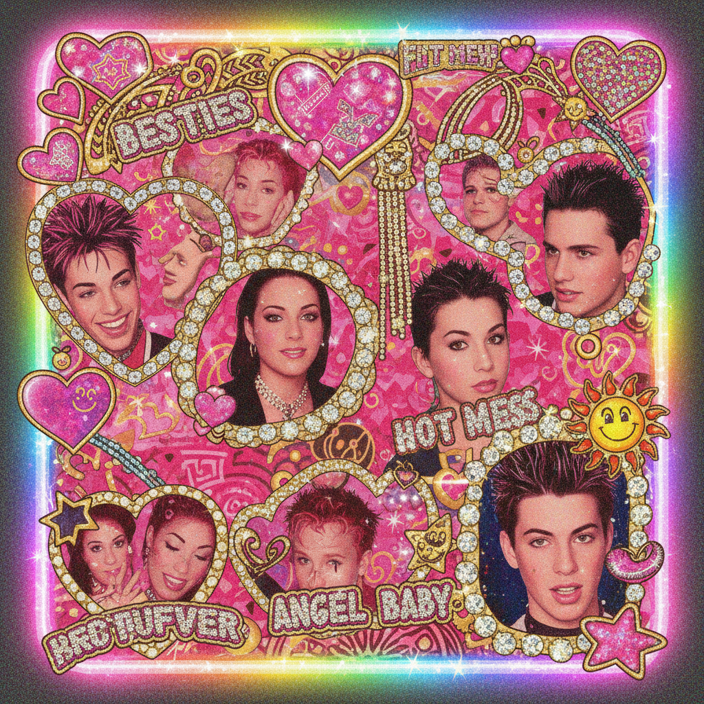
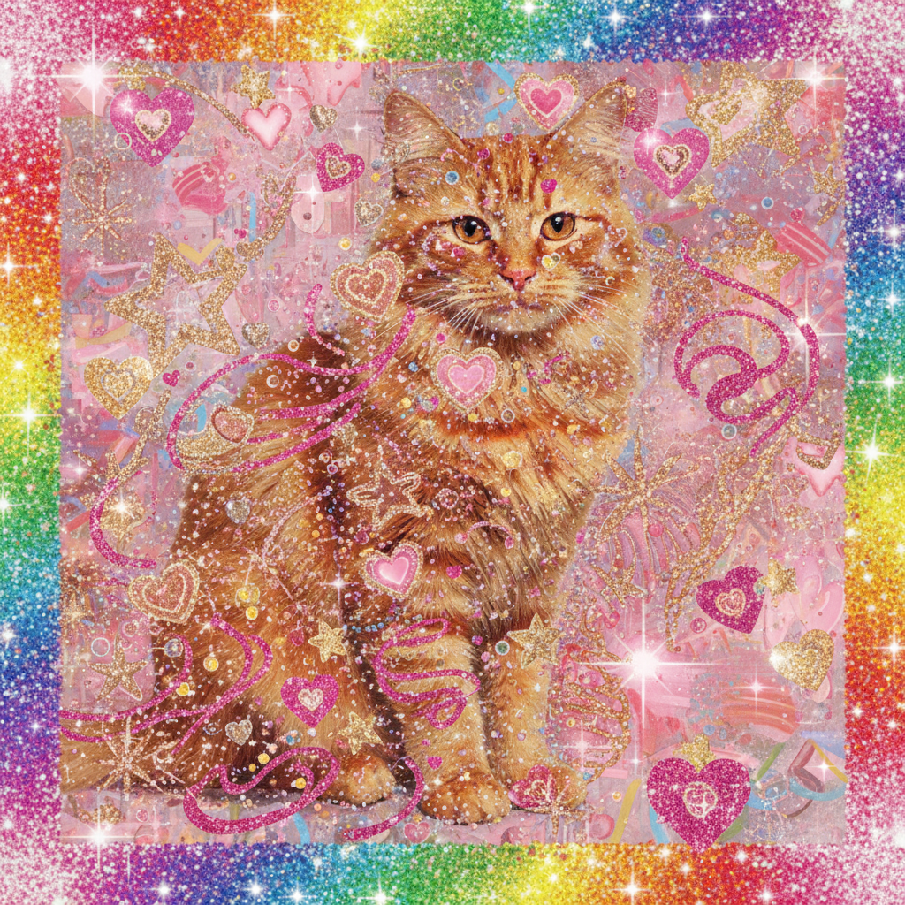

# Glitter Graphics / Blingee

> **别名**：Sparkle Graphics, MySpace Glitter, GIF Bling  
> **活跃年代**：2005 – 2013  
> **核心平台**：Blingee、Glitter-Graphics.com、PhotoBucket、MySpace

---

## 一句话定义

Glitter Graphics 是 2000 年代中后期互联网上最具"民间艺术"气质的视觉风格——用户通过在线工具给照片叠加闪光贴纸、动态 GIF 星星、亮片边框和旋转文字，创造出一种**越闪越好、越多越好**的极致装饰主义。

---

## 视觉语言

| 元素 | 描述 |
|------|------|
| 闪光贴纸 | 星星、心形、蝴蝶、天使翅膀，全部带动态闪烁 |
| 动态 GIF 边框 | 彩虹渐变、金色花纹、钻石镶嵌效果 |
| 旋转/弹跳文字 | "Best Friends Forever"、"I ♥ U" 等短语 |
| 叠加滤镜 | 镜头光晕、彩虹棱镜、雪花飘落 |
| 色彩 | 粉色、金色、紫色、彩虹渐变为主 |
| 底图 | 自拍、明星照片、宠物照片 |

### 技术构成

Glitter Graphics 的视觉效果建立在几种特定的技术基础上：

- **GIF 动画**：256 色限制下的逐帧闪烁，每帧交替显示亮/暗像素模拟"闪光"
- **透明叠层**：多个 GIF 图层叠加在底图上，每层独立循环
- **HTML 嵌入**：通过 `` 标签和 `<embed>` 将动态图片嵌入 MySpace 页面
- **预制模板**：Blingee 提供数千种预制贴纸，用户只需拖放组合

这种"模块化装饰"的工作方式——从素材库中选取元素、叠加组合——预示了后来 Instagram 滤镜和 Snapchat 贴纸的产品逻辑。

---

## 历史时间线

| 时期 | 事件 |
|------|------|
| 2004 | Glitter-Graphics.com 前身网站出现，提供静态闪光文字生成器 |
| 2005 | MySpace 允许自定义 HTML，闪光图片嵌入成为主流装饰手段 |
| 2006 | **Blingee 正式上线**（6月26日注册域名），成为该风格的标志性平台 |
| 2006-2007 | Blingee 用户数爆发式增长，日均生成数十万张闪光图片 |
| 2007 | PhotoBucket 成为闪光 GIF 的主要托管平台 |
| 2008 | Facebook 超越 MySpace 成为第一大社交网络；Blingee 开始推出移动版 |
| 2009 | MySpace 用户大规模流失，Glitter Graphics 的原生栖息地萎缩 |
| 2010-2012 | Instagram 上线并推广滤镜文化，"精致感"取代"闪光感" |
| 2013 | Blingee 停止重大更新，网站进入维护模式 |
| 2017-2019 | Tumblr 上出现 Blingee 怀旧社区，开始反讽性使用 |
| 2020-2022 | TikTok "Blingee edit" 标签爆发，Z世代重新发现这种美学 |
| 2023+ | 独立艺术家将 Blingee 风格引入画廊展览和 zine 出版 |

---

## 文化内核

### 互联网民间艺术

Glitter Graphics 是真正的**数字民间艺术（Digital Folk Art）**。它不需要 Photoshop 技能，不需要设计学位，只需要一个浏览器和对"闪亮"的热爱。这种零门槛的创作方式让每一个 MySpace 用户都成为了自己主页的"室内设计师"。

学术界已经开始认真对待这种现象。2019 年，纽约新博物馆（New Museum）的展览 *"My Blingee"* 将 Blingee 作品作为数字时代的民间艺术进行展示，认为它与传统的剪纸、刺绣、拼贴画具有相同的文化功能：**用手边可得的材料，表达个人情感和社群归属**。

### 装饰即表达

在 Glitter Graphics 的世界里，装饰不是多余的——**装饰就是内容本身**。一张普通的自拍经过 Blingee 处理后，变成了一件个人宣言：
- 闪光心形 = 我在恋爱
- 天使翅膀 = 我是好女孩
- 骷髅+玫瑰 = 我很酷但也很浪漫
- 钻石边框 = 我值得最好的
- 美国国旗+鹰 = 爱国主题（节日特供）
- 十字架+光芒 = 信仰表达

这种"符号化自我表达"的逻辑，在今天的 emoji、表情包和 AR 滤镜中依然存活。

### 与 McBling 的关系

Glitter Graphics 是 McBling 美学在数字空间的直接延伸。McBling 把水钻和 logo 穿在身上，Glitter Graphics 则把同样的"bling"精神贴在了每一张照片上。两者共享同一种文化态度：**可见的装饰 = 可见的价值**。

### 性别与阶级维度

Glitter Graphics 的用户群体以年轻女性和少女为主，这一事实直接导致了它被主流设计界轻视。"太闪了"、"太俗了"、"太少女了"——这些批评背后隐藏着对女性化审美和工人阶级品味的双重偏见。

值得注意的是，Blingee 在拉丁美洲、东南亚和中国（QQ 空间闪图）同样流行，它是一种**全球性的草根数字装饰文化**，而非仅限于英语互联网。

---

## 子类型

| 子类型 | 特征 | 典型场景 |
|--------|------|----------|
| **Holiday Blingee** | 节日主题贴纸（圣诞雪花、万圣南瓜） | 节日贺卡、祝福图 |
| **Emo Blingee** | 黑色+粉色、碎心、眼泪贴纸 | Scene/Emo 社区 |
| **Celebrity Blingee** | 明星照片+皇冠+钻石 | 粉丝创作 |
| **Memorial Blingee** | 天使翅膀+光芒+RIP文字 | 悼念逝者 |
| **Kawaii Blingee** | 日系可爱元素+闪光 | 动漫粉丝社区 |
| **Religious Blingee** | 十字架+圣光+经文 | 宗教社区 |

---

## 为什么它消失了？

1. **平台迁移**：Facebook 和 Instagram 不支持自定义 HTML/嵌入式 GIF
2. **审美转向**：扁平化设计和"less is more"成为主流
3. **技术淘汰**：Flash 的衰落让很多动态效果失效
4. **社会偏见**：被贴上"low taste"标签，与"杀马特"类似的阶级歧视
5. **商业模式失败**：Blingee 未能成功转型移动端，错过了 App 经济

---

## 为什么它值得怀念？

> "Blingee 时代的互联网有一种今天很少见的东西：它真的很想让你开心。"

- 它代表了一个**人人都是创作者**的互联网时代
- 它证明了审美不需要"正确"，只需要真诚
- 它是社交媒体从"个人表达"走向"算法喂养"之前的最后一道闪光
- 它记录了一种**未经设计教育规训的原始创造力**

---

## 当代回响

- **Kidcore / Webcore** 社区重新拥抱闪光 GIF 美学
- TikTok 上的 "Blingee edit" 标签累计数亿播放
- 独立艺术家用 Blingee 风格创作反讽作品，批判当代社交媒体的"精致感"
- Y2K 时尚回潮中，水钻贴纸和亮片重新出现在实体商品上
- **AI 图像编辑工具**（如 Picsart、CapCut）的贴纸功能本质上是 Blingee 逻辑的现代化
- 2024 年 Apple 的 Genmoji 和 Image Playground 延续了"用预制元素装饰照片"的产品思路

---

## 中国语境：QQ 空间闪图

在中国互联网中，Glitter Graphics 有一个完美的本土对应物——**QQ 空间闪图**：

- 2006-2010 年间，QQ 空间提供"闪图"功能，用户可以给照片添加闪光效果
- "非主流"文化大量使用闪光文字、星星边框、彩虹效果
- 与 Blingee 一样，它后来被贴上"杀马特"标签而遭到嘲笑
- 但它同样代表了一代人最早的数字创作体验

两者的平行发展证明：**在全球范围内，当普通人第一次获得数字装饰工具时，他们的本能反应是一致的——让一切闪闪发光。**

---

## 代表性视觉参考

- Blingee.com 存档页面（Internet Archive）
- MySpace 个人主页截图（2006-2008）
- Glitter-Graphics.com 贺卡模板
- 早期 QQ 空间闪图装饰
- Tumblr #blingee 标签存档

---

## 延伸阅读

- [Aesthetics Wiki - Glitter Graphics](https://aesthetics.fandom.com/wiki/Glitter_Graphics)
- [The History of Blingee](https://www.vice.com/en/article/the-history-of-blingee)
- *"Glitter and Glue: Digital Folk Art in the Age of Social Media"*（学术论文）
- 本项目相关：[McBling](mcbling.md) | [Webcore](webcore.md) | [Scene](scene.md) | [Kidcore](kidcore.md)
