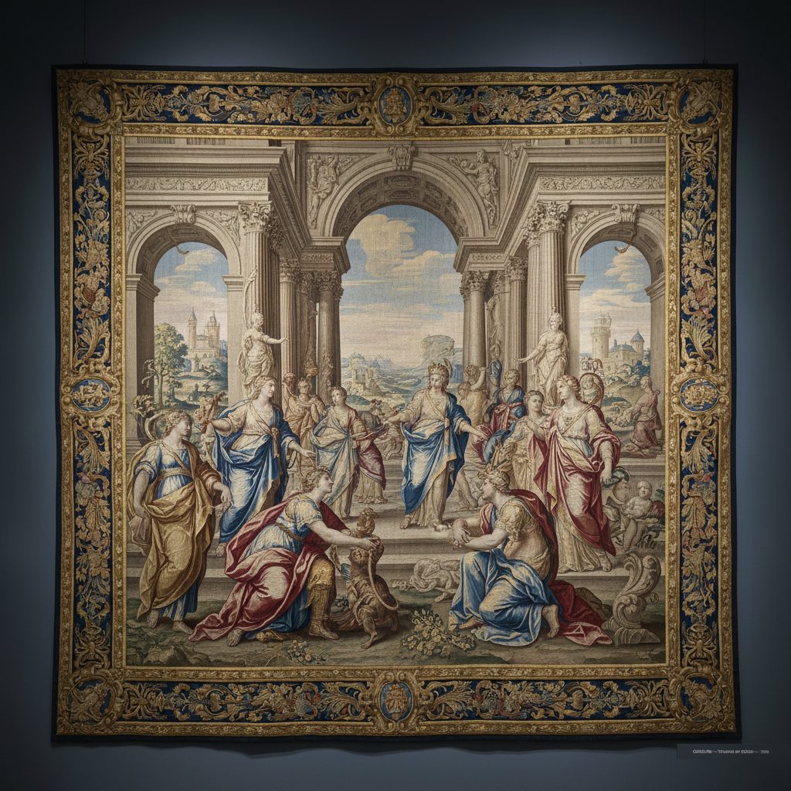

# Gobelins Art 戈布兰挂毯艺术

> "Gobelins is the state art of France woven large — since Louis XIV established the royal manufactory, the finest painters' compositions have been translated thread by thread into monumental tapestries on high-warp looms, each square meter requiring months of skilled labor, creating textile masterpieces that served as portable propaganda, diplomatic gifts, and the ultimate expression of French artistic supremacy." — Unknown

## 概述

戈布兰挂毯艺术（Gobelins Art）是法国国家戈布兰制造厂（Manufacture des Gobelins）自1662年以来的皇家/国家挂毯织造传统——以其高经织造技法、巨大的尺幅、精湛的技艺和与顶级画家的合作著称。戈布兰挂毯代表了欧洲挂毯艺术的最高水平，至今仍在为法国国家机构生产挂毯。

戈布兰挂毯艺术的实践包括：1）高经织造——在垂直织机上进行高经织造；2）画家合作——与顶级画家合作设计；3）巨幅——制作巨大尺幅的挂毯；4）精细——极其精细的织造密度；5）国家订制——为国家机构和外交礼品制作；6）修复——古老挂毯的修复；7）当代戈布兰——与当代艺术家合作的新作品。

## 核心特征

| 特征 | 描述 |
|------|------|
| 高经 | 高经（垂直）织造 |
| 皇家 | 皇家/国家制造厂 |
| 巨幅 | 巨大的尺幅 |
| 精细 | 极其精细的织造 |
| 合作 | 与顶级画家合作 |
| 外交 | 外交礼品的功能 |

## 视觉特征

- **精细**：极其精细的织造密度
- **巨幅**：巨大的画面尺幅
- **叙事**：宏大的叙事场景
- **色彩**：丰富精确的色彩
- **立体**：接近绘画的立体感
- **华丽**：华丽的整体效果

## 代表作品

| 作品 | 艺术家/文化 | 年代 | 意义 |
|------|-------------|------|------|
| *History of the King* | 法国 | 1665-80年 | 《国王的历史》 |
| *Acts of the Apostles* | 拉斐尔设计 | 17世纪 | 《使徒行传》 |
| *The Months/Royal Residences* | 法国 | 1668-94年 | 《月份/皇家宫殿》 |
| *Don Quixote series* | 法国 | 18世纪 | 《堂吉诃德》系列 |
| *Contemporary Gobelins* | 法国 | 当代 | 当代戈布兰挂毯 |

## 历史时间线

| 时期 | 事件 |
|------|------|
| 1443年 | 戈布兰家族建立染坊 |
| 1662年 | 路易十四建立皇家制造厂 |
| 17-18世纪 | 戈布兰的黄金时代 |
| 法国大革命 | 制造厂的转型 |
| 当代 | 继续为法国国家生产挂毯 |

## 中国语境

戈布兰挂毯与中国的国家级织物工艺有一定的可比性。中国的缂丝——作为"织中之圣"，与戈布兰挂毯有相似的精细度和艺术地位。中国的宫廷织造——如江宁织造、苏州织造，与戈布兰的皇家制造厂有类似的功能。中国的国礼——丝绸和刺绣作品作为国家礼品，与戈布兰挂毯的外交功能相似。中国与法国的文化交流中，戈布兰制造厂——是重要的参观和交流场所。中国的工艺美术教育中，戈布兰挂毯作为欧洲织物艺术的巅峰——在相关课程中介绍。

## AI生成概念图

## 与其他风格的关系

- **Aubusson** → 奥比松挂毯
- **Verdure Tapestry** → 绿荫挂毯
- **Tapestry Weaving** → 挂毯织造
- **French Royal Art** → 法国皇家艺术
- **Baroque** → 巴洛克
- **Textile Art** → 纺织艺术

---

*浮光艺志 | Chronicle of Artistry*
