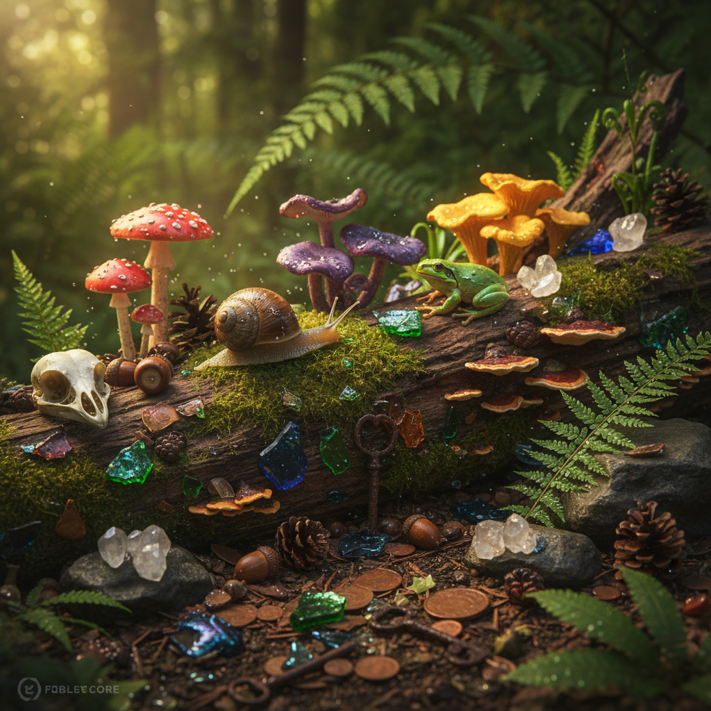

# Goblincore Art 哥布林核艺术

> "Goblincore is the aesthetic of finding treasure in what others discard — the love of mud and mushrooms and snails and moss-covered rocks, the joy of collecting shiny things and interesting bones and unusual stones, the refusal to see nature through the sanitized lens of cottagecore's pretty gardens, instead embracing the damp, the dark, the decomposing, the crawling, the slimy, and the strange, finding beauty not in flowers but in fungi, not in butterflies but in beetles, not in meadows but in the forest floor where everything is rotting and growing simultaneously." — Unknown

## 概述

哥布林核（Goblincore）是2010年代末至2020年代兴起的一种互联网美学，以对自然界中"不美"的事物的热爱为核心——蘑菇、苔藓、蜗牛、甲虫、泥土、石头、骨头、青蛙等。与田园核（Cottagecore）的理想化乡村美学不同，哥布林核拥抱自然的混乱、潮湿和腐朽面，找到被主流审美忽视或排斥的事物中的美。

哥布林核的名称来自幻想文学中的哥布林——贪婪地收集闪亮物品的小生物。这种美学的核心行为包括：收集有趣的石头和贝壳、观察蘑菇和苔藓、在泥地里玩耍、欣赏昆虫和两栖动物、以及对"闪亮的垃圾"的热爱。哥布林核也有环保的维度——它鼓励人们关注和欣赏被忽视的生态系统（如腐殖层、真菌网络），从而培养对自然多样性的尊重。

## 核心特征

| 特征 | 描述 |
|------|------|
| 蘑菇 | 对蘑菇和真菌的热爱 |
| 收集 | 收集自然物品 |
| 泥土 | 拥抱泥土和潮湿 |
| 昆虫 | 欣赏昆虫和小动物 |
| 混乱 | 自然的混乱之美 |
| 闪亮 | 对闪亮物品的贪恋 |

## 视觉特征

- **蘑菇**：各种蘑菇和真菌
- **苔藓**：苔藓覆盖的表面
- **石头**：有趣的石头和矿物
- **昆虫**：甲虫、蜗牛、青蛙
- **泥土**：泥土和腐殖质
- **宝藏**：闪亮的小物件

## 代表作品

| 作品 | 艺术家 | 年代 | 意义 |
|------|--------|------|------|
| *Goblincore aesthetics* | Various | 2019起 | 在线美学社区 |
| *Mushroom illustrations* | Various | 2020年代 | 蘑菇插画的流行 |
| *Nature journals* | Various | 2020年代 | 自然日记 |
| *Goblincore fashion* | Various | 2020年代 | 哥布林核时尚 |
| *Indie games* | Various | 2020年代 | 蘑菇主题游戏 |

## 历史时间线

| 时期 | 事件 |
|------|------|
| 2019 | Goblincore在Tumblr上兴起 |
| 2020 | 疫情期间的户外探索热 |
| 2021 | TikTok上的传播 |
| 2022 | 蘑菇文化的主流化 |
| 当代 | 与环保意识的融合 |

## 中国语境

哥布林核在中国有独特的文化对应。中国传统文化中有丰富的"赏石"传统——对奇石、太湖石的收集和欣赏——这与哥布林核的"收集有趣石头"高度一致。中国的菌类文化也非常丰富——云南的野生菌文化、中医对各种菌类的使用、以及近年来"菌子"在社交媒体上的流行。中国的一些年轻人在实践着类似哥布林核的生活方式——在城市公园里寻找蘑菇、收集有趣的石头和贝壳、观察昆虫和苔藓。中国的"博物学"复兴——对自然观察和记录的兴趣——也与哥布林核的精神相通。

## AI生成概念图

## 与其他风格的关系

- **Cottagecore** → 田园核
- **Dark Academia** → 暗黑学院
- **Mushroom Art** → 蘑菇艺术
- **Nature Art** → 自然艺术
- **Fairy Tale Art** → 童话艺术
- **Botanical Illustration** → 植物插画

---

*浮光艺志 | Chronicle of Artistry*
