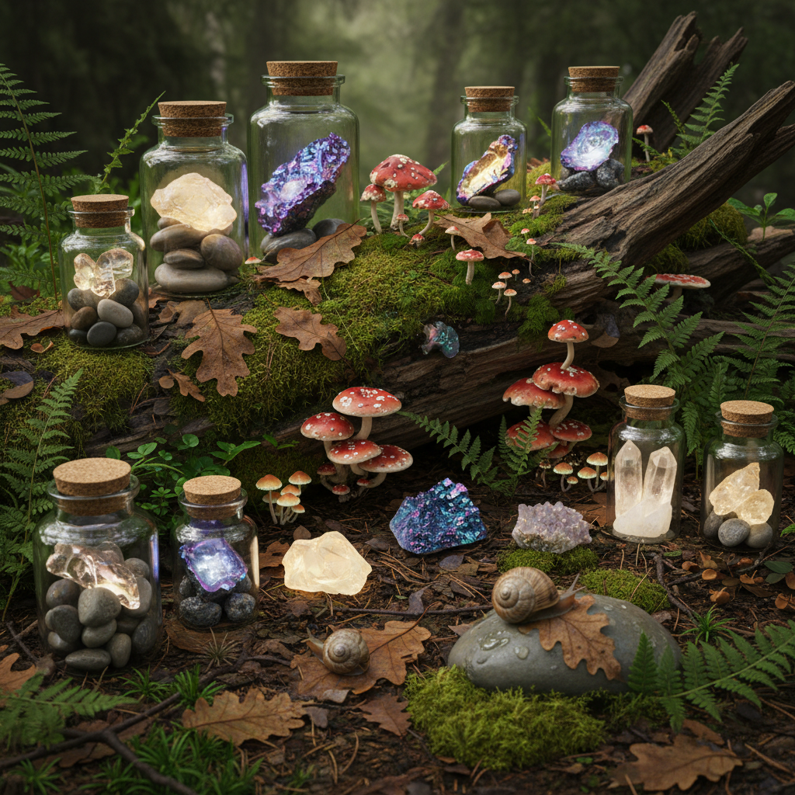
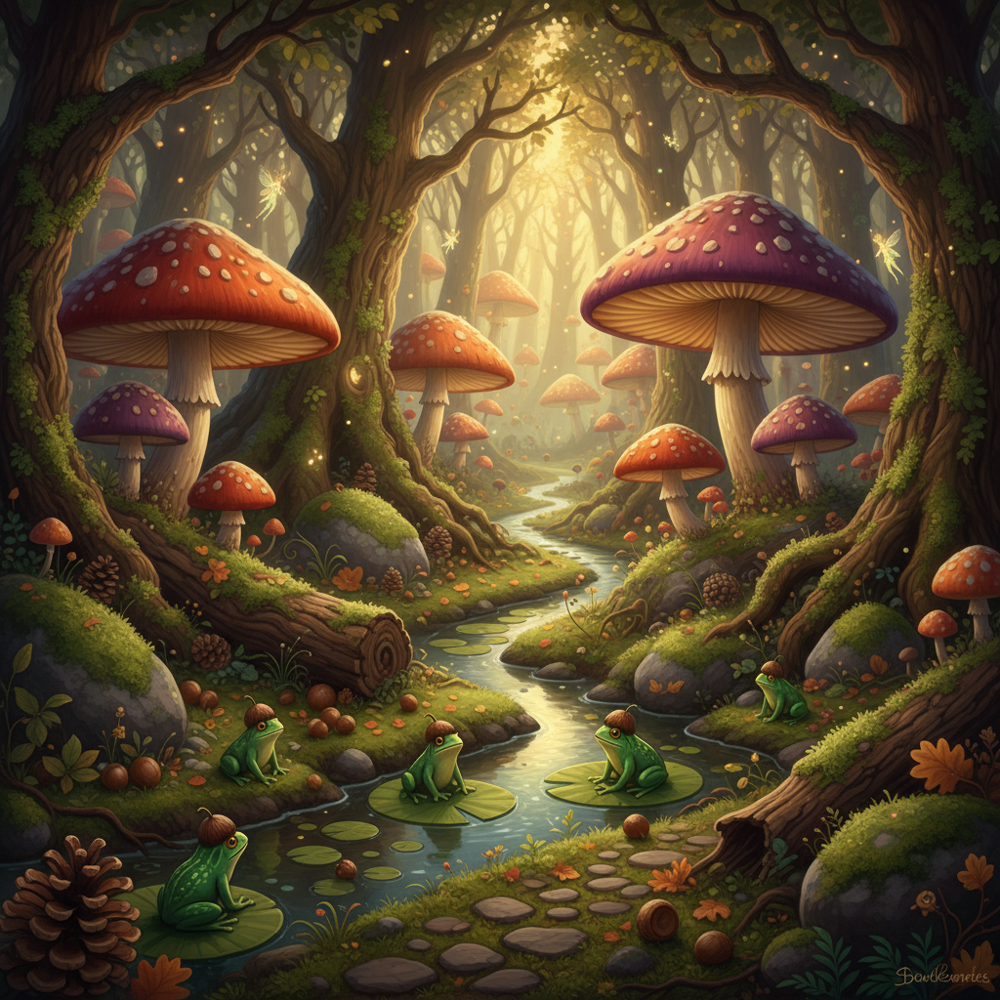

# Goblincore 哥布林核





> **"捡石头、看蘑菇、在泥巴里打滚——拒绝'漂亮'，拥抱'有趣'。"**

## 概述

| 维度 | 描述 |
|------|------|
| 时期 | 2019–至今 |
| 别名 | Goblincore, Gremlincore, Crowcore, Moss Aesthetic |
| 核心色彩 | 苔藓绿、泥土棕、蘑菇米、深紫、暗金 |
| 关键元素 | 蘑菇、青蛙、蜗牛、石头收藏、苔藓、泥土 |
| 代表人物 | Tumblr/TikTok 匿名社群、Studio Ghibli 的森林精灵 |
| 关联风格 | Cottagecore, Dark Academia, Witchcore, Forestcore |

---

## 历史脉络

### 2019–2020：Tumblr 的地下生物

Goblincore 在 2019 年左右从 Tumblr 上出现，是 Cottagecore 的"脏版本"：

**Cottagecore vs Goblincore**：
- Cottagecore：摘花、烤面包、穿碎花裙 → 干净、美丽、有序
- Goblincore：捡石头、看虫子、在森林里翻烂木头 → 脏、奇怪、混乱

两者共享"亲近自然"的核心，但 Goblincore 拒绝了 Cottagecore 的"田园牧歌"滤镜，拥抱自然中不那么"漂亮"的部分。

### 文化基因

| 来源 | 贡献 |
|------|------|
| 奇幻文学中的哥布林 | 收集闪亮物品、住在洞穴里 |
| Studio Ghibli | 《龙猫》的森林精灵、《幽灵公主》的自然崇拜 |
| 乌鸦行为 | 收集闪亮的小物件（"crow behavior"） |
| 童年记忆 | 小时候捡石头、抓虫子的快乐 |
| ADHD/神经多样性 | "闪亮综合征"——被随机物品吸引 |

### 2020–2021：TikTok 爆发

疫情期间，Goblincore 在 TikTok 上爆发：
- 户外散步成为少数被允许的活动 → 人们开始注意地上的蘑菇和石头
- #goblincore 标签累积数十亿播放
- "shiny rock collection" 视频成为热门格式
- 与 cottagecore 形成互补的双子美学

### 核心哲学

Goblincore 的核心不是"丑"，而是**重新定义什么值得被珍视**：
- 一块有趣形状的石头 = 和钻石一样值得收藏
- 一只蜗牛 = 和蝴蝶一样值得欣赏
- 泥土 = 和花朵一样是自然的一部分
- 这是对消费主义"价值等级"的温和颠覆

---

## 视觉语法

### 色彩系统

```
主色（全部取自森林地面）：
  苔藓绿 (#4A5D23) — 最核心的 Goblincore 色
  泥土棕 (#5C4033) — 土壤、树皮、烂叶
  蘑菇米 (#C4A882) — 蘑菇伞盖
  深紫 (#4B0082) — 水晶、浆果
  暗金 (#B8860B) — "闪亮的东西"

辅色：
  青蛙绿 (#6B8E23) — 两栖动物
  蜗牛灰 (#808080) — 贝壳、石头
  朽木黑 (#2F2F2F) — 腐烂的木头

质感：
  苔藓 — 湿润、柔软
  泥土 — 粗糙、有机
  石头 — 光滑或粗糙
  蘑菇 — 柔软、有弹性
  树皮 — 粗糙、有纹理
```

### 标志性元素

| 类别 | 元素 |
|------|------|
| 生物 | 蘑菇（最重要）、青蛙、蜗牛、甲虫、蚯蚓 |
| 矿物 | 石头收藏、水晶、化石、贝壳 |
| 植物 | 苔藓、蕨类、地衣、藤蔓 |
| 收藏 | 闪亮的小物件、瓶盖、钥匙、硬币、玻璃珠 |
| 空间 | 森林地面、溪流边、烂木头下面 |
| 服装 | 宽松的棕色/绿色衣服、补丁、口袋很多 |
| 容器 | 玻璃罐（装石头/蘑菇/苔藓）、布袋 |

---

## 与千禧怀旧的关系

Goblincore 怀念的是**童年的探索精神**：
- 小时候在路边捡石头觉得是宝藏
- 小时候蹲在地上看蚂蚁搬家
- 小时候把口袋装满"有趣的东西"
- 长大后被告知这些东西"没有价值"
- Goblincore = 重新允许自己像孩子一样对世界好奇

---

## 中国语境

- "赶山"文化（云南/贵州的采菌子）
- 小红书上的"捡石头"内容
- 多肉/苔藓微景观爱好者
- 博物学/自然笔记的复兴
- 与"松弛感"生活方式的交叉

---

## 设计应用

| 场景 | 应用方式 |
|------|----------|
| 品牌设计 | 手绘蘑菇插画+泥土色板+有机形状 |
| 包装 | 牛皮纸+蘑菇/蕨类图案+手写字 |
| 空间 | 苔藓墙+石头装饰+玻璃罐收藏 |
| 游戏 | 森林探索+收集机制+可爱生物 |

---

## 延伸阅读

- Aesthetics Wiki: [Goblincore](https://aesthetics.fandom.com/wiki/Goblincore)
- "Why Gen Z Is Obsessed with Mushrooms" 文化分析
- Goblincore 与神经多样性的关系

---

## 相关风格

← [Cottagecore 田园核](cottagecore.md) | [Cluttercore 杂物核](cluttercore.md) →

↑ [返回千禧怀旧目录](README.md) | [返回总目录](../README.md)
