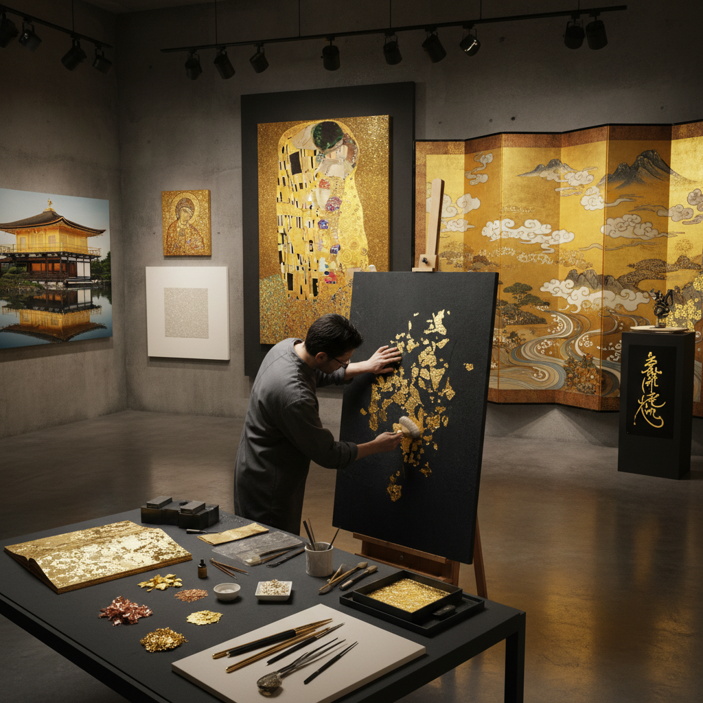

# Gold Leaf Art 金箔艺术

> "Gold leaf is light made solid — beaten so thin that it becomes translucent, floating on the slightest breath like a whisper of metal, yet when laid upon a surface it transforms everything it touches into something sacred, catching every photon and returning it multiplied, a material so ancient and so modern that it bridges the gold backgrounds of Byzantine icons to the installations of contemporary galleries." — Unknown

## 概述

金箔艺术（Gold Leaf Art）是一种使用极薄的金箔（通常厚度仅0.1-0.2微米，约为人类头发直径的1/500）作为艺术媒介的创作形式。金箔通过反复锤打金块制成——一盎司（约28克）的金可以被打成覆盖约9平方米的金箔。金箔艺术不仅包括传统的鎏金装饰，还包括当代艺术家将金箔作为独立的艺术表达媒介。

金箔在艺术史上有着特殊的地位——从拜占庭圣像画的金色背景到克里姆特的《吻》，从日本的金屏风到当代装置艺术。金箔的独特之处在于它既是材料又是光——它不反射特定颜色的光，而是反射所有的光，创造出一种超越普通颜料的发光效果。当代金箔艺术家探索金箔的物理特性——它的透明性、脆弱性、可塑性和永恒性。

## 核心特征

| 特征 | 描述 |
|------|------|
| 极薄 | 0.1微米的极薄金属 |
| 发光 | 自身发光的效果 |
| 脆弱 | 极其脆弱易碎 |
| 永恒 | 金不氧化不变色 |
| 神圣 | 神圣和奢华的象征 |
| 多用 | 多种应用方式 |

## 视觉特征

- **金光**：纯金的光芒
- **平面**：平面的金色表面
- **裂纹**：金箔的自然裂纹
- **透光**：极薄处可透光
- **温暖**：温暖的金色调
- **神圣**：超越世俗的光感

## 代表作品

| 作品 | 艺术家 | 年代 | 意义 |
|------|--------|------|------|
| *The Kiss* | Gustav Klimt | 1907-1908 | 克里姆特的金箔绘画 |
| *Byzantine icons* | 拜占庭画家 | 6-15世纪 | 拜占庭金色背景圣像 |
| *Japanese gold screens* | 日本画家 | 16-17世纪 | 日本金屏风 |
| *Kinkaku-ji (Golden Pavilion)* | 足利义满 | 1397 | 金阁寺 |
| *Contemporary gold leaf installations* | Various | 当代 | 当代金箔装置 |

## 历史时间线

| 时期 | 事件 |
|------|------|
| 古埃及 | 金箔制作的起源 |
| 拜占庭 | 金色背景圣像画 |
| 中世纪 | 泥金手抄本装饰 |
| 文艺复兴 | 金箔在绘画中的应用 |
| 当代 | 金箔作为当代艺术媒介 |

## 中国语境

金箔艺术在中国有悠久的传统。南京是中国金箔的主要产地——南京金箔锻制技艺是国家级非物质文化遗产。中国的佛教艺术中大量使用金箔——"贴金"是佛像装饰的重要工序。中国的传统建筑装饰（如故宫的金顶）使用金箔。中国的漆器"贴金"和"洒金"技法使用金箔。当代中国的一些艺术家在创作中使用金箔作为表达媒介。中国的金箔还用于食品装饰和中药。

## AI生成概念图

## 与其他风格的关系

- **Gilding** → 鎏金
- **Illumination** → 泥金装饰
- **Klimt** → 克里姆特风格
- **Japanese Art** → 日本艺术
- **Religious Art** → 宗教艺术
- **Mixed Media** → 混合媒介

---

*浮光艺志 | Chronicle of Artistry*
