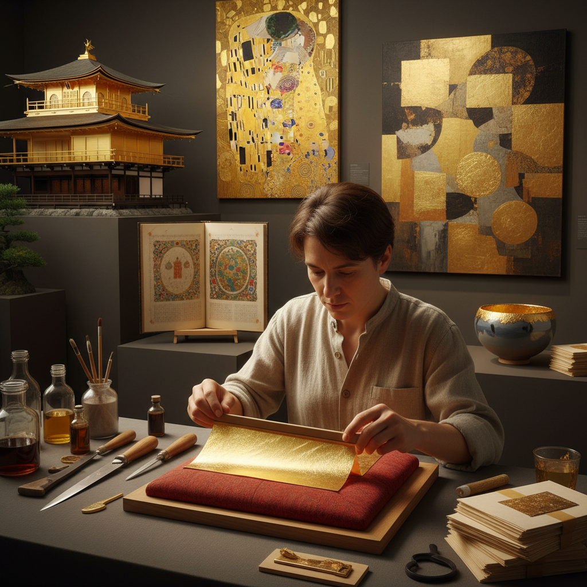

# Gold Leaf 金箔

> "Gold leaf is light made solid — beaten to a thickness measured in atoms, it floats on breath and clings to surfaces with a luminosity that no paint or pigment can replicate." — Unknown

## 概述

金箔（Gold Leaf）是将纯金或金合金锤打成极薄的薄片的工艺及其产品。标准金箔的厚度约为0.1微米（约500个金原子厚）——薄到几乎透明，可以透过绿色的光线。金箔是鎏金（gilding）的主要材料之一，但金箔本身的制作也是一门独立的精湛工艺。

金箔的制作过程（金箔锤打，gold beating）是将金锭反复锤打、折叠、再锤打——从一小块金锭开始，经过数千次锤打，最终得到数百张极薄的金箔。传统的金箔锤打完全依靠手工——需要极大的耐心和精确的力度控制。金箔的应用极其广泛：建筑装饰、画框、佛像、书籍装帧、食品装饰、化妆品、艺术创作等。

## 核心特征

| 特征 | 描述 |
|------|------|
| 极薄 | 约0.1微米厚 |
| 锤打 | 反复锤打制成 |
| 纯金 | 通常为高纯度金 |
| 轻盈 | 极其轻盈 |
| 光泽 | 永不褪色的光泽 |
| 多用 | 用途极其广泛 |

## 视觉特征

- **金色**：纯正的金色
- **光泽**：独特的金属光泽
- **轻盈**：轻盈飘逸的质感
- **褶皱**：自然的褶皱纹理
- **反射**：强烈的光线反射
- **温暖**：温暖华贵的色调

## 代表作品

| 作品 | 艺术家 | 年代 | 意义 |
|------|--------|------|------|
| *Kinkaku-ji (Golden Pavilion)* | 匿名 | 1397 | 金阁寺 |
| *Gustav Klimt paintings* | Gustav Klimt | 1900s | 克里姆特金箔画 |
| *Illuminated manuscripts* | 匿名 | 中世纪 | 泥金手抄本 |
| *Chinese gold leaf Buddha* | 匿名 | 各时期 | 贴金佛像 |
| *Contemporary gold leaf art* | Various | 当代 | 当代金箔艺术 |

## 历史时间线

| 时期 | 事件 |
|------|------|
| 古埃及 | 最早的金箔使用 |
| 古代中国 | 南京金箔的传统 |
| 中世纪 | 泥金手抄本的繁荣 |
| 文艺复兴 | 金箔在绘画中的应用 |
| 19世纪 | 机械辅助金箔生产 |
| 当代 | 金箔在当代艺术中的复兴 |

## 中国语境

金箔在中国有着极其悠久的历史——南京是中国金箔的主要产地，南京金箔锻制技艺被列为国家级非物质文化遗产。中国的金箔生产历史可追溯到东晋时期。中国的金箔主要应用于：佛像贴金、建筑装饰（如故宫的金顶）、传统工艺品（金箔画、金箔漆器）、以及现代的食品和化妆品。南京的金箔产量占全球的70%以上。中国的金箔工匠至今仍保留着传统的手工锤打技艺。

## AI生成概念图

## 与其他风格的关系

- **Gilding** → 鎏金
- **Silver Leaf** → 银箔
- **Icon Painting** → 圣像画
- **Illumination** → 泥金装饰
- **Lacquerware** → 漆器
- **Klimt Style** → 克里姆特风格

---

*浮光艺志 | Chronicle of Artistry*
