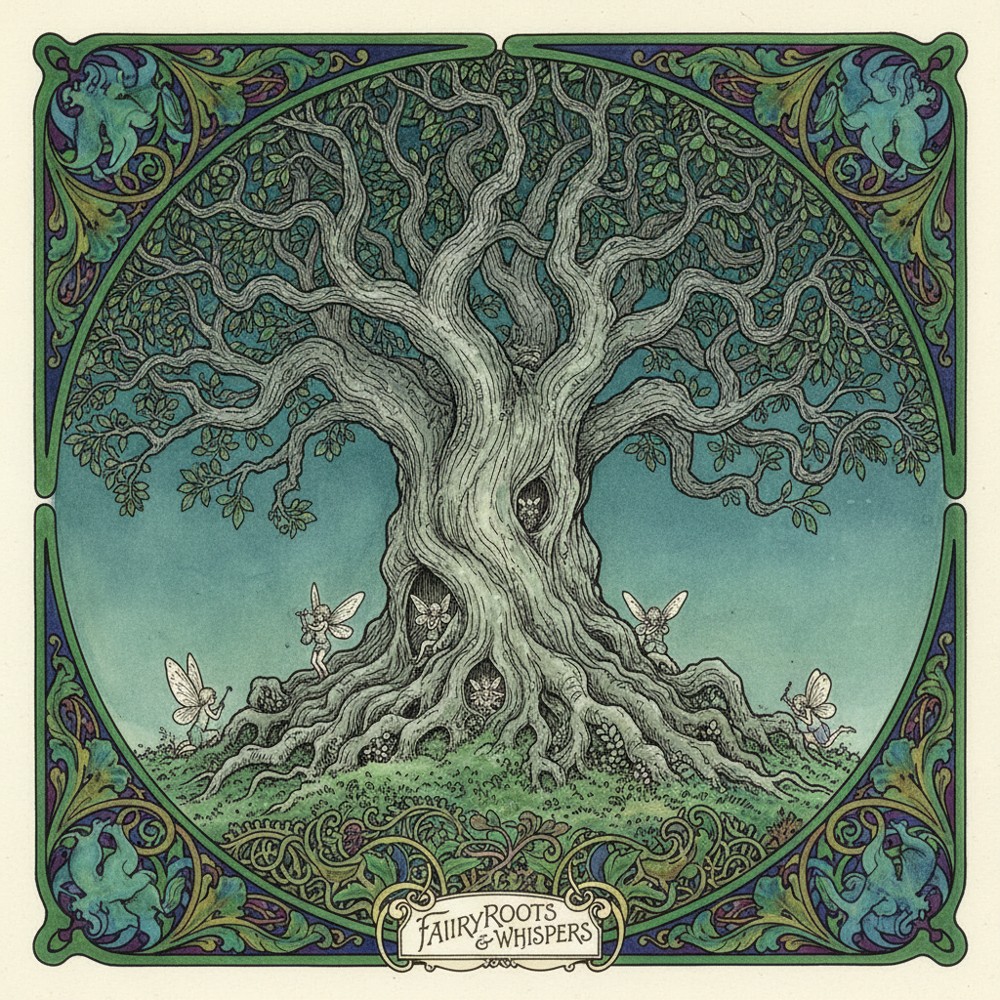

# Golden Age Illustration 黄金时代插画



> **"水彩与墨线的极致、童话与神话的视觉化——插画史上最华丽的篇章。"**

## 概述

| 维度 | 描述 |
|------|------|
| 时期 | 1880–1914（核心）/影响至今 |
| 别名 | Golden Age of Illustration, Edwardian Illustration |
| 核心色彩 | 深宝石色、金色、森林绿、暗红、靛蓝 |
| 关键元素 | 精细墨线、水彩渲染、装饰性边框、叙事性场景、神话题材 |
| 代表人物 | Arthur Rackham, Edmund Dulac, Kay Nielsen, N.C. Wyeth, Howard Pyle |
| 关联风格 | Art Nouveau, Pre-Raphaelite, Storybook Illustration, Fantasy Art |

---

## 历史脉络

| 年份 | 事件 |
|------|------|
| 1880s | 彩色印刷技术成熟——插画黄金时代开始 |
| 1900 | Arthur Rackham 成名——精细墨线+水彩 |
| 1907 | Edmund Dulac《一千零一夜》——东方主义巅峰 |
| 1914 | 一战爆发——黄金时代结束 |
| 1920s | Kay Nielsen《东方太阳西方月亮》——北欧神话 |
| 2000s | 黄金时代插画被重新发现和收藏 |
| 2020s | AI生成中的"Golden Age"风格复兴 |

### 核心哲学

黄金时代插画的精神是**"插画不是文字的附庸——它是独立的艺术"**：
- 技艺 = 极致（"每一根线条都经过深思熟虑"）
- 叙事 = 核心（"一幅画讲述整个故事的关键时刻"）
- 装饰 = 尊重（"边框和装饰是对读者的礼物"）
- 想象 = 无限（"让读者看到文字无法描述的世界"）
- "黄金时代的插画家证明了：插画可以和油画一样伟大"

---

## 视觉语法

### 色彩系统

```
主色：
  深宝石蓝 (#1B3A5C) — 神秘、深邃
  森林绿 (#1B4D3E) — 自然、魔法
  暗红 (#722F37) — 戏剧、温暖
  金色 (#B8860B) — 华丽、珍贵

辅色：
  靛蓝 (#2E0854) — 夜晚、魔法
  象牙白 (#FFFFF0) — 纸张、光
  赭石 (#CC7722) — 泥土、古典

规则：
  - 深色调为主
  - 水彩透明感
  - 金色点缀
  - 暗色背景+亮色主体

质感：
  水彩 — 透明、层叠
  墨线 — 精细、交叉线影
  纸张 — 古典、温暖
  金箔 — 装饰、华丽
```

### 标志性元素

| 类别 | 元素 |
|------|------|
| 技法 | 墨线+水彩、交叉线影、精细渲染 |
| 构图 | 装饰性边框、文图融合、叙事性场景 |
| 题材 | 童话、神话、传说、莎士比亚、冒险 |
| 角色 | 精灵、骑士、公主、巨人、森林生物 |
| 氛围 | 神秘、华丽、梦幻、戏剧性、古典 |
| 态度 | 极致技艺、叙事性、装饰性、想象力 |

---

## 与千禧怀旧的关系

### 永恒的视觉遗产
- 黄金时代 → 迪士尼早期动画的视觉DNA
- Rackham 的树 → 所有"魔法森林"的原型
- "每一本现代奇幻小说的封面都欠黄金时代一笔债"
- AI生成中"Golden Age Illustration"是高频prompt

### 对当代Fantasy Art的影响
- 黄金时代 → Tolkien插画 → 现代奇幻视觉
- 游戏概念艺术中的黄金时代回响
- "100年前的插画——今天看依然令人屏息"

---

## 中国语境

- 与中国传统工笔画的精细度对比
- 中国奇幻/仙侠插画中的黄金时代影响
- 中国绘本艺术家对黄金时代的学习
- 作为"西方插画史"的核心教学内容

---

## 设计应用

| 场景 | 应用方式 |
|------|----------|
| 出版 | 精装书+限量版+收藏级插画 |
| 游戏 | 奇幻概念艺术+角色设计+世界观 |
| 品牌 | 华丽+古典+手工+精细+收藏 |
| 数字 | AI风格参考+数字绘画+概念艺术 |

---

## 相关风格

← [Storybook Illustration 故事书插画](storybook-illustration.md) | [Art Nouveau 新艺术运动](art-nouveau.md) →

↑ [返回千禧怀旧目录](README.md) | [返回总目录](../README.md)
